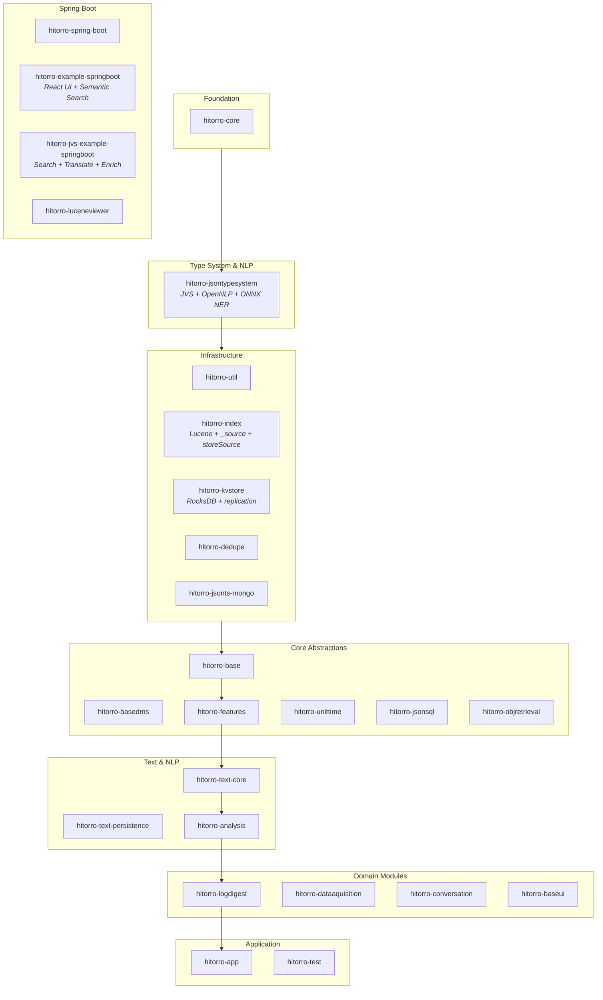

# HiTorro

HiTorro is a modular Java 21 framework (Maven multi-module, currently v3.0.1) for building type-aware JSON processing systems with NLP capabilities, full-text search, and multi-language document processing. It can operate standalone or integrate with Spring Boot 3.2 via optional auto-configuration.

## Getting Started

### Prerequisites

- Java 21
- Maven 3.9+
- Git with SSH key configured for GitHub
- Python 3.8+ (optional, for ONNX NER model export)
- Ollama (optional, for AI translation)

### Cloning

The root repository contains the parent POM, build scripts, and configuration. Each module is an independent Git repository cloned into this directory.

```bash
# Clone the root repo
git clone git@github.com:geekychris/hitorro.git
cd hitorro

# Clone all module repos
./checkout-modules.sh

# Or clone targeting a specific branch
./checkout-modules.sh main
```

### Building

```bash
# Full build with tests
mvn clean install

# Build without tests
mvn clean install -DskipTests

# Build and deploy to local Maven repo (~/code/hitorro-maven)
./build-and-deploy.sh --clean
./build-and-deploy.sh --clean --skip-tests

# Download ONNX NER model (one-time, requires Python 3.8+)
./download-onnx-models.sh
```

### Version Management

```bash
./bump-patch-version.sh   # 3.0.0 -> 3.0.1
./bump-minor-version.sh   # 3.0.0 -> 3.1.0
./bump-major-version.sh   # 3.0.0 -> 4.0.0
./set-version.sh 3.2.5    # explicit version
```

## Module Architecture

### Dependency Graph

```mermaid
graph TD
    core[hitorro-core<br/><i>Propaccess, JSON, I/O, caching</i>]
    jts[hitorro-jsontypesystem<br/><i>JVS, types, NLP, ONNX NER</i>]
    util[hitorro-util<br/><i>commands, state machines, scheduling</i>]
    base[hitorro-base<br/><i>doc processing, XML-RPC, PDFBox</i>]
    unittime[hitorro-unittime]
    features[hitorro-features]
    jsonsql[hitorro-jsonsql]
    jsonts_mongo[hitorro-jsonts-mongo]
    objretrieval[hitorro-objretrieval]
    textcore[hitorro-text-core<br/><i>NER filters, analyzers</i>]
    textpersist[hitorro-text-persistence]
    basedms[hitorro-basedms<br/><i>DMS, Hibernate</i>]
    dedupe[hitorro-dedupe]
    analysis[hitorro-analysis<br/><i>parsing, sentiment</i>]
    logdigest[hitorro-logdigest]
    dataaq[hitorro-dataaquisition]
    conversation[hitorro-conversation]
    baseui[hitorro-baseui]
    index[hitorro-index<br/><i>Lucene search, facets, _source</i>]
    kvstore[hitorro-kvstore<br/><i>RocksDB, replication</i>]
    luceneviewer[hitorro-luceneviewer]
    test[hitorro-test]
    app[hitorro-app]
    sb_auto[hitorro-spring-boot-autoconfigure]
    sb_starter[hitorro-spring-boot-starter]
    example_sb[hitorro-example-springboot<br/><i>Full demo + React UI</i>]
    jvs_example[hitorro-jvs-example-springboot<br/><i>JVS + NLP + Search demo</i>]

    jts --> core
    util --> core
    util --> jts
    base --> util
    base --> jts

    unittime --> base
    features --> util
    features --> base
    jsonsql --> util
    jsonsql --> jts
    jsonsql --> base
    jsonts_mongo --> util
    objretrieval --> features
    objretrieval --> jts
    index --> util
    kvstore --> util
    dedupe --> util

    textcore --> util
    textcore --> jts
    textcore --> base
    textcore --> features

    basedms --> base
    basedms --> jts
    basedms --> util

    textpersist --> textcore
    textpersist --> jts
    textpersist --> basedms
    textpersist --> objretrieval

    analysis --> textcore
    analysis --> jts
    analysis --> objretrieval

    logdigest --> textcore
    logdigest --> basedms
    logdigest --> analysis

    dataaq --> analysis
    dataaq --> textpersist
    dataaq --> basedms
    dataaq --> dedupe

    conversation --> textcore
    conversation --> textpersist
    conversation --> basedms

    baseui --> analysis
    baseui --> basedms
    baseui --> base
    baseui --> textcore

    test --> features
    test --> jts
    test --> basedms
    test --> jsonsql
    test --> logdigest
    test --> analysis
    test --> conversation
    test --> textcore
    test --> textpersist

    app --> util
    app --> base
    app --> unittime
    app --> features
    app --> jsonsql
    app --> objretrieval
    app --> textcore
    app --> textpersist
    app --> basedms
    app --> dedupe
    app --> analysis
    app --> logdigest
    app --> dataaq
    app --> conversation
    app --> baseui
    app --> test

    sb_auto --> util
    sb_auto --> base
    sb_auto --> basedms
    sb_starter --> sb_auto

    example_sb --> sb_starter
    example_sb --> luceneviewer
    example_sb --> basedms
    example_sb --> textcore
    example_sb --> analysis
    example_sb --> unittime
    example_sb --> test
    example_sb --> index
    example_sb --> kvstore

    jvs_example --> jts
    jvs_example --> index
    jvs_example --> kvstore
    jvs_example --> luceneviewer
```



### Layer Diagram



### Module Summary

| Module | Purpose |
|--------|---------|
| **hitorro-core** | Foundation utilities: Propaccess path navigation, JSON processing (Jackson), file I/O (local/HDFS/S3), caching, iteration framework, HTTP clients |
| **hitorro-jsontypesystem** | JSON Type System (JVS): type/field/group definitions, projection executors (index/enrich/remove), Groovy data mappers, JSON Schema support, NLP (OpenNLP MaxEnt + ONNX transformer NER via HuggingFace, Snowball stemming, WordNet), classifiers. Dynamic fields use a compute-on-first-read, cache-on-JSON-node pattern via PAContextTyped. |
| **hitorro-util** | Application infrastructure: command framework, state machines, ZooKeeper, Redis, mail, scheduling, telnet/SSH servers, service counters |
| **hitorro-base** | Core abstractions: document processing pipelines, type management, XML-RPC networking, PDFBox |
| **hitorro-unittime** | Unit and time handling utilities |
| **hitorro-features** | Feature extraction and management |
| **hitorro-jsonsql** | SQL-like query engine for JSON documents |
| **hitorro-jsonts-mongo** | MongoDB integration for the JSON type system |
| **hitorro-objretrieval** | Solr-based object retrieval, JVS2JVSEnrichMapper for NLP enrichment with tag-based filtering |
| **hitorro-text-core** | Text processing: NER filters, sentence enhancement, Lucene analyzers |
| **hitorro-text-persistence** | Full-text indexing and search persistence |
| **hitorro-basedms** | Document Management System with Hibernate persistence |
| **hitorro-dedupe** | Deduplication utilities |
| **hitorro-analysis** | CKY parsing, sentiment analysis, term vectors |
| **hitorro-logdigest** | Log digestion and analysis |
| **hitorro-dataaquisition** | Data acquisition pipelines |
| **hitorro-conversation** | Conversation processing |
| **hitorro-baseui** | Base UI components |
| **hitorro-index** | Lucene integration: type-aware field projection, fielded search, faceting, multi-language tokenization (30+ languages), streaming NDJson, optional `_source` storage (`storeSource(false)` for KV-backed retrieval), embedding/vector search support |
| **hitorro-kvstore** | RocksDB key-value store with typed/untyped APIs, batch operations, prefix scanning, WAL-based replication |
| **hitorro-luceneviewer** | Lucene index viewer and diagnostics utility |
| **hitorro-test** | Test utilities (TestPlus interface) |
| **hitorro-app** | Application entry point (CommandLine) |
| **hitorro-spring-boot** | Spring Boot auto-configuration and starter (contains autoconfigure + starter submodules) |
| **hitorro-example-springboot** | Full Spring Boot demo with React UI: translate → enrich → index pipeline, Lucene + KV store search, semantic/hybrid search with Ollama embeddings, DMS, data mappers |
| **hitorro-jvs-example-springboot** | Standalone JVS + NLP + Search demo: translate → enrich → index pipeline, multi-language Lucene search, RocksDB KV store, NDJSON processing, Ollama translation |

## Key Concepts

- **JSON Type System (JVS)**: Central to the project. Type definitions live in `config/types/*.json`. Schemas in `config/schemas/*.schema.json`. JVS is the universal document wrapper used throughout the system.
- **Propaccess**: Dot-notation path navigation for JSON (`id.did`, `title.mls[0].text`). Defined in hitorro-core, used everywhere.
- **Projections**: Three-phase execution model (index, enrich, remove) for transforming typed documents. Defined in `jsontypesystem/executors/`.
- **Dynamic Fields**: Lazy-computed fields declared in type definitions. Computed on first read via PAContextTyped and cached directly on the JSON node. The enrichment pipeline "touches" dynamic fields to materialize them (e.g., NER, segmentation, POS tagging).
- **Data Mapping**: Groovy DSL for transforming documents between types. Scripts in `config/transforms/`, generators in `config/generators/`.
- **Search Pipeline**: Translate (Ollama) → Enrich (NLP) → Index (Lucene) + Store (RocksDB KV). Index stores projected fields for search; KV store holds full documents for retrieval.
- **NLP Models**: OpenNLP MaxEnt models in `data/opennlpmodels1.5/` (9 languages: en, de, es, fr, it, nl, pt, da, se). ONNX transformer NER model in `data/opennlpmodels-onnx/ner-multilingual/` (optional, covers 10+ languages via `Davlan/xlm-roberta-base-ner-hrl`). NER falls back from MaxEnt → ONNX automatically when `.bin` models are unavailable.
- **ServiceContext**: Custom dependency injection used in standalone mode (non-Spring).
- **Configuration-driven**: Type definitions, Groovy transform scripts, CSV generators, service implementation mappings (`config/implementations.json`), and `config/generalconfig.json`.

## Module Scripts

Each module is an independent Git repository. These scripts manage them:

| Script | Purpose |
|--------|---------|
| `checkout-modules.sh [branch]` | Clone all module repos (or update existing ones) |
| `update-modules.sh [branch]` | Pull updates for all cloned modules |
| `update-modules-improved.sh [branch]` | Enhanced update with detailed diagnostics |
| `diagnose-modules.sh` | Check sync status of all modules against remote |
| `download-onnx-models.sh` | Export HuggingFace NER model to ONNX (one-time, requires Python 3.8+) |
| `build-and-deploy.sh` | Build and deploy to local Maven repo (auto-downloads ONNX model on first run) |

## Testing

- JUnit 5 (Jupiter) with Mockito and AssertJ
- Custom `TestPlus` interface (`com.hitorro.util.testframework`) provides test helper methods
- `HT_HOME` environment variable is set during test execution via Surefire config

```bash
# Run tests for a single module
mvn test -pl hitorro-jsontypesystem

# Run a single test class
mvn test -pl hitorro-jsontypesystem -Dtest=JVSTest

# Run a single test method
mvn test -pl hitorro-jsontypesystem -Dtest=JVSTest#shouldCreateEmptyJvs
```

## Spring Boot Integration

The `hitorro-spring-boot/` directory contains the auto-configuration and starter modules. Core modules remain Spring-agnostic; the Spring Boot modules bridge via auto-configuration.

- `hitorro-example-springboot/` — Full demo application with React UI, Lucene search, KV store, semantic search, DMS, data mappers
- `hitorro-jvs-example-springboot/` — Standalone type system + NLP + search demo with translate → enrich → index pipeline
