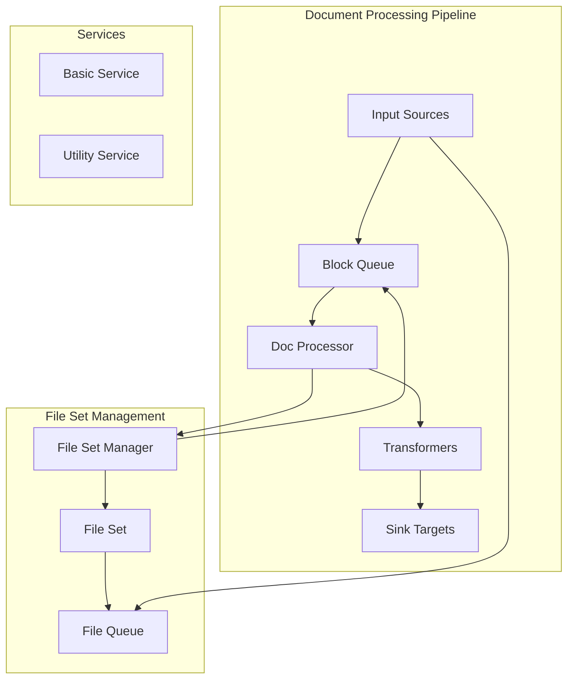
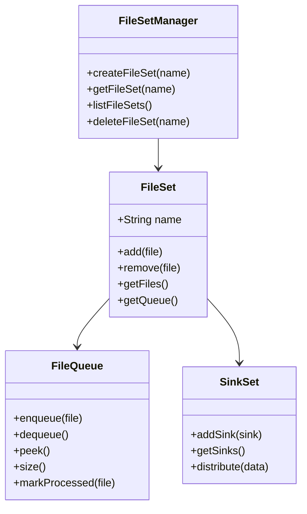
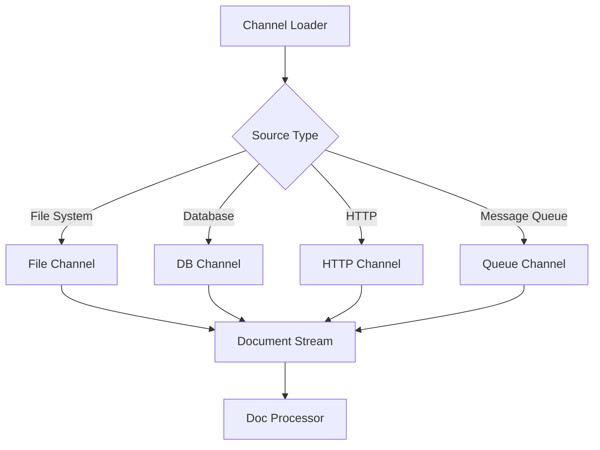
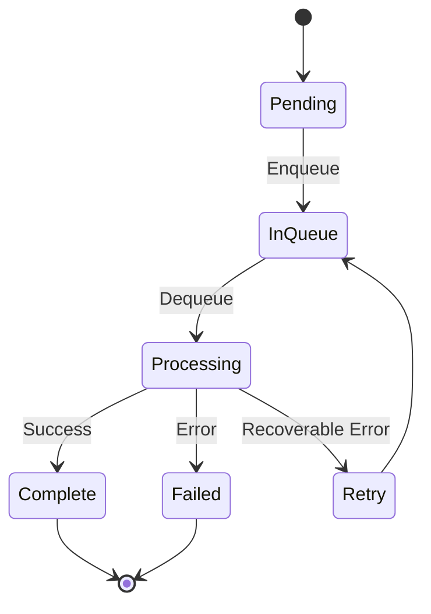

# Hitorro-Base Module Documentation

## Overview

**hitorro-base** provides document processing, file management, and workflow orchestration capabilities. It extends hitorro-util with features for handling large-scale document processing pipelines, file set management, and distributed processing coordination.

**Version:** 3.0.0  
**Package:** `com.hitorro.base`  
**Artifact ID:** `hitorro-base`  
**Dependencies:** hitorro-util

---

## Architecture Overview



---

## Key Components

### 1. Document Processing Framework

A scalable pipeline architecture for processing large volumes of documents with support for distributed processing and fault tolerance.

#### Pipeline Architecture


**Key Classes:**
- `DocProcessor` - Core document processing engine
- `PipelineElement` - Processing stage interface
- `EnqueueHandler` - Document ingestion
- `SinkTarget` - Output destination
- `EnqueueClient` - Distributed queue client

**Features:**
- Multi-stage pipeline processing
- Distributed queue support (Kafka, RabbitMQ, etc.)
- Fault tolerance and retry logic
- Progress tracking and monitoring
- Dynamic pipeline reconfiguration

#### Pipeline Element Example

```java
public class MyPipelineElement implements PipelineElement {
    @Override
    public void process(Document doc, PipelineContext context) {
        // Extract text
        String text = doc.getContent();
        
        // Transform
        String processed = transform(text);
        
        // Update document
        doc.setField("processed_text", processed);
        
        // Pass to next stage
        context.next(doc);
    }
    
    @Override
    public String getName() {
        return "MyTransformer";
    }
}
```

---

### 2. File Set Management

A sophisticated file tracking and queue management system for handling large collections of files across distributed storage.



**Key Classes:**
- `FileSetManager` - Centralized file set management
- `FileSet` - Collection of files with metadata
- `FileQueue` - FIFO processing queue
- `SinkSet` - Output distribution

**Features:**
- Persistent file tracking
- Progress monitoring
- Error recovery and retry
- Parallel processing support
- File state management (pending, processing, complete, failed)

**Usage Example:**

```java
// Create file set manager
FileSetManager manager = new FileSetManager();

// Create a new file set
FileSet fileSet = manager.createFileSet("my-documents");

// Add files to the set
fileSet.add(new File("/path/to/doc1.pdf"));
fileSet.add(new File("/path/to/doc2.pdf"));

// Get processing queue
FileQueue queue = fileSet.getQueue();

// Process files
while (!queue.isEmpty()) {
    File file = queue.dequeue();
    try {
        processFile(file);
        queue.markProcessed(file);
    } catch (Exception e) {
        queue.markFailed(file, e.getMessage());
    }
}
```

---

### 3. Document Processing Components

#### Enqueue Handlers

Handle document ingestion from various sources into the processing pipeline.

**Key Classes:**
- `EnqueueHandler` - Base handler interface
- `DocProcessorEnqueueHandler` - Standard document handler
- `HDFSDocprocessEnqueue` - HDFS integration
- `EnqueueElement` - Document metadata wrapper

**Supported Sources:**
- Local file system
- HDFS (Hadoop Distributed File System)
- S3-compatible storage
- HTTP/HTTPS URLs
- Database queries
- Message queues

#### Sink Targets

Define output destinations for processed documents.

**Key Classes:**
- `SinkTarget` - Output interface
- `ECSinkTarget` - Elasticsearch sink
- `SinkTargetInitializer` - Sink configuration

**Supported Destinations:**
- Local file system
- HDFS
- S3-compatible storage
- Elasticsearch
- Database tables
- Message queues
- REST APIs

---

### 4. Channel Loaders

Channel loaders provide abstraction for loading and processing documents from various sources.



**Key Classes:**
- `ChannelLoader` - Base loader interface
- `DocProcessingChannelLoader` - Document channel loader

**Features:**
- Pluggable source adapters
- Streaming document processing
- Batch processing support
- Error handling and recovery

---

### 5. Services

#### BasicService

Provides core infrastructure for document processing services.

**Location:** `com.hitorro.base.service.BasicService`

**Features:**
- Service lifecycle management
- Configuration management
- Debug command integration
- Health checks

**Service Definition:**
```java
@ServiceDefinition(
    dependentService = {UtilityService.class},
    shortName = "basic",
    description = "Basic document processing service"
)
public class BasicService {
    public String init(boolean dbInit, boolean upgrading, 
                      long currentVersion, long targetVersion) {
        // Initialize document processors
        initializeProcessors();
        return null;
    }
    
    public String start(boolean dbInit) {
        // Start processing threads
        startProcessingThreads();
        return null;
    }
    
    public String deInit() {
        // Cleanup
        stopProcessingThreads();
        return null;
    }
}
```

#### UtilityService

Provides utility functions and helper methods for document processing.

**Location:** `com.hitorro.base.service.UtilityService`

**Features:**
- File utility functions
- Path resolution
- Content type detection
- Temporary file management

---

### 6. Block Queue Management

Efficient queue implementation for handling large document processing workloads.



**Key Classes:**
- `BlockQueue` - Distributed queue implementation
- `QueueLoaderBaseFileCrawlerCallback` - File-based queue loader

**Features:**
- Distributed queue support
- Priority queuing
- Dead letter queue for failed items
- Queue monitoring and statistics
- Batch dequeue operations

---

### 7. Document Mapping

Document mapping provides transformation and routing logic for documents in the pipeline.

**Key Classes:**
- `DocMap` - Document mapping configuration
- `DocumentMapper` - Mapping execution engine

**Features:**
- Field mapping and transformation
- Conditional routing
- Content enrichment
- Metadata extraction

**Example Mapping:**
```json
{
  "mappings": [
    {
      "source": "title",
      "target": "document_title",
      "transform": "uppercase"
    },
    {
      "source": "content",
      "target": "text",
      "transform": "html_to_text"
    }
  ]
}
```

---

### 8. Base File Utilities

Extended file handling utilities beyond those in hitorro-util.

**Key Classes:**
- `BaseBaseFileUtil` - Base file operations
- File crawling and traversal
- Archive handling
- Content detection

**Features:**
- Recursive directory traversal
- File filtering and selection
- Symbolic link handling
- Large file support
- Checksum calculation

---

## Integration with Other Modules

### With hitorro-util
- Uses service framework for lifecycle
- Leverages command system for debug commands
- Uses event system for notifications
- Depends on core utilities

### With hitorro-basedms
- Provides document processing for DMS
- File set integration with content stores
- Pipeline processing for transformations

### With hitorro-text-core
- Document text extraction
- NLP pipeline integration
- Search index building

---

## Configuration

### Pipeline Configuration

**Example: `config/docprocessing.json`**
```json
{
  "docprocessing": {
    "threads": 10,
    "queue": {
      "type": "kafka",
      "brokers": "localhost:9092",
      "topic": "documents"
    },
    "pipeline": [
      {
        "name": "text-extraction",
        "class": "com.hitorro.base.pipeline.TextExtractor"
      },
      {
        "name": "metadata-enrichment",
        "class": "com.hitorro.base.pipeline.MetadataEnricher"
      }
    ],
    "sinks": [
      {
        "name": "elasticsearch",
        "class": "com.hitorro.base.sink.ElasticsearchSink",
        "config": {
          "hosts": ["localhost:9200"],
          "index": "documents"
        }
      }
    ]
  }
}
```

### File Set Configuration

**Example: `config/filesets.json`**
```json
{
  "filesets": {
    "storage": {
      "path": "${HT_HOME}/data/filesets",
      "maxSize": "100GB",
      "retention": "30d"
    },
    "processing": {
      "maxConcurrent": 20,
      "retryAttempts": 3,
      "retryDelay": "5m"
    }
  }
}
```

---

## Performance Considerations

### Document Processing
- **Throughput**: Can process 1000+ documents/second with proper tuning
- **Concurrency**: Use thread pools sized to CPU cores + I/O threads
- **Memory**: Pipeline stages should stream when possible
- **Queuing**: Use distributed queues for horizontal scaling

### File Set Management
- **File Tracking**: Optimized for millions of files
- **Queue Operations**: O(1) enqueue/dequeue
- **Persistence**: Periodic checkpointing reduces recovery time
- **Monitoring**: Low-overhead progress tracking

---

## Common Use Cases

### 1. Batch Document Processing

```java
// Setup pipeline
DocProcessor processor = new DocProcessor();
processor.addStage(new TextExtractor());
processor.addStage(new MetadataEnricher());
processor.addStage(new IndexBuilder());

// Create file set
FileSetManager manager = new FileSetManager();
FileSet files = manager.createFileSet("batch-2024-01");

// Add files
File directory = new File("/data/documents");
DirectoryCrawler crawler = new DirectoryCrawler(directory);
crawler.crawl(file -> files.add(file));

// Process
FileQueue queue = files.getQueue();
while (!queue.isEmpty()) {
    File file = queue.dequeue();
    Document doc = loadDocument(file);
    processor.process(doc);
    queue.markProcessed(file);
}
```

### 2. Distributed Processing

```java
// Configure distributed queue
EnqueueClient client = new EnqueueClient();
client.setQueueType("kafka");
client.setBrokers("kafka1:9092,kafka2:9092");
client.setTopic("documents");

// Enqueue documents (Producer)
EnqueueHandler handler = new DocProcessorEnqueueHandler(client);
DirectoryCrawler crawler = new DirectoryCrawler(directory);
crawler.crawl(file -> {
    EnqueueElement element = new EnqueueElement(file);
    handler.enqueue(element);
});

// Process documents (Consumer)
DocProcessor processor = createProcessor();
while (true) {
    EnqueueElement element = client.dequeue();
    if (element != null) {
        Document doc = element.getDocument();
        processor.process(doc);
        client.acknowledge(element);
    }
}
```

### 3. Real-time Document Ingestion

```java
// Watch directory for new files
FileWatcher watcher = new FileWatcher("/data/incoming");
watcher.addListener(new FileListener() {
    @Override
    public void onFileCreated(File file) {
        // Process immediately
        Document doc = loadDocument(file);
        processor.process(doc);
        
        // Move to processed
        Files.move(file, new File("/data/processed/" + file.getName()));
    }
});

watcher.start();
```

---

## Monitoring and Observability

### Queue Statistics

```java
// Get queue metrics
FileQueue queue = fileSet.getQueue();
QueueStats stats = queue.getStats();

System.out.println("Pending: " + stats.getPending());
System.out.println("Processing: " + stats.getProcessing());
System.out.println("Completed: " + stats.getCompleted());
System.out.println("Failed: " + stats.getFailed());
System.out.println("Throughput: " + stats.getThroughput() + " docs/sec");
```

### Pipeline Monitoring

```java
// Get pipeline metrics
DocProcessor processor = getProcessor();
PipelineStats stats = processor.getStats();

for (PipelineStage stage : stats.getStages()) {
    System.out.println(stage.getName() + ":");
    System.out.println("  Processed: " + stage.getProcessed());
    System.out.println("  Avg Time: " + stage.getAvgTime() + "ms");
    System.out.println("  Errors: " + stage.getErrors());
}
```

---

## Error Handling

### Retry Strategies

```java
public class RetryHandler {
    private static final int MAX_RETRIES = 3;
    private static final long RETRY_DELAY = 5000; // 5 seconds
    
    public void processWithRetry(Document doc) {
        int attempts = 0;
        while (attempts < MAX_RETRIES) {
            try {
                processor.process(doc);
                return; // Success
            } catch (RecoverableException e) {
                attempts++;
                if (attempts >= MAX_RETRIES) {
                    handleFailure(doc, e);
                } else {
                    Thread.sleep(RETRY_DELAY * attempts);
                }
            } catch (FatalException e) {
                handleFailure(doc, e);
                return;
            }
        }
    }
}
```

### Dead Letter Queue

```java
// Configure DLQ
FileQueue mainQueue = fileSet.getQueue();
FileQueue dlq = fileSet.getDeadLetterQueue();

// Process with DLQ
File file = mainQueue.dequeue();
try {
    processFile(file);
    mainQueue.markProcessed(file);
} catch (Exception e) {
    // Move to DLQ
    dlq.enqueue(file, e.getMessage());
    mainQueue.markFailed(file);
}
```

---

## Testing

### Unit Testing Pipeline Elements

```java
@Test
public void testPipelineElement() {
    // Create test document
    Document doc = new Document();
    doc.setField("title", "Test Document");
    doc.setField("content", "This is a test");
    
    // Create pipeline element
    PipelineElement element = new TextExtractor();
    
    // Create mock context
    PipelineContext context = mock(PipelineContext.class);
    
    // Process
    element.process(doc, context);
    
    // Verify
    assertNotNull(doc.getField("extracted_text"));
    verify(context).next(doc);
}
```

### Integration Testing

```java
@Test
public void testEndToEndPipeline() {
    // Setup test file set
    FileSetManager manager = new FileSetManager();
    FileSet testSet = manager.createFileSet("test-set");
    
    // Add test files
    testSet.add(createTestFile("test1.pdf"));
    testSet.add(createTestFile("test2.pdf"));
    
    // Process
    DocProcessor processor = createTestProcessor();
    FileQueue queue = testSet.getQueue();
    
    int processed = 0;
    while (!queue.isEmpty()) {
        File file = queue.dequeue();
        processor.process(loadDocument(file));
        queue.markProcessed(file);
        processed++;
    }
    
    // Verify
    assertEquals(2, processed);
    assertEquals(0, queue.size());
}
```

---

## Best Practices

1. **Pipeline Design**
   - Keep stages small and focused
   - Make stages stateless when possible
   - Handle errors at stage level
   - Log progress for debugging

2. **File Set Management**
   - Use meaningful file set names
   - Clean up completed file sets
   - Monitor queue depths
   - Implement proper error handling

3. **Performance**
   - Tune thread pool sizes
   - Use batch operations
   - Stream large files
   - Implement backpressure

4. **Monitoring**
   - Track processing rates
   - Monitor error rates
   - Set up alerts for failures
   - Log detailed metrics

5. **Error Recovery**
   - Implement retry logic
   - Use dead letter queues
   - Preserve original files
   - Log detailed error information

---

## Troubleshooting

### Common Issues

**Pipeline stalls:**
- Check thread pool configuration
- Look for blocking operations
- Review error logs for exceptions
- Monitor queue depths

**File set errors:**
- Verify file permissions
- Check disk space
- Review file set configuration
- Check for locked files

**Memory issues:**
- Review pipeline stage memory usage
- Implement streaming for large files
- Tune JVM heap settings
- Monitor garbage collection

---

## Related Modules

- **hitorro-util** - Foundation and utilities
- **hitorro-basedms** - Document management integration
- **hitorro-text-core** - Text processing pipelines
- **hitorro-features** - Feature extraction integration
