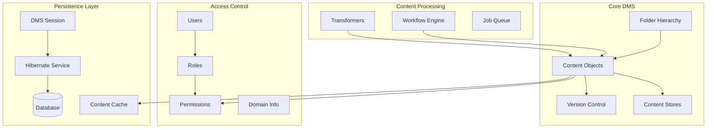
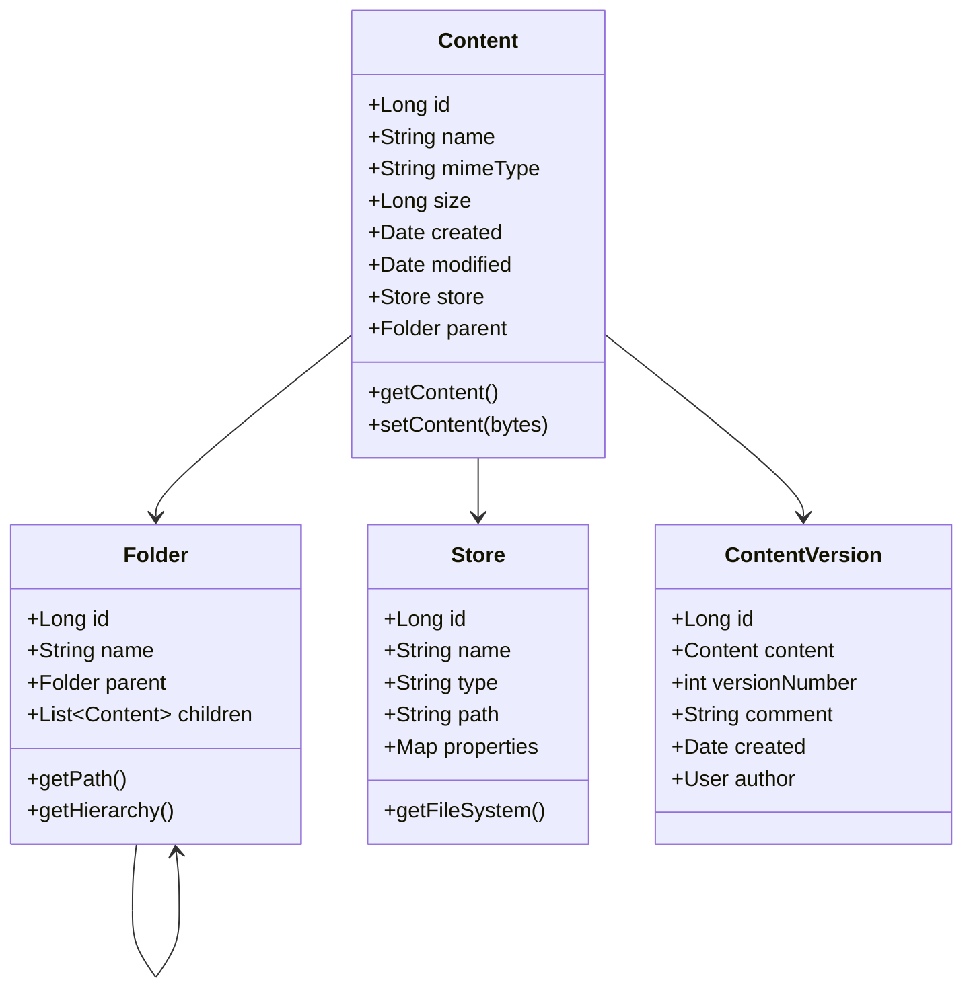
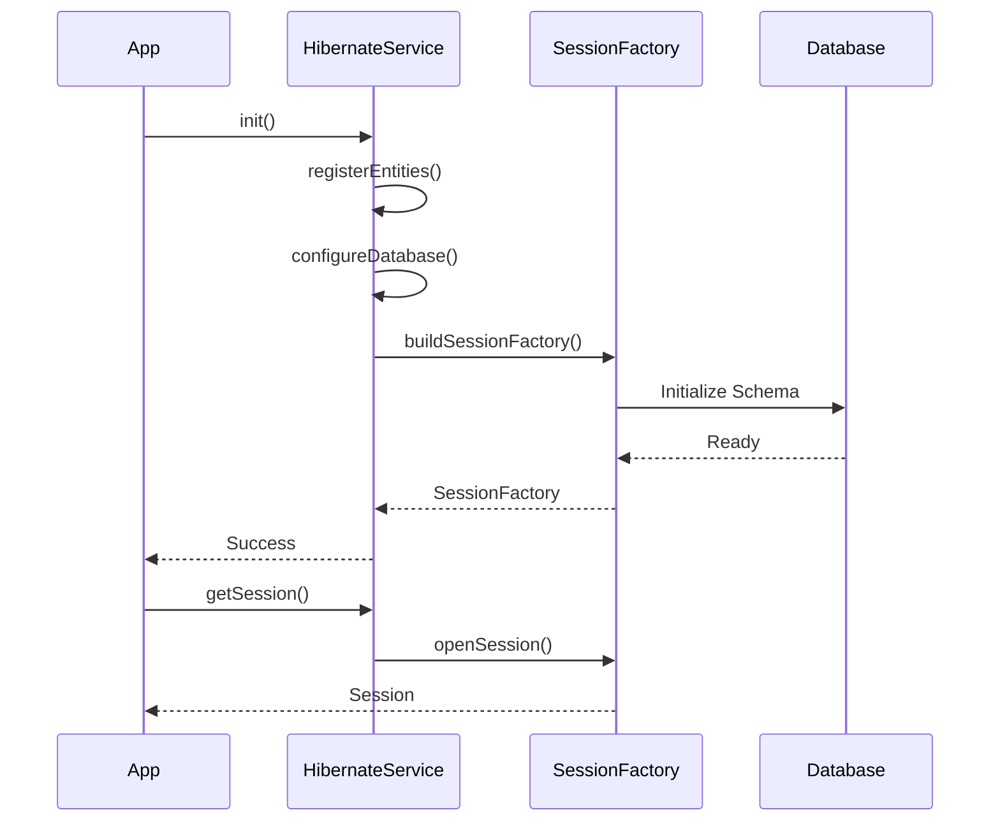
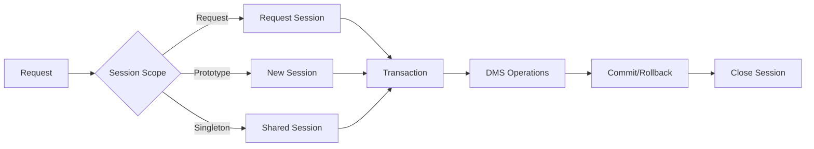
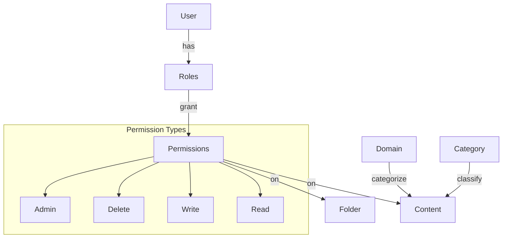
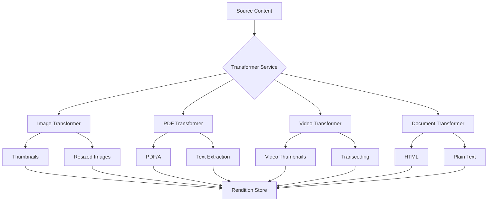
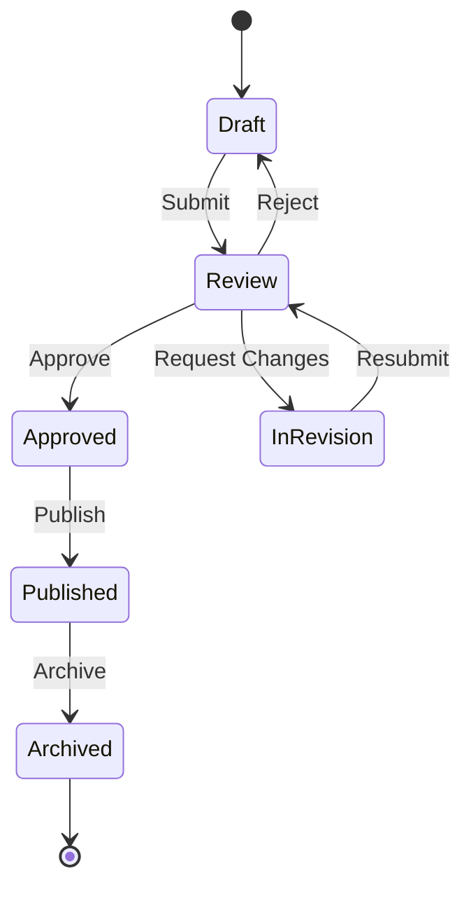
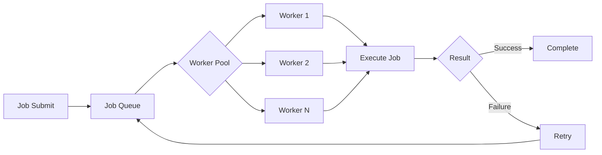
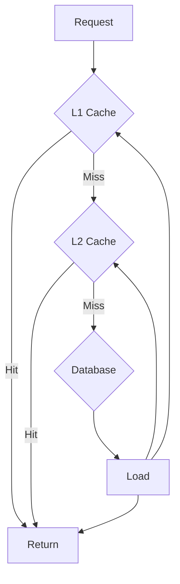

# Hitorro-BaseDMS Module Documentation

## Overview

**hitorro-basedms** is a comprehensive Document Management System (DMS) that provides enterprise-grade content management, version control, access control, and workflow capabilities. Built on Hibernate ORM, it offers a robust persistence layer with support for complex content hierarchies, transformations, and multi-format renditions.

**Version:** 3.0.0  
**Package:** `com.hitorro.basedms`  
**Artifact ID:** `hitorro-basedms`  
**Dependencies:** hitorro-util, hitorro-base, Hibernate 6.x

---

## Architecture Overview



---

## Key Components

### 1. Content Management

The core content management system handles document storage, retrieval, versioning, and metadata.



**Key Entities:**
- `Content` - Base content entity with metadata
- `Folder` - Hierarchical container for organizing content
- `Store` - Physical storage location configuration
- `ContentVersion` - Version history tracking

**Features:**
- Hierarchical folder structure
- Multiple storage backends (local, S3, HDFS)
- Automatic version control
- Content deduplication
- Metadata extraction
- Full-text search integration

---

### 2. Hibernate Integration

Comprehensive Hibernate service managing database lifecycle, entity registration, and session management.



**Key Classes:**
- `HibernateService` - Service lifecycle and configuration
- `HibernateUtil` - Session and transaction management
- `DatabaseConfigProvider` - Database configuration abstraction
- `SpringDatabaseConfigProvider` - Spring DataSource integration

**Features:**
- Entity auto-registration via `@TypeManagedClass`
- Schema auto-creation and migration
- Connection pool management (HikariCP)
- Multi-database support (H2, MySQL, PostgreSQL, Oracle)
- Transaction management
- Second-level caching
- Query optimization

**Service Definition:**
```java
@ServiceDefinition(
    dependentService = {},
    shortName = "hibernate",
    description = "Hibernate ORM Service"
)
public class HibernateService {
    public String init(boolean dbInit, boolean upgrading, 
                      long currentVersion, long targetVersion) {
        // Register entities from all services
        registerManagedEntities();
        
        // Configure Hibernate
        Configuration config = configureHibernate();
        
        // Build session factory
        sessionFactory = config.buildSessionFactory();
        
        // Run schema updates if dbInit
        if (dbInit) {
            SchemaUpdate update = new SchemaUpdate();
            update.execute(EnumSet.of(TargetType.DATABASE), 
                          sessionFactory.getMetadata());
        }
        
        return null;
    }
}
```

---

### 3. DMS Session Management

Session management provides thread-safe access to DMS operations with proper transaction handling.



**Key Classes:**
- `DMSSession` - Primary DMS session interface
- `DMSSessionFactory` - Session creation and pooling
- `ThreadLocalDMSSession` - Thread-local session storage

**Features:**
- Multiple session scopes (request, prototype, singleton)
- Automatic transaction management
- Session pooling and reuse
- Context propagation
- Error recovery

**Usage Example:**
```java
// Get DMS session
DMSSession session = DMSSessionFactory.getSession();

try {
    // Begin transaction
    session.begin();
    
    // Perform operations
    Content content = session.getContent(contentId);
    content.setName("Updated Name");
    session.save(content);
    
    // Commit
    session.commit();
} catch (Exception e) {
    session.rollback();
    throw e;
} finally {
    session.close();
}
```

---

### 4. Access Control & Security

Role-based access control (RBAC) with fine-grained permissions.



**Key Entities:**
- `User` - User account with authentication
- `Role` - Named permission collection
- `Permission` - Specific access right
- `DomainInfo` - Content domain classification
- `Category` - Content categorization

**Features:**
- Multi-tenant support via domains
- Role hierarchy
- Permission inheritance
- Content-level ACLs
- Authentication methods (password, LDAP, SSO)
- Password policies and encryption

**Example ACL:**
```java
// Create user
User user = new User();
user.setUsername("john.doe");
user.setPassword(hashPassword("secret"));
session.save(user);

// Create role
Role editorRole = new Role();
editorRole.setName("Editor");
session.save(editorRole);

// Assign permissions
Permission readPerm = new Permission("read", "/documents/*");
Permission writePerm = new Permission("write", "/documents/*");
editorRole.addPermission(readPerm);
editorRole.addPermission(writePerm);

// Assign role to user
user.addRole(editorRole);
session.save(user);

// Check permission
boolean canEdit = user.hasPermission("write", "/documents/report.pdf");
```

---

### 5. Content Transformers

Advanced content transformation pipeline for generating renditions, thumbnails, and format conversions.



**Key Classes:**
- `TransformerService` - Transformation orchestration
- `TransformationMethod` - Base transformation interface
- `TransformationConstraint` - Conditional transformation rules
- `RenditionManager` - Rendition lifecycle management

**Built-in Transformers:**
- **Image**: Resize, crop, format conversion, thumbnail generation
- **PDF**: PDF/A conversion, text extraction, thumbnail generation
- **Video**: Thumbnail extraction, format conversion, streaming preparation
- **Document**: Office formats to PDF/HTML/text
- **AI**: Content analysis, OCR, classification

**Features:**
- Async transformation processing
- Caching of renditions
- On-demand generation
- Format negotiation
- Quality settings
- Watermarking

**Transformation Definition:**
```json
{
  "transformations": [
    {
      "name": "thumbnail",
      "method": "image-resize",
      "constraints": {
        "mimeType": "image/*"
      },
      "parameters": {
        "width": 200,
        "height": 200,
        "quality": 85
      }
    },
    {
      "name": "pdf-text",
      "method": "pdf-extract-text",
      "constraints": {
        "mimeType": "application/pdf"
      }
    }
  ]
}
```

**Usage Example:**
```java
// Get transformer service
TransformerService transformer = TransformerService.getInstance();

// Transform content
Content source = session.getContent(contentId);
TransformationRequest request = new TransformationRequest();
request.setMethod("thumbnail");
request.setParameter("width", 200);
request.setParameter("height", 200);

// Execute transformation
Content rendition = transformer.transform(source, request);

// Store rendition
session.save(rendition);
```

---

### 6. Workflow Engine

Flexible workflow engine for automating content lifecycle processes.



**Key Classes:**
- `Workflow` - Workflow definition
- `WorkflowState` - Workflow state
- `WorkflowTransition` - State transition logic
- `WorkflowInstance` - Running workflow instance
- `WorkflowAction` - Automated actions

**Features:**
- State machine based
- Conditional transitions
- Automated actions on state change
- Role-based workflow assignments
- Parallel approval paths
- Escalation rules
- Audit trail

**Workflow Definition:**
```java
// Create workflow
Workflow publishingWorkflow = new Workflow("publishing");

// Define states
WorkflowState draft = new WorkflowState("draft");
WorkflowState review = new WorkflowState("review");
WorkflowState approved = new WorkflowState("approved");

publishingWorkflow.addState(draft);
publishingWorkflow.addState(review);
publishingWorkflow.addState(approved);

// Define transitions
WorkflowTransition submit = new WorkflowTransition("submit");
submit.setFrom(draft);
submit.setTo(review);
submit.setRequiredRole("Author");

WorkflowTransition approve = new WorkflowTransition("approve");
approve.setFrom(review);
approve.setTo(approved);
approve.setRequiredRole("Editor");

// Add actions
approve.addAction(new WorkflowAction() {
    @Override
    public void execute(Content content) {
        // Notify author
        notifyUser(content.getAuthor(), "Content approved");
    }
});

session.save(publishingWorkflow);
```

---

### 7. Job Queue System

Asynchronous job processing for long-running operations.



**Key Classes:**
- `JobQueue` - Queue management
- `Job` - Base job interface
- `JobExecutor` - Job execution engine
- `JobScheduler` - Job scheduling

**Features:**
- Priority-based queuing
- Retry logic with exponential backoff
- Job dependencies
- Progress tracking
- Concurrent job execution
- Job history and logging

**Job Types:**
- Content transformation
- Bulk operations
- Search index updates
- Report generation
- Data import/export

---

### 8. Content Property Extraction

Automatic metadata extraction from content files.

**Key Classes:**
- `ContentPropertiesExtractor` - Base extractor
- `ImageExtractor` - Image metadata (EXIF, IPTC)
- `JPEGImageExtractor` - JPEG-specific extraction
- `MP3Extractor` - MP3 ID3 tags
- `PDFExtractor` - PDF metadata

**Extracted Properties:**
- Image: dimensions, color space, camera info, GPS coordinates
- Audio: artist, album, duration, bitrate
- Video: dimensions, codec, duration, framerate
- Documents: author, title, subject, keywords
- PDF: page count, version, encryption status

---

### 9. Caching System

Multi-level caching for improved performance.



**Cache Types:**
- `ContentTypeCache` - Content type definitions
- `DomainInfoCache` - Domain information
- `StoreCache` - Store configurations
- `ObjectVersionsCache` - Version metadata

**Features:**
- Configurable TTL
- Size-based eviction
- Manual cache invalidation
- Cache warming
- Cache statistics

---

### 10. Database Utilities

Comprehensive database management utilities.

**Key Classes:**
- `DatabaseUtil` - Database operations
- `Hql` - HQL query building
- `CSVHibernateLoader` - CSV data import
- `CSVHibernateLoaderConsumer` - Custom CSV consumers

**CSV Data Loading:**
```java
// Define CSV consumer
public class UserCSVConsumer extends CSVHibernateLoaderConsumer {
    @Override
    public void consume(String[] row, Session session) {
        User user = new User();
        user.setUsername(row[0]);
        user.setEmail(row[1]);
        user.setFullName(row[2]);
        session.save(user);
    }
}

// Load CSV file
CSVHibernateLoader loader = new CSVHibernateLoader();
loader.load("data/users.csv", new UserCSVConsumer());
```

**Available CSV Consumers:**
- `UserCSVConsumer` - User import
- `RoleCSVConsumer` - Role definitions
- `PermissionCSVConsumer` - Permission setup
- `StoreCSVConsumer` - Store configuration
- `CategoryCSVConsumer` - Category hierarchy
- `DomainInfoCSVConsumer` - Domain setup

---

## Configuration

### Hibernate Configuration

**Spring Boot (`application.yml`):**
```yaml
spring:
  datasource:
    url: jdbc:h2:file:./data/hitorrodb
    driver-class-name: org.h2.Driver
    username: sa
    password: hitorro
  
  jpa:
    hibernate:
      ddl-auto: update
      naming:
        physical-strategy: org.hibernate.boot.model.naming.PhysicalNamingStrategyStandardImpl
    properties:
      hibernate:
        dialect: org.hibernate.dialect.H2Dialect
        globally_quoted_identifiers: true
        show_sql: false
        format_sql: true

hitorro:
  dms:
    enabled: true
    session-scope: prototype  # request, prototype, singleton
    transaction-mode: spring-managed  # or hitorro-native
```

### Content Store Configuration

**Example: `config/stores.json`**
```json
{
  "stores": [
    {
      "name": "local-documents",
      "type": "local",
      "path": "${HT_HOME}/data/content",
      "properties": {
        "maxFileSize": "1GB",
        "enableCompression": true
      }
    },
    {
      "name": "s3-archive",
      "type": "s3",
      "properties": {
        "endpoint": "https://s3.amazonaws.com",
        "bucket": "hitorro-archive",
        "accessKey": "${AWS_ACCESS_KEY}",
        "secretKey": "${AWS_SECRET_KEY}",
        "region": "us-east-1"
      }
    }
  ]
}
```

### Transformer Configuration

**Example: `config/transformers.json`**
```json
{
  "transformers": {
    "enabled": true,
    "threads": 4,
    "cacheRenditions": true,
    "methods": {
      "image-thumbnail": {
        "class": "com.hitorro.basedms.transformer.methods.ImageThumbnailMethod",
        "defaultWidth": 200,
        "defaultHeight": 200,
        "quality": 85
      },
      "pdf-to-text": {
        "class": "com.hitorro.basedms.transformer.methods.PDFTextExtractionMethod",
        "encoding": "UTF-8"
      }
    }
  }
}
```

---

## REST API Integration

The DMS module provides REST endpoints when integrated with Spring Boot:

### Content Management Endpoints

```
GET    /api/rest/content/{id}              # Get content
POST   /api/rest/content                   # Create content
PUT    /api/rest/content/{id}              # Update content
DELETE /api/rest/content/{id}              # Delete content
GET    /api/rest/content/{id}/versions     # Get versions
POST   /api/rest/content/{id}/upload       # Upload file
GET    /api/rest/content/{id}/download     # Download file
```

### Folder Management

```
GET    /api/rest/folder/{id}               # Get folder
POST   /api/rest/folder                    # Create folder
PUT    /api/rest/folder/{id}               # Update folder
DELETE /api/rest/folder/{id}               # Delete folder
GET    /api/rest/folder/{id}/children      # List children
GET    /api/rest/folder/{id}/tree          # Get hierarchy
```

### Transformation

```
POST   /api/rest/transform/{id}            # Transform content
GET    /api/rest/transform/{id}/renditions # List renditions
GET    /api/rest/transform/{id}/status     # Transform status
```

---

## Common Use Cases

### 1. Document Upload and Storage

```java
// Create DMS session
DMSSession session = DMSSessionFactory.getSession();
session.begin();

try {
    // Get or create folder
    Folder folder = session.getFolderByPath("/documents/reports");
    if (folder == null) {
        folder = new Folder();
        folder.setName("reports");
        folder.setPath("/documents/reports");
        session.save(folder);
    }
    
    // Create content
    Content content = new Content();
    content.setName("quarterly-report.pdf");
    content.setMimeType("application/pdf");
    content.setFolder(folder);
    content.setStore(session.getDefaultStore());
    
    // Set file content
    byte[] fileData = Files.readAllBytes(uploadedFile.toPath());
    content.setContent(fileData);
    
    // Extract metadata
    ContentPropertiesExtractor extractor = getExtractor(content);
    extractor.extract(content);
    
    // Save
    session.save(content);
    session.commit();
    
    return content.getId();
} catch (Exception e) {
    session.rollback();
    throw e;
} finally {
    session.close();
}
```

### 2. Version Management

```java
// Get content
Content content = session.getContent(contentId);

// Create new version
ContentVersion version = new ContentVersion();
version.setContent(content);
version.setVersionNumber(content.getLatestVersion() + 1);
version.setComment("Updated financial figures");
version.setAuthor(currentUser);

// Update content
content.setContent(newFileData);
content.addVersion(version);

session.save(content);
session.save(version);
```

### 3. Content Transformation

```java
// Get content
Content content = session.getContent(contentId);

// Request thumbnail
TransformerService transformer = TransformerService.getInstance();
TransformationRequest request = new TransformationRequest();
request.setMethod("image-thumbnail");
request.setParameter("width", 200);
request.setParameter("height", 200);

// Transform (async)
CompletableFuture<Content> future = transformer.transformAsync(content, request);

// Wait for completion
Content thumbnail = future.get(30, TimeUnit.SECONDS);

// Link rendition to original
content.addRendition("thumbnail", thumbnail);
session.save(content);
```

### 4. Folder Hierarchy Navigation

```java
// Get folder
Folder folder = session.getFolder(folderId);

// Get path
String path = folder.getPath(); // "/documents/reports/2024"

// Get hierarchy
List<Folder> hierarchy = folder.getHierarchy();
for (Folder parent : hierarchy) {
    System.out.println(parent.getName());
}

// List children
List<Content> children = folder.getChildren();
for (Content child : children) {
    System.out.println(child.getName());
}

// Recursive tree
printTree(folder, 0);

void printTree(Folder folder, int depth) {
    System.out.println("  ".repeat(depth) + folder.getName());
    for (Folder child : folder.getSubfolders()) {
        printTree(child, depth + 1);
    }
}
```

---

## Performance Optimization

### Query Optimization

```java
// Use batch fetching
@BatchSize(size = 20)
@Entity
public class Content {
    // ...
}

// Fetch associations eagerly when needed
Content content = session.createQuery(
    "FROM Content c " +
    "LEFT JOIN FETCH c.folder " +
    "LEFT JOIN FETCH c.store " +
    "WHERE c.id = :id", Content.class)
    .setParameter("id", contentId)
    .uniqueResult();
```

### Caching Strategy

```java
// Enable second-level cache
@Entity
@Cacheable
@org.hibernate.annotations.Cache(usage = CacheConcurrencyStrategy.READ_WRITE)
public class Content {
    // ...
}

// Query cache
List<Content> results = session.createQuery(
    "FROM Content WHERE mimeType = :mimeType", Content.class)
    .setParameter("mimeType", "application/pdf")
    .setCacheable(true)
    .list();
```

### Bulk Operations

```java
// Bulk update
session.createQuery(
    "UPDATE Content SET category = :newCat WHERE category = :oldCat")
    .setParameter("newCat", newCategory)
    .setParameter("oldCat", oldCategory)
    .executeUpdate();

// Batch processing
for (int i = 0; i < contentList.size(); i++) {
    Content content = contentList.get(i);
    session.save(content);
    
    if (i % 50 == 0) {
        session.flush();
        session.clear();
    }
}
```

---

## Security Best Practices

1. **Authentication:**
   - Use strong password hashing (BCrypt, PBKDF2)
   - Implement account lockout after failed attempts
   - Support multi-factor authentication

2. **Authorization:**
   - Apply principle of least privilege
   - Regular permission audits
   - Content-level ACLs for sensitive data

3. **Data Protection:**
   - Encrypt sensitive fields
   - Secure file storage
   - Audit trail for all operations

4. **SQL Injection:**
   - Always use parameterized queries
   - Validate user input
   - Use Hibernate's built-in protections

---

## Troubleshooting

### Common Issues

**Hibernate Session Issues:**
- Ensure sessions are properly closed
- Use try-with-resources or finally blocks
- Check for session scope configuration

**Content Not Found:**
- Verify content ID is correct
- Check user permissions
- Ensure content wasn't deleted

**Transformation Failures:**
- Check transformer service is running
- Verify source format is supported
- Review transformer logs for details

**Performance Problems:**
- Enable Hibernate SQL logging
- Review query execution plans
- Check connection pool settings
- Monitor cache hit rates

---

## Related Modules

- **hitorro-util** - Core utilities and service framework
- **hitorro-base** - Document processing pipelines
- **hitorro-text-core** - Text extraction and NLP
- **hitorro-spring-boot** - Spring Boot integration
