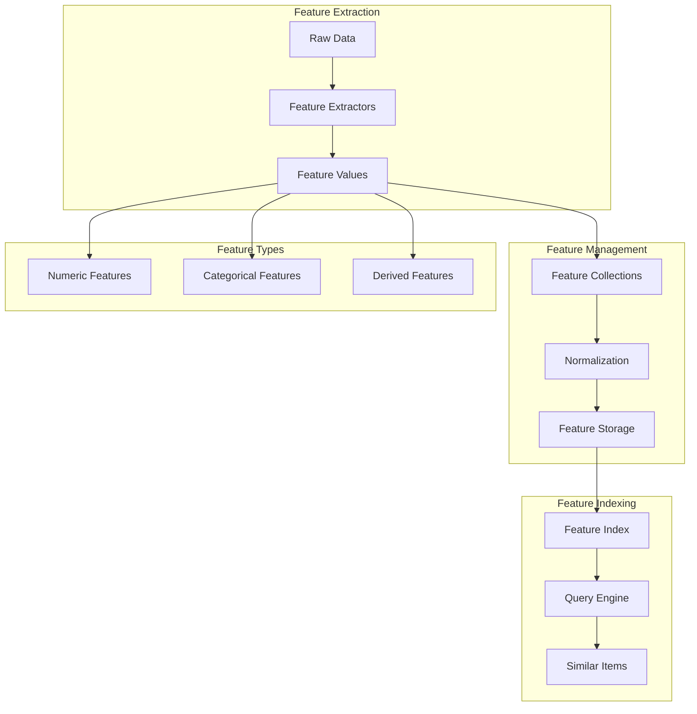
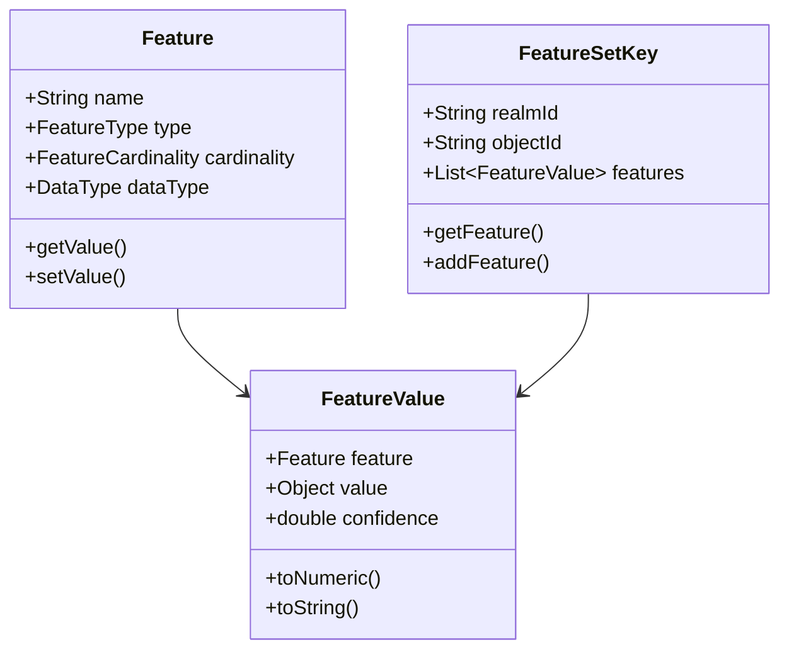
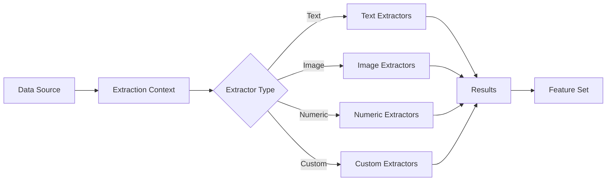
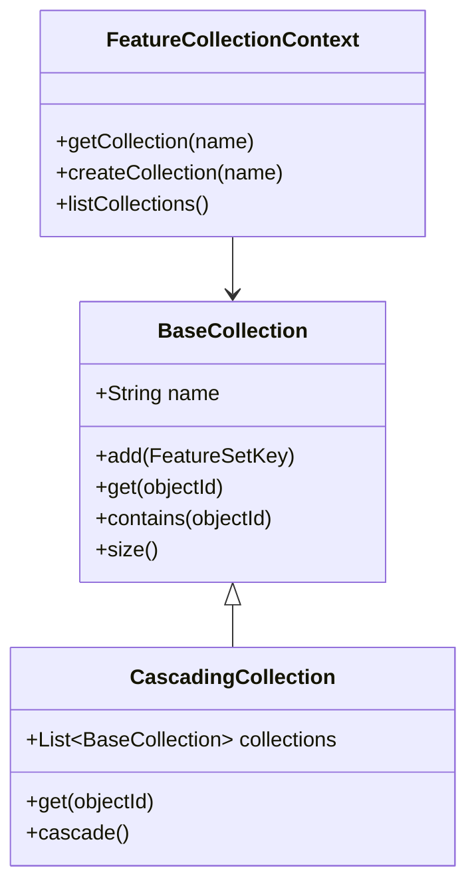
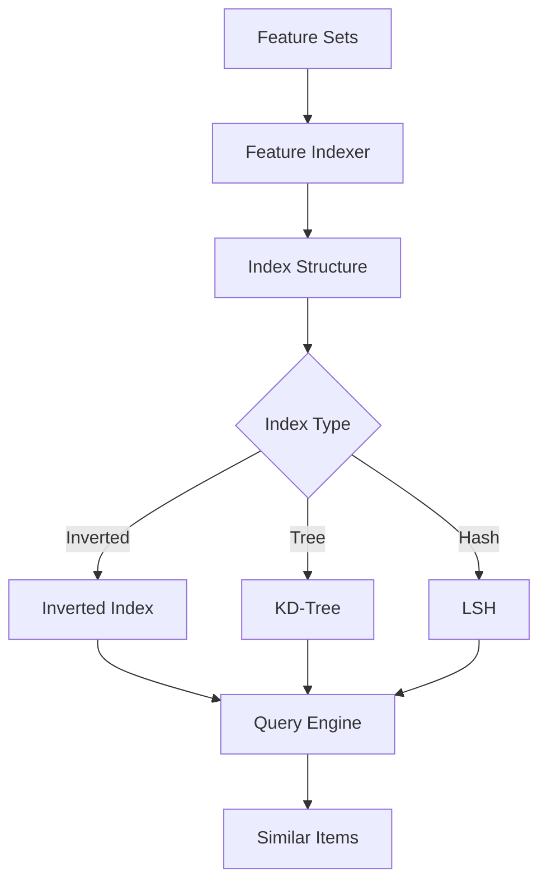

# Hitorro Features Module Documentation

## Overview

**hitorro-features** provides a comprehensive feature extraction and indexing framework for machine learning applications. It enables extracting numerical and categorical features from various data sources, managing feature collections, and building efficient feature indices for similarity search and recommendation systems.

**Version:** 3.0.0  
**Package:** `com.hitorro.features`  
**Artifact ID:** `hitorro-features`  
**Dependencies:** hitorro-util

---

## Architecture Overview



---

## Key Components

### 1. Feature Definition

Core classes for defining and representing features.



**Key Classes:**
- `Feature` - Feature definition with metadata
- `FeatureValue` - Feature instance with value
- `FeatureSetKey` - Collection of features for an object
- `FeatureType` - Feature type enumeration
- `DataType` - Data type enumeration
- `FeatureCardinality` - Single or multi-valued features

**Feature Types:**
```java
public enum FeatureType {
    NUMERIC,        // Numerical values (int, float, double)
    CATEGORICAL,    // Discrete categories
    BINARY,         // Binary features (0/1, true/false)
    TEXT,          // Text features
    TEMPORAL,      // Time-based features
    GEOSPATIAL     // Location-based features
}
```

**Example Feature Definition:**
```java
// Define numerical feature
Feature wordCount = new Feature();
wordCount.setName("word_count");
wordCount.setType(FeatureType.NUMERIC);
wordCount.setDataType(DataType.INTEGER);
wordCount.setCardinality(FeatureCardinality.SINGLE);

// Define categorical feature
Feature category = new Feature();
category.setName("category");
category.setType(FeatureType.CATEGORICAL);
category.setDataType(DataType.STRING);
category.setCardinality(FeatureCardinality.SINGLE);

// Create feature values
FeatureValue wcValue = new FeatureValue(wordCount, 1500);
FeatureValue catValue = new FeatureValue(category, "technology");

// Build feature set
FeatureSetKey featureSet = new FeatureSetKey("doc", "doc123");
featureSet.addFeature(wcValue);
featureSet.addFeature(catValue);
```

---

### 2. Feature Extraction Framework

Extensible framework for extracting features from various data sources.



**Key Classes:**
- `FeatureExtractor` - Base extractor interface
- `ExtractionContext` - Extraction context and state
- `ExtractorDefinition` - Extractor configuration
- `ExtractorManager` - Extractor registry and execution
- `Results` - Extraction results
- `MappedResults` - Named feature results

**Built-in Extractors:**
- Text features (word count, sentence count, vocabulary size)
- Statistical features (mean, median, std deviation)
- Token type counters (nouns, verbs, adjectives)
- Custom extractors via plugin architecture

**Example Extractor:**
```java
public class DocumentLengthExtractor implements FeatureExtractor {
    
    @Override
    public Results extract(ExtractionContext context) {
        String text = context.getData("text", String.class);
        
        // Extract features
        int charCount = text.length();
        int wordCount = text.split("\\s+").length;
        int sentCount = text.split("[.!?]").length;
        
        // Create results
        Results results = new Results();
        results.add("char_count", charCount);
        results.add("word_count", wordCount);
        results.add("sentence_count", sentCount);
        
        return results;
    }
    
    @Override
    public String getName() {
        return "document_length";
    }
}
```

**Using Extractors:**
```java
// Create extraction context
ExtractionContext context = new ExtractionContext();
context.setData("text", document);

// Register extractors
ExtractorManager manager = new ExtractorManager();
manager.register(new DocumentLengthExtractor());
manager.register(new WordCountExtractor());
manager.register(new TokenTypeCounterExtractor());

// Extract features
Results results = manager.extractAll(context);

// Convert to feature set
FeatureSetKey features = results.toFeatureSet("doc", docId);
```

---

### 3. Feature Collections

Manage collections of features with various storage strategies.



**Key Classes:**
- `BaseCollection` - In-memory feature collection
- `CascadingCollection` - Hierarchical collection search
- `FeatureCollectionContext` - Collection management
- `CollectionType` - Collection type enumeration

**Collection Types:**
- **In-Memory**: Fast access, limited by RAM
- **Disk-Based**: Persistent storage
- **Cascading**: Search multiple collections in order

**Example Usage:**
```java
// Create collection
FeatureCollectionContext context = new FeatureCollectionContext();
BaseCollection collection = context.createCollection("documents");

// Add features
FeatureSetKey features1 = extractFeatures(doc1);
FeatureSetKey features2 = extractFeatures(doc2);

collection.add(features1);
collection.add(features2);

// Retrieve features
FeatureSetKey retrieved = collection.get("doc123");

// Cascading search
CascadingCollection cascade = new CascadingCollection();
cascade.add(memoryCollection);
cascade.add(diskCollection);
cascade.add(archiveCollection);

FeatureSetKey result = cascade.get("doc456"); // Searches all
```

---

### 4. Feature Normalization

Normalize features for machine learning algorithms.

**Key Classes:**
- `NormalizerInterface` - Normalization interface
- `MinMaxNormalizer` - Min-max normalization
- `ZScoreNormalizer` - Z-score standardization
- `MappingFunction` - Custom mapping functions

**Normalization Methods:**
```java
// Min-max normalization [0, 1]
MinMaxNormalizer minMax = new MinMaxNormalizer();
minMax.fit(features);  // Calculate min/max
FeatureSetKey normalized = minMax.transform(featureSet);

// Z-score standardization
ZScoreNormalizer zScore = new ZScoreNormalizer();
zScore.fit(features);  // Calculate mean/std
FeatureSetKey standardized = zScore.transform(featureSet);

// Custom normalization
MappingFunction custom = new MappingFunction() {
    @Override
    public double map(double value) {
        return Math.log(value + 1);  // Log transformation
    }
};
```

---

### 5. Feature Indexing

Build efficient indices for similarity search and nearest neighbor queries.



**Key Classes:**
- `FeatureIndexer` - Build feature indices
- `FeatureIndexManager` - Index lifecycle management
- `FeatureQueryContext` - Query execution context
- `FeatureIndexReader` - Read from indices
- `PostingsFeatureReader` - Inverted index reader

**Features:**
- Inverted index for categorical features
- KD-tree for numerical features
- Locality-Sensitive Hashing (LSH) for approximate search
- Compressed storage formats
- Incremental index updates

**Building an Index:**
```java
// Create index manager
FeatureIndexManager indexManager = new FeatureIndexManager();
indexManager.setIndexPath("/data/features/index");

// Build index
FeatureIndexer indexer = indexManager.createIndexer("documents");
indexer.setCompressionEnabled(true);

// Add features
for (Document doc : documents) {
    FeatureSetKey features = extractFeatures(doc);
    indexer.add(features);
}

// Optimize and save
indexer.optimize();
indexer.save();
```

**Querying an Index:**
```java
// Open index
FeatureIndexReader reader = indexManager.openReader("documents");

// Create query
FeatureQueryContext query = new FeatureQueryContext();
query.setFeature("category", "technology");
query.setFeature("word_count", 1000, 2000);  // Range query

// Execute query
List<FeatureSetKey> results = reader.query(query, 10);

// Find similar items
FeatureSetKey sourceFeatures = reader.get("doc123");
List<FeatureSetKey> similar = reader.findSimilar(sourceFeatures, 10);

// Calculate similarity
double similarity = reader.similarity(features1, features2);
```

---

### 6. Derived Features

Create features derived from other features.

**Key Classes:**
- `DerivedFeature` - Derived feature definition
- Feature combination operations
- Aggregation functions

**Example Derived Features:**
```java
// Define derived feature: words per sentence
DerivedFeature wordsPerSentence = new DerivedFeature("words_per_sentence");
wordsPerSentence.setFormula((features) -> {
    double wordCount = features.getNumeric("word_count");
    double sentCount = features.getNumeric("sentence_count");
    return wordCount / sentCount;
});

// Categorical combination
DerivedFeature categoryTier = new DerivedFeature("category_tier");
categoryTier.setFormula((features) -> {
    String category = features.getString("category");
    int wordCount = features.getInteger("word_count");
    
    if (category.equals("premium") && wordCount > 1000) {
        return "high";
    } else if (wordCount > 500) {
        return "medium";
    } else {
        return "low";
    }
});

// Apply derived features
FeatureEngine engine = new FeatureEngine();
engine.addDerivedFeature(wordsPerSentence);
engine.addDerivedFeature(categoryTier);

FeatureSetKey enriched = engine.process(originalFeatures);
```

---

### 7. Feature I/O

Efficient serialization and deserialization of features.

**Key Classes:**
- `BaseIO` - Base I/O interface
- `IntegerIO`, `LongIO`, `FloatIO`, `DoubleIO` - Numeric I/O
- `StringIO` - String I/O
- `ByteIO` - Binary I/O
- Compression support

**Features:**
- Binary serialization for efficiency
- Compression (GZIP, LZ4)
- Streaming I/O for large datasets
- Schema versioning

**Example I/O:**
```java
// Write features to file
OutputStream out = new FileOutputStream("features.bin");
FeatureWriter writer = new FeatureWriter(out);

for (FeatureSetKey features : featureSets) {
    writer.write(features);
}

writer.close();

// Read features from file
InputStream in = new FileInputStream("features.bin");
FeatureReader reader = new FeatureReader(in);

while (reader.hasNext()) {
    FeatureSetKey features = reader.next();
    processFeatures(features);
}

reader.close();
```

---

### 8. Feature Pipeline Integration

Integration with document processing pipelines.

**Key Classes:**
- `ExtractionProcessingService` - Service integration
- `ExtractorCommand` - Command-line interface
- `FeatureSinkTarget` - Pipeline sink
- `FeatureSinkCommand` - Sink configuration

**Pipeline Example:**
```java
// Create extraction service
ExtractionProcessingService service = new ExtractionProcessingService();

// Configure extractors
service.addExtractor(new DocumentLengthExtractor());
service.addExtractor(new TokenTypeCounterExtractor());
service.addExtractor(new NERExtractor());

// Process documents in pipeline
DocProcessor processor = new DocProcessor();
processor.addStage((doc, context) -> {
    // Extract features
    Results features = service.extract(doc);
    
    // Store in feature index
    FeatureSetKey featureSet = features.toFeatureSet("doc", doc.getId());
    featureIndex.add(featureSet);
    
    context.next(doc);
});
```

---

## Common Use Cases

### 1. Document Feature Extraction

```java
public class DocumentFeatureExtractor {
    
    private ExtractorManager manager;
    private FeatureIndexManager indexManager;
    
    public void extractAndIndex(List<Document> documents) {
        // Setup extractors
        manager = new ExtractorManager();
        manager.register(new DocumentLengthExtractor());
        manager.register(new VocabularyExtractor());
        manager.register(new EntityCountExtractor());
        
        // Create index
        FeatureIndexer indexer = indexManager.createIndexer("documents");
        
        // Process documents
        for (Document doc : documents) {
            ExtractionContext context = new ExtractionContext();
            context.setData("text", doc.getText());
            context.setData("metadata", doc.getMetadata());
            
            // Extract features
            Results results = manager.extractAll(context);
            FeatureSetKey features = results.toFeatureSet("doc", doc.getId());
            
            // Index features
            indexer.add(features);
        }
        
        // Optimize index
        indexer.optimize();
        indexer.save();
    }
}
```

### 2. Similarity Search

```java
public class DocumentSimilaritySearch {
    
    public List<Document> findSimilar(String documentId, int topN) {
        // Open feature index
        FeatureIndexReader reader = indexManager.openReader("documents");
        
        // Get source document features
        FeatureSetKey sourceFeatures = reader.get(documentId);
        
        if (sourceFeatures == null) {
            return Collections.emptyList();
        }
        
        // Find similar documents
        List<FeatureSetKey> similar = reader.findSimilar(
            sourceFeatures, 
            topN,
            0.5  // Minimum similarity threshold
        );
        
        // Convert to documents
        return similar.stream()
            .map(fs -> getDocument(fs.getObjectId()))
            .collect(Collectors.toList());
    }
    
    public Map<String, Double> getSimilarityScores(String doc1Id, String doc2Id) {
        FeatureIndexReader reader = indexManager.openReader("documents");
        
        FeatureSetKey features1 = reader.get(doc1Id);
        FeatureSetKey features2 = reader.get(doc2Id);
        
        Map<String, Double> scores = new HashMap<>();
        scores.put("cosine", reader.cosineSimilarity(features1, features2));
        scores.put("euclidean", reader.euclideanDistance(features1, features2));
        scores.put("jaccard", reader.jaccardSimilarity(features1, features2));
        
        return scores;
    }
}
```

### 3. Feature-Based Classification

```java
public class FeatureBasedClassifier {
    
    private FeatureIndexManager indexManager;
    private Map<String, FeatureSetKey> classPrototypes;
    
    public void train(List<LabeledDocument> trainingData) {
        // Extract features for each class
        Map<String, List<FeatureSetKey>> classSets = new HashMap<>();
        
        for (LabeledDocument doc : trainingData) {
            FeatureSetKey features = extractFeatures(doc);
            classSets.computeIfAbsent(doc.getLabel(), k -> new ArrayList<>())
                     .add(features);
        }
        
        // Create prototype for each class (centroid)
        classPrototypes = new HashMap<>();
        for (Map.Entry<String, List<FeatureSetKey>> entry : classSets.entrySet()) {
            FeatureSetKey prototype = computeCentroid(entry.getValue());
            classPrototypes.put(entry.getKey(), prototype);
        }
    }
    
    public String classify(Document document) {
        FeatureSetKey features = extractFeatures(document);
        
        String bestClass = null;
        double bestSimilarity = -1;
        
        FeatureIndexReader reader = indexManager.openReader("prototypes");
        
        for (Map.Entry<String, FeatureSetKey> entry : classPrototypes.entrySet()) {
            double similarity = reader.cosineSimilarity(features, entry.getValue());
            
            if (similarity > bestSimilarity) {
                bestSimilarity = similarity;
                bestClass = entry.getKey();
            }
        }
        
        return bestClass;
    }
}
```

### 4. Recommendation System

```java
public class FeatureBasedRecommender {
    
    public List<String> recommend(String userId, int count) {
        // Get user's feature profile (aggregated from history)
        FeatureSetKey userProfile = getUserProfile(userId);
        
        // Get items user hasn't seen
        List<String> unseenItems = getUnseenItems(userId);
        
        // Find most similar items
        FeatureIndexReader reader = indexManager.openReader("items");
        
        List<ScoredItem> scored = new ArrayList<>();
        for (String itemId : unseenItems) {
            FeatureSetKey itemFeatures = reader.get(itemId);
            double similarity = reader.cosineSimilarity(userProfile, itemFeatures);
            scored.add(new ScoredItem(itemId, similarity));
        }
        
        // Sort by similarity and return top N
        return scored.stream()
            .sorted(Comparator.comparingDouble(ScoredItem::getScore).reversed())
            .limit(count)
            .map(ScoredItem::getItemId)
            .collect(Collectors.toList());
    }
}
```

---

## Configuration

### Feature Definitions

**Example: `config/features.json`**
```json
{
  "features": {
    "word_count": {
      "type": "numeric",
      "dataType": "integer",
      "description": "Number of words in document"
    },
    "category": {
      "type": "categorical",
      "dataType": "string",
      "description": "Document category"
    },
    "reading_level": {
      "type": "numeric",
      "dataType": "double",
      "description": "Flesch reading ease score"
    },
    "has_images": {
      "type": "binary",
      "dataType": "boolean",
      "description": "Document contains images"
    }
  }
}
```

### Extractor Configuration

**Example: `config/extractors.json`**
```json
{
  "extractors": {
    "document_length": {
      "class": "com.hitorro.features.extractors.DocumentLengthExtractor",
      "enabled": true
    },
    "vocabulary": {
      "class": "com.hitorro.features.extractors.VocabularyExtractor",
      "enabled": true,
      "params": {
        "minWordLength": 3,
        "stopWords": true
      }
    }
  }
}
```

---

## Performance Considerations

### Memory Usage
- **In-Memory Collections**: O(n) memory for n feature sets
- **Disk-Based Indices**: Minimal memory, I/O bound
- **Caching**: Configure cache size based on available RAM

### Index Size
- **Sparse Features**: Compressed storage, ~10-20 bytes per feature
- **Dense Features**: Fixed-size arrays, more efficient
- **Text Features**: Variable size, use compression

### Query Performance
- **Inverted Index**: O(k) where k = matching items
- **KD-Tree**: O(log n) for nearest neighbor
- **LSH**: O(1) approximate search

### Optimization Tips
```java
// Use batch operations
indexer.addBatch(featureSets);

// Enable compression
indexer.setCompressionEnabled(true);

// Configure cache
reader.setCacheSize(10000);

// Use parallel processing
featureSets.parallelStream()
    .map(this::extractFeatures)
    .forEach(indexer::add);
```

---

## Best Practices

1. **Feature Selection**: Choose features relevant to your task
2. **Normalization**: Always normalize before similarity computation
3. **Index Optimization**: Run optimization after bulk loads
4. **Cache Management**: Monitor and tune cache sizes
5. **Versioning**: Version your feature schemas
6. **Testing**: Validate feature extraction with unit tests

---

## Related Modules

- **hitorro-text-core** - Text feature extraction
- **hitorro-util** - Core utilities
- **hitorro-base** - Pipeline integration

---

*Last Updated: January 2026*
