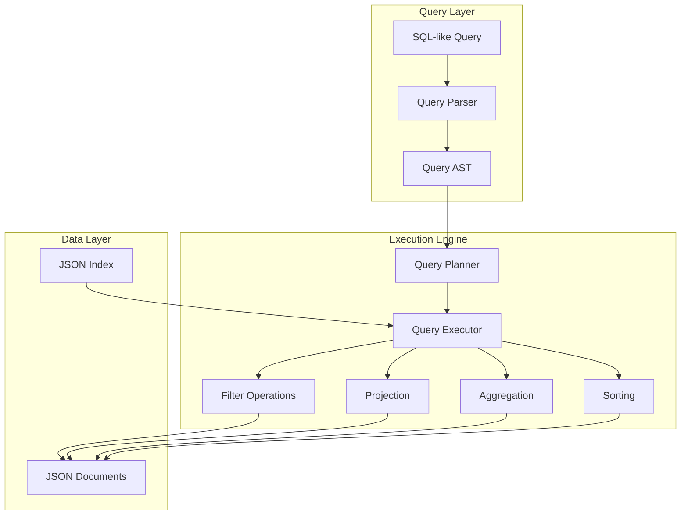

# Hitorro JSON-SQL Module Documentation

## Overview

**hitorro-jsonsql** provides SQL-like querying capabilities for JSON data structures. It enables querying, filtering, aggregating, and transforming JSON documents using a familiar SQL-inspired syntax, making it easy to work with complex nested JSON data without requiring a traditional database.

**Version:** 3.0.0  
**Package:** `com.hitorro.jsonsql`, `ht.util.jsonsql`  
**Artifact ID:** `hitorro-jsonsql`  
**Dependencies:** hitorro-util, Jackson

---

## Architecture Overview



---

## Key Features

### 1. SQL-Like Query Syntax

Familiar SQL syntax for querying JSON data:

```sql
-- Basic SELECT
SELECT name, age, email 
FROM users 
WHERE age > 18

-- Nested path access
SELECT user.profile.name, user.profile.age
FROM documents
WHERE user.profile.age BETWEEN 20 AND 30

-- Aggregation
SELECT category, COUNT(*), AVG(price)
FROM products
GROUP BY category
HAVING AVG(price) > 100

-- Sorting and limits
SELECT * 
FROM articles
ORDER BY publishDate DESC
LIMIT 10

-- JOIN operations
SELECT orders.id, users.name
FROM orders
JOIN users ON orders.userId = users.id
WHERE orders.status = 'completed'
```

---

### 2. Path Navigation

Access nested JSON properties using dot notation:

```java
// Query nested properties
String query = "SELECT user.address.city, user.address.zipCode " +
               "FROM documents " +
               "WHERE user.address.country = 'USA'";

JsonSqlQuery jsql = new JsonSqlQuery(query);
List<JsonNode> results = jsql.execute(jsonDocuments);

// Array access
query = "SELECT tags[0], tags[1] FROM articles";

// Wildcard matching
query = "SELECT user.* FROM documents";
```

---

### 3. Filtering Operations

Comprehensive filtering with SQL operators:

**Comparison Operators:**
- `=`, `!=`, `<>` - Equality and inequality
- `<`, `<=`, `>`, `>=` - Comparisons
- `BETWEEN ... AND ...` - Range queries
- `IN (...)` - List membership
- `LIKE` - Pattern matching
- `IS NULL`, `IS NOT NULL` - Null checks

**Logical Operators:**
- `AND`, `OR`, `NOT`
- Grouping with parentheses

**Examples:**
```sql
-- Equality
SELECT * FROM products WHERE category = 'electronics'

-- Range
SELECT * FROM events WHERE date BETWEEN '2024-01-01' AND '2024-12-31'

-- List membership
SELECT * FROM users WHERE role IN ('admin', 'moderator', 'editor')

-- Pattern matching
SELECT * FROM articles WHERE title LIKE '%machine learning%'

-- Null checks
SELECT * FROM contacts WHERE email IS NOT NULL

-- Complex conditions
SELECT * FROM orders 
WHERE (status = 'pending' OR status = 'processing')
  AND total > 100
  AND customer.country = 'USA'
```

---

### 4. Aggregation Functions

Standard SQL aggregation functions:

```sql
-- COUNT
SELECT COUNT(*) FROM users
SELECT category, COUNT(*) FROM products GROUP BY category

-- SUM
SELECT SUM(price) FROM orders
SELECT userId, SUM(total) FROM orders GROUP BY userId

-- AVG
SELECT AVG(rating) FROM reviews
SELECT productId, AVG(rating) FROM reviews GROUP BY productId

-- MIN/MAX
SELECT MIN(price), MAX(price) FROM products
SELECT category, MIN(price), MAX(price) FROM products GROUP BY category

-- Multiple aggregations
SELECT 
    category,
    COUNT(*) as count,
    AVG(price) as avg_price,
    MIN(price) as min_price,
    MAX(price) as max_price,
    SUM(quantity) as total_quantity
FROM products
GROUP BY category
HAVING COUNT(*) > 10
```

---

### 5. Sorting and Pagination

Sort results and limit output:

```sql
-- Single column sort
SELECT * FROM articles ORDER BY publishDate DESC

-- Multiple column sort
SELECT * FROM products 
ORDER BY category ASC, price DESC

-- Pagination
SELECT * FROM users 
ORDER BY createdDate DESC 
LIMIT 20 OFFSET 40  -- Page 3 (20 items per page)

-- Top N
SELECT * FROM products 
ORDER BY sales DESC 
LIMIT 10
```

---

### 6. Projection and Transformation

Select and transform specific fields:

```sql
-- Select specific fields
SELECT id, name, email FROM users

-- Rename fields (aliases)
SELECT 
    id as userId, 
    name as fullName,
    email as contactEmail
FROM users

-- Computed fields
SELECT 
    firstName || ' ' || lastName as fullName,
    price * quantity as total,
    UPPER(category) as categoryUpper
FROM products

-- Nested object construction
SELECT 
    id,
    {
        name: name,
        email: email,
        age: age
    } as userInfo
FROM users
```

---

### 7. JOIN Operations

Join multiple JSON collections:

```sql
-- INNER JOIN
SELECT 
    orders.id,
    users.name,
    products.name as productName
FROM orders
INNER JOIN users ON orders.userId = users.id
INNER JOIN products ON orders.productId = products.id
WHERE orders.status = 'completed'

-- LEFT JOIN
SELECT 
    users.name,
    orders.id,
    orders.total
FROM users
LEFT JOIN orders ON users.id = orders.userId

-- Multiple joins
SELECT 
    customers.name,
    orders.orderDate,
    products.name,
    orderItems.quantity
FROM customers
JOIN orders ON customers.id = orders.customerId
JOIN orderItems ON orders.id = orderItems.orderId
JOIN products ON orderItems.productId = products.id
```

---

## Usage Examples

### Basic Query Execution

```java
import com.hitorro.jsonsql.JsonSqlQuery;
import com.fasterxml.jackson.databind.JsonNode;

// Prepare JSON data
List<JsonNode> documents = loadJsonDocuments();

// Execute query
String query = "SELECT name, age FROM users WHERE age > 18 ORDER BY age DESC";
JsonSqlQuery jsql = new JsonSqlQuery(query);
List<JsonNode> results = jsql.execute(documents);

// Process results
for (JsonNode result : results) {
    String name = result.get("name").asText();
    int age = result.get("age").asInt();
    System.out.println(name + ": " + age);
}
```

### Aggregation Example

```java
// Group by and aggregate
String query = """
    SELECT 
        category,
        COUNT(*) as count,
        AVG(price) as avgPrice,
        MIN(price) as minPrice,
        MAX(price) as maxPrice
    FROM products
    GROUP BY category
    HAVING COUNT(*) > 5
    ORDER BY avgPrice DESC
    """;

JsonSqlQuery jsql = new JsonSqlQuery(query);
List<JsonNode> results = jsql.execute(products);

for (JsonNode result : results) {
    String category = result.get("category").asText();
    int count = result.get("count").asInt();
    double avgPrice = result.get("avgPrice").asDouble();
    
    System.out.printf("%s: %d items, avg price: $%.2f%n", 
                     category, count, avgPrice);
}
```

### Complex Nested Query

```java
// Query nested structures
String query = """
    SELECT 
        user.profile.name,
        user.profile.email,
        user.address.city,
        user.address.country,
        user.preferences.theme,
        COUNT(user.orders) as orderCount
    FROM documents
    WHERE user.profile.verified = true
      AND user.address.country IN ('USA', 'Canada', 'UK')
      AND user.registrationDate > '2023-01-01'
    ORDER BY user.profile.name
    """;

List<JsonNode> results = new JsonSqlQuery(query).execute(documents);
```

### JOIN Example

```java
// Join multiple collections
String query = """
    SELECT 
        o.id as orderId,
        u.name as customerName,
        u.email as customerEmail,
        p.name as productName,
        o.quantity,
        o.total
    FROM orders o
    INNER JOIN users u ON o.userId = u.id
    INNER JOIN products p ON o.productId = p.id
    WHERE o.status = 'completed'
      AND o.orderDate > '2024-01-01'
    ORDER BY o.orderDate DESC
    """;

// Prepare collections
Map<String, List<JsonNode>> collections = new HashMap<>();
collections.put("orders", orderDocuments);
collections.put("users", userDocuments);
collections.put("products", productDocuments);

JsonSqlQuery jsql = new JsonSqlQuery(query);
List<JsonNode> results = jsql.execute(collections);
```

---

## Advanced Features

### 1. Parameterized Queries

Use parameters for safe query execution:

```java
String query = """
    SELECT * FROM users 
    WHERE country = :country 
      AND age >= :minAge 
      AND status = :status
    """;

JsonSqlQuery jsql = new JsonSqlQuery(query);
jsql.setParameter("country", "USA");
jsql.setParameter("minAge", 18);
jsql.setParameter("status", "active");

List<JsonNode> results = jsql.execute(documents);
```

### 2. Subqueries

Execute subqueries in WHERE clauses:

```java
String query = """
    SELECT * FROM users
    WHERE id IN (
        SELECT userId FROM orders 
        WHERE total > 1000 
        GROUP BY userId
        HAVING COUNT(*) > 5
    )
    """;
```

### 3. Window Functions

Perform window operations:

```java
String query = """
    SELECT 
        category,
        name,
        price,
        RANK() OVER (PARTITION BY category ORDER BY price DESC) as priceRank,
        AVG(price) OVER (PARTITION BY category) as categoryAvgPrice
    FROM products
    """;
```

### 4. Array Operations

Work with JSON arrays:

```java
// Array element access
String query = "SELECT tags[0], tags[1], tags[2] FROM articles";

// Array aggregation
query = "SELECT ARRAY_AGG(category) as categories FROM products";

// Array contains
query = "SELECT * FROM articles WHERE 'technology' IN tags";

// Array length
query = "SELECT *, ARRAY_LENGTH(tags) as tagCount FROM articles";
```

---

## Query Optimization

### Indexing

Create indices for faster queries:

```java
// Create index on frequently queried fields
JsonSqlIndex index = new JsonSqlIndex();
index.addField("category");
index.addField("status");
index.addField("userId");
index.build(documents);

// Use index in queries
JsonSqlQuery query = new JsonSqlQuery("SELECT * FROM products WHERE category = 'electronics'");
query.setIndex(index);
List<JsonNode> results = query.execute(documents);
```

### Query Caching

Cache query results:

```java
// Enable query caching
JsonSqlQueryCache cache = new JsonSqlQueryCache();
cache.setMaxSize(1000);
cache.setTTL(Duration.ofMinutes(5));

JsonSqlQuery query = new JsonSqlQuery("SELECT * FROM products");
query.setCache(cache);
```

### Projection Pushdown

Select only needed fields early:

```java
// Efficient - only requested fields are processed
String query = "SELECT id, name FROM users WHERE age > 18";

// Inefficient - all fields processed then filtered
String query = "SELECT * FROM users WHERE age > 18";
```

---

## Integration with Hitorro

### DMS Integration

Query DMS content:

```java
@Service
public class ContentQueryService {
    
    @Autowired
    private DMSSessionFactory sessionFactory;
    
    public List<JsonNode> queryContent(String query) {
        DMSSession session = sessionFactory.getSession();
        
        // Get all content
        List<Content> content = session.createQuery("FROM Content", Content.class).list();
        
        // Convert to JSON
        List<JsonNode> jsonDocs = content.stream()
            .map(this::toJson)
            .collect(Collectors.toList());
        
        // Execute JSON-SQL query
        JsonSqlQuery jsql = new JsonSqlQuery(query);
        return jsql.execute(jsonDocs);
    }
    
    private JsonNode toJson(Content content) {
        ObjectMapper mapper = new ObjectMapper();
        return mapper.valueToTree(content);
    }
}
```

### REST API Integration

Expose JSON-SQL via REST:

```java
@RestController
@RequestMapping("/api/query")
public class JsonSqlController {
    
    @PostMapping("/execute")
    public ResponseEntity<List<JsonNode>> executeQuery(
            @RequestBody QueryRequest request) {
        
        try {
            JsonSqlQuery query = new JsonSqlQuery(request.getQuery());
            
            // Set parameters
            if (request.getParameters() != null) {
                request.getParameters().forEach(query::setParameter);
            }
            
            // Execute
            List<JsonNode> results = query.execute(getData(request.getCollection()));
            
            return ResponseEntity.ok(results);
        } catch (Exception e) {
            return ResponseEntity.badRequest().build();
        }
    }
}
```

---

## Performance Considerations

### Memory Usage
- **Streaming**: Use streaming for large datasets
- **Projection**: Select only needed fields
- **Pagination**: Use LIMIT and OFFSET for large result sets

### Query Optimization
- **Indices**: Create indices on frequently queried fields
- **Filter Early**: Apply WHERE clauses before JOINs
- **Avoid SELECT ***: Select specific fields

### Best Practices
```java
// Good - efficient query
String query = """
    SELECT id, name, email 
    FROM users 
    WHERE status = 'active' 
    LIMIT 100
    """;

// Bad - inefficient query
String query = """
    SELECT * 
    FROM users 
    ORDER BY id
    """;
```

---

## Limitations

- **No UPDATE/DELETE**: Read-only queries
- **Limited Joins**: Performance degrades with many joins
- **Memory Bound**: All data must fit in memory (use streaming for large datasets)
- **No Transactions**: No ACID guarantees

---

## Error Handling

```java
try {
    JsonSqlQuery query = new JsonSqlQuery(queryString);
    List<JsonNode> results = query.execute(documents);
} catch (JsonSqlSyntaxException e) {
    // Invalid SQL syntax
    System.err.println("Syntax error: " + e.getMessage());
} catch (JsonSqlExecutionException e) {
    // Execution error (e.g., field not found)
    System.err.println("Execution error: " + e.getMessage());
} catch (Exception e) {
    // Other errors
    System.err.println("Error: " + e.getMessage());
}
```

---

## Related Modules

- **hitorro-util** - Core utilities
- **hitorro-basedms** - DMS integration
- **hitorro-text-core** - Text search integration

---

*Last Updated: January 2026*
