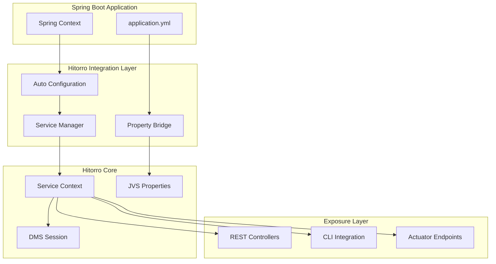
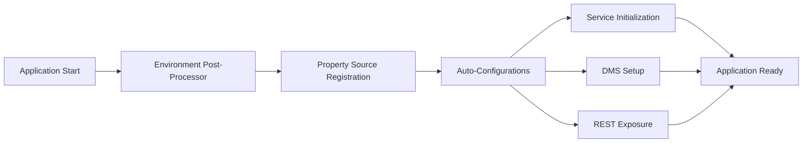
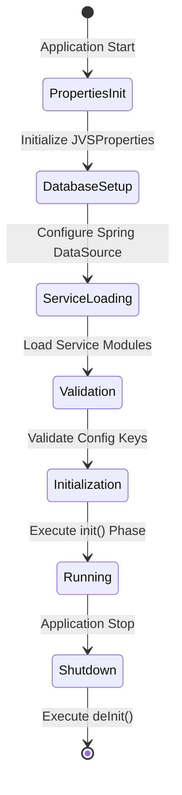
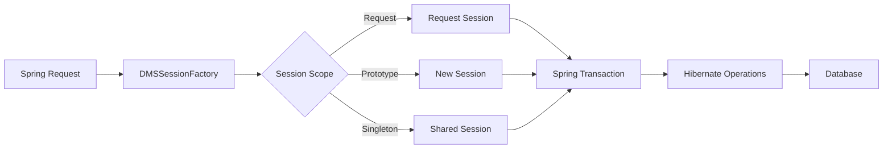
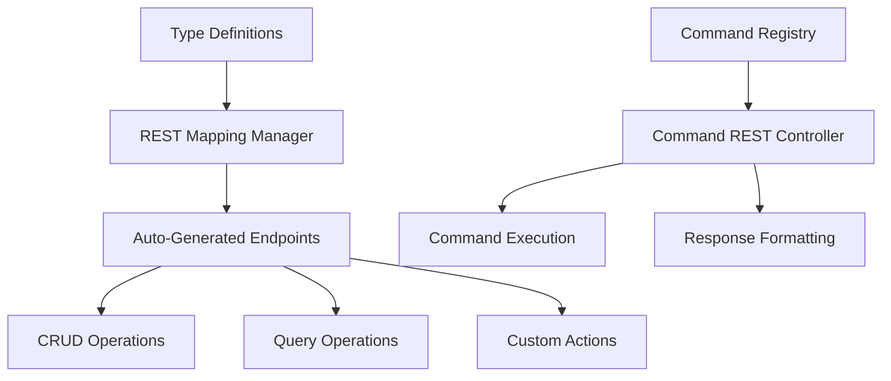
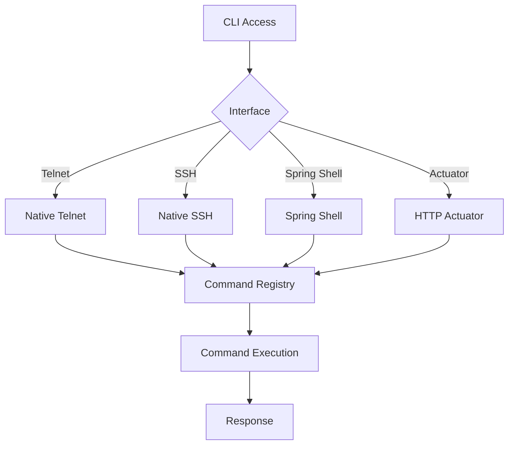

# Hitorro Spring Boot Integration Module

## Overview

**hitorro-spring-boot** provides seamless integration between the Hitorro platform and Spring Boot applications. It auto-configures Hitorro services, bridges property systems, exposes REST endpoints, and manages the complete lifecycle of Hitorro components within Spring's dependency injection container.

**Version:** 1.0.0  
**Package:** `com.hitorro.spring.autoconfigure`  
**Artifact ID:** `hitorro-spring-boot-starter`  
**Dependencies:** Spring Boot 3.x, hitorro-util, hitorro-basedms

---

## Architecture Overview



---

## Key Components

### 1. Auto-Configuration System

Spring Boot auto-configuration that initializes Hitorro components automatically.



**Key Classes:**
- `HitorroEnvironmentPostProcessor` - Sets up HT_BIN and HT_HOME early
- `HitorroServiceAutoConfiguration` - Service framework integration
- `DMSAutoConfiguration` - DMS and Hibernate setup
- `HitorroRestAutoConfiguration` - REST endpoint exposure
- `JsonTypeSystemAutoConfiguration` - JVS integration
- `HitorroCliAutoConfiguration` - CLI system setup
- `TransformerAutoConfiguration` - Content transformation

**Auto-Configuration Order:**
1. Environment setup (HT_BIN, HT_HOME)
2. Property source registration
3. Service context initialization
4. Hibernate and DMS setup
5. Type system loading
6. REST endpoint mapping
7. CLI startup

---

### 2. Property System Integration

Bidirectional property integration between Spring Boot and Hitorro.

```mermaid
graph TD
    A[application.yml] --> B[HitorroProperties]
    B --> C[Property Conversion]
    C --> D[JVSProperties]
    
    E[Hitorro Config Files] --> F[JVS Property Loaders]
    F --> D
    
    D --> G[Property Merging]
    G --> H[Unified Property System]
    
    H --> I[@Value Injection]
    H --> J[JVS Property Access]
```

**Key Classes:**
- `HitorroProperties` - Spring Boot configuration properties
- `HitorroPropertySource` - Bridge to JVS properties
- `ServiceContextManager` - Property initialization and merging

**Configuration Hierarchy (highest to lowest priority):**
1. Spring Boot `application.yml` / `application.properties`
2. System properties (-D flags)
3. `${HT_BIN}/config` directory
4. `${HT_HOME}/config` directory

**Example Configuration:**
```yaml
hitorro:
  enabled: true
  ht-bin: /opt/hitorro
  ht-home: /var/lib/hitorro
  
  services:
    enabled: true
    db-init: true
    load:
      - com.hitorro.basedms.db.HibernateService
      - com.hitorro.base.objects.BaseDMSService
  
  dms:
    enabled: true
    session-scope: request  # request, prototype, singleton
    transaction-mode: spring-managed
  
  jvs:
    enabled: true
    nlp-enabled: false
  
  rest:
    enabled: true
    base-path: /api/rest
    expose-internal: false
  
  cli:
    native-enabled: true
    telnet-port: 9000
    ssh-port: 9022
    spring-shell-enabled: false
    actuator-enabled: true
  
  transformer:
    enabled: true
    rest:
      enabled: true
  
  test:
    enabled: true
    run-on-startup: false
```

---

### 3. Service Framework Integration

Manages Hitorro service lifecycle within Spring Boot.

**Key Classes:**
- `ServiceContextManager` - Service lifecycle orchestration
- `HitorroServiceFactory` - Service access via Spring DI
- `ServiceExplorerController` - REST API for service exploration

**Service Lifecycle:**


**Usage in Spring Beans:**
```java
@Service
public class MyService {
    
    @Autowired
    private HitorroServiceFactory serviceFactory;
    
    @Autowired
    private ServiceContext serviceContext;
    
    public void useHitorroServices() {
        // Get service by class
        BasicService basic = serviceFactory.getService(BasicService.class);
        
        // Get service by short name
        Object service = serviceFactory.getService("hibernate");
        
        // Check availability
        if (serviceFactory.isServiceAvailable(BasicService.class)) {
            // Use service
        }
        
        // List all services
        List<ServiceWrapper> services = serviceContext.getServices();
    }
}
```

---

### 4. DMS Integration

Complete DMS integration with Spring transaction management.



**Key Classes:**
- `DMSAutoConfiguration` - DMS setup and configuration
- `DMSSessionFactory` - Session creation and management
- `SpringDatabaseConfigProvider` - Bridge Spring DataSource to Hitorro
- `HibernateIntegratorRegistrar` - Register Hibernate integrators

**Features:**
- **Automatic Hibernate Setup**: Uses Spring's DataSource configuration
- **Session Scope Control**: Request, prototype, or singleton sessions
- **Transaction Integration**: Spring `@Transactional` works with DMS
- **Entity Auto-Registration**: Discovers entities from all services
- **Schema Management**: Controlled via `spring.jpa.hibernate.ddl-auto`

**Example Usage:**
```java
@Service
@Transactional
public class ContentService {
    
    @Autowired
    private DMSSessionFactory sessionFactory;
    
    public Content createContent(String name, byte[] data) {
        DMSSession session = sessionFactory.getSession();
        
        Content content = new Content();
        content.setName(name);
        content.setContent(data);
        content.setStore(session.getDefaultStore());
        
        session.save(content);
        return content;
    }
    
    public Content getContent(Long id) {
        DMSSession session = sessionFactory.getSession();
        return session.get(Content.class, id);
    }
}
```

---

### 5. REST Endpoint Exposure

Automatic REST API generation for Hitorro objects and commands.



**Key Classes:**
- `HitorroRestAutoConfiguration` - REST setup
- `HitorroRestController` - Main REST controller for objects
- `HitorroRestMappingManager` - Endpoint discovery and mapping
- `CommandRestController` - Command execution via REST

**Auto-Generated Endpoints:**

**Object Operations:**
```
GET    /api/rest/{typeName}              # Query objects
POST   /api/rest/{typeName}              # Create object
GET    /api/rest/{typeName}/{id}         # Get by ID
PUT    /api/rest/{typeName}/{id}         # Update object
DELETE /api/rest/{typeName}/{id}         # Delete object
```

**Content Operations:**
```
GET    /api/rest/content/{id}            # Get content metadata
GET    /api/rest/content/{id}/download   # Download content file
POST   /api/rest/content/{id}/upload     # Upload file
GET    /api/rest/content/{id}/versions   # List versions
```

**Folder Operations:**
```
GET    /api/rest/folder/{id}             # Get folder
GET    /api/rest/folder/{id}/children    # List children
GET    /api/rest/folder/{id}/tree        # Get hierarchy
POST   /api/rest/folder                  # Create folder
PUT    /api/rest/folder/{id}             # Update folder
DELETE /api/rest/folder/{id}             # Delete folder
```

**Command Execution:**
```
POST   /api/commands/{commandName}       # Execute command
GET    /api/commands                     # List commands
GET    /api/commands/{commandName}       # Command details
```

**Example REST Calls:**
```bash
# Create content
curl -X POST http://localhost:8080/api/rest/content \
  -H "Content-Type: application/json" \
  -d '{
    "name": "document.pdf",
    "mimeType": "application/pdf",
    "folder": {"id": 1}
  }'

# Query with filters
curl "http://localhost:8080/api/rest/content?mimeType=application/pdf&limit=10"

# Execute command
curl -X POST http://localhost:8080/api/commands/stats \
  -H "Content-Type: application/json" \
  -d '{"format": "json"}'

# Get folder hierarchy
curl http://localhost:8080/api/rest/folder/1/tree
```

---

### 6. CLI Integration

Multiple CLI options for command execution and system interaction.



**Key Classes:**
- `HitorroCliAutoConfiguration` - CLI setup
- `NativeCliManager` - Telnet/SSH management
- `SpringShellCommandAdapter` - Spring Shell integration
- `CommandActuatorEndpoint` - Actuator endpoint
- `CommandEndpointController` - Web-based command execution

**CLI Options:**

**1. Native Telnet CLI:**
```bash
telnet localhost 9000
# Interactive command shell with history and tab completion
```

**2. Native SSH CLI:**
```bash
ssh -p 9022 user@localhost
# Secure CLI access with authentication
```

**3. Spring Shell (Optional):**
```bash
# Runs in the same JVM, integrated with Spring Shell
spring-shell> hitorro:stats
```

**4. Actuator Endpoint:**
```bash
# HTTP-based command execution
curl http://localhost:8080/actuator/hitorro-commands \
  -H "Content-Type: application/json" \
  -d '{"command": "stats", "args": {"format": "json"}}'
```

**Configuration:**
```yaml
hitorro:
  cli:
    native-enabled: true       # Enable Telnet/SSH
    telnet-port: 9000
    ssh-port: 9022
    spring-shell-enabled: false  # Enable Spring Shell integration
    actuator-enabled: true     # Enable Actuator endpoint
```

---

### 7. Content Transformation Integration

REST API for content transformations and renditions.

**Key Classes:**
- `TransformerAutoConfiguration` - Transformer setup
- `RenditionTransformationController` - Transformation REST API
- `DocumentContentController` - Content management API

**Transformation Endpoints:**
```
POST   /api/transform/{contentId}         # Request transformation
GET    /api/transform/{contentId}/status  # Check status
GET    /api/transform/{contentId}/renditions  # List renditions
GET    /api/rendition/{renditionId}       # Get rendition
DELETE /api/rendition/{renditionId}       # Delete rendition
```

**Example Transformation:**
```bash
# Request thumbnail generation
curl -X POST http://localhost:8080/api/transform/123 \
  -H "Content-Type: application/json" \
  -d '{
    "method": "image-thumbnail",
    "parameters": {
      "width": 200,
      "height": 200,
      "quality": 85
    }
  }'

# Check transformation status
curl http://localhost:8080/api/transform/123/status

# Get rendition
curl http://localhost:8080/api/rendition/456 -o thumbnail.jpg
```

---

### 8. Integration Events

Automatic data loading on application startup.

**Key Classes:**
- `IntegrationEventsAutoConfiguration` - Event configuration
- `IntegrationEventsManager` - Manual event triggering

**Features:**
- CSV-based data loading
- Event sequencing
- Manual or automatic execution
- Error handling and logging

**Configuration:**
```yaml
hitorro:
  integration:
    enabled: true
    run-on-startup: false  # Set to true for auto-load
  
  hitorro-properties:
    integration:
      initdblist: "users,roles,permissions"
      events:
        users:
          file: "classpath:data/users.csv"
          consumer: "com.hitorro.basedms.csvconsumers.UserCSVConsumer"
```

**Manual Triggering:**
```java
@Service
public class DataLoader {
    
    @Autowired
    private IntegrationEventsManager eventsManager;
    
    public void loadInitialData() {
        // Load all configured events
        eventsManager.runAllEvents();
        
        // Or load specific event
        eventsManager.runEvent("users");
    }
}
```

---

### 9. File System Integration

Multiple file system backends with unified API.

**Key Classes:**
- `FileSystemAutoConfiguration` - File system setup
- `FileSystemProperties` - Configuration

**Supported Backends:**
- **Local**: Traditional file system
- **S3**: AWS S3, MinIO, Wasabi, DigitalOcean Spaces
- **JAR**: Access files inside JAR archives

**Configuration:**
```yaml
hitorro:
  filesystem:
    local:
      enabled: true
      base-path: ./data/files
    
    s3:
      enabled: true
      endpoint: https://s3.amazonaws.com
      bucket: my-bucket
      access-key: ${AWS_ACCESS_KEY}
      secret-key: ${AWS_SECRET_KEY}
      region: us-east-1
      ssl-enabled: true
    
    jar:
      enabled: false
      jar-path: ./resources.jar
```

---

## Spring Boot Starter

The `hitorro-spring-boot-starter` provides a single dependency that brings in all necessary components.

**Maven:**
```xml
<dependency>
    <groupId>com.hitorro</groupId>
    <artifactId>hitorro-spring-boot-starter</artifactId>
    <version>1.0.0</version>
</dependency>
```

**Gradle:**
```gradle
implementation 'com.hitorro:hitorro-spring-boot-starter:1.0.0'
```

**What's Included:**
- hitorro-spring-boot-autoconfigure
- hitorro-util
- hitorro-base
- hitorro-basedms
- Spring Boot starters (web, data-jpa, actuator)

---

## Configuration Reference

### Complete application.yml Example

```yaml
server:
  port: 8080

spring:
  application:
    name: my-hitorro-app
  
  datasource:
    url: jdbc:h2:file:./data/db
    driver-class-name: org.h2.Driver
    username: sa
    password: secret
  
  jpa:
    hibernate:
      ddl-auto: update
    show-sql: false

hitorro:
  enabled: true
  application-name: MyApp
  ht-bin: /opt/hitorro
  ht-home: /var/lib/hitorro
  
  services:
    enabled: true
    db-init: true
    load:
      - com.hitorro.basedms.db.HibernateService
      - com.hitorro.base.objects.BaseDMSService
      - com.hitorro.basedms.transformer.TransformerService
  
  dms:
    enabled: true
    session-scope: request
    transaction-mode: spring-managed
    db-init:
      enabled: false
  
  jvs:
    enabled: true
    nlp-enabled: false
  
  rest:
    enabled: true
    base-path: /api/rest
    expose-internal: false
  
  commands:
    rest:
      enabled: true
      base-path: /api/commands
  
  cli:
    native-enabled: true
    telnet-port: 9000
    ssh-port: 9022
    spring-shell-enabled: false
    actuator-enabled: true
  
  transformer:
    enabled: true
    rest:
      enabled: true
  
  integration:
    enabled: true
    run-on-startup: false
  
  filesystem:
    local:
      enabled: true
      base-path: ./data/files
  
  test:
    enabled: true
    run-on-startup: false

management:
  endpoints:
    web:
      exposure:
        include: health,info,metrics,hitorro-commands

logging:
  level:
    root: INFO
    com.hitorro: DEBUG
```

---

## Best Practices

### 1. Property Management
- Use `application.yml` for Spring-specific configuration
- Use Hitorro config files for complex type definitions
- Leverage environment variables for secrets
- Override with system properties for testing

### 2. Service Loading
- Load services in dependency order
- Use `db-init: true` for development
- Use `db-init: false` with Flyway/Liquibase in production

### 3. DMS Sessions
- Use `request` scope for web applications
- Use `prototype` for multi-tenant applications
- Use `singleton` only for read-only operations

### 4. Transaction Management
- Use Spring's `@Transactional` for consistency
- Set `transaction-mode: spring-managed`
- Be aware of transaction boundaries

### 5. REST Security
- Add Spring Security for authentication
- Use `expose-internal: false` in production
- Implement proper authorization checks

### 6. Performance
- Enable Hibernate second-level cache
- Configure connection pools appropriately
- Use async transformation processing

---

## Common Integration Patterns

### Pattern 1: REST API with DMS

```java
@RestController
@RequestMapping("/api/documents")
public class DocumentController {
    
    @Autowired
    private DMSSessionFactory sessionFactory;
    
    @PostMapping
    @Transactional
    public ResponseEntity<Content> upload(
            @RequestParam("file") MultipartFile file,
            @RequestParam("name") String name) {
        
        DMSSession session = sessionFactory.getSession();
        
        Content content = new Content();
        content.setName(name);
        content.setMimeType(file.getContentType());
        content.setContent(file.getBytes());
        
        session.save(content);
        
        return ResponseEntity.ok(content);
    }
    
    @GetMapping("/{id}")
    public ResponseEntity<byte[]> download(@PathVariable Long id) {
        DMSSession session = sessionFactory.getSession();
        Content content = session.get(Content.class, id);
        
        if (content == null) {
            return ResponseEntity.notFound().build();
        }
        
        return ResponseEntity.ok()
            .contentType(MediaType.parseMediaType(content.getMimeType()))
            .body(content.getContent());
    }
}
```

### Pattern 2: Background Processing

```java
@Service
public class DocumentProcessor {
    
    @Autowired
    private DMSSessionFactory sessionFactory;
    
    @Autowired
    private TransformerService transformer;
    
    @Async
    @Transactional(propagation = Propagation.REQUIRES_NEW)
    public CompletableFuture<Void> processDocument(Long contentId) {
        DMSSession session = sessionFactory.getSession();
        Content content = session.get(Content.class, contentId);
        
        // Generate thumbnail
        TransformationRequest request = new TransformationRequest();
        request.setMethod("image-thumbnail");
        Content thumbnail = transformer.transform(content, request);
        
        content.addRendition("thumbnail", thumbnail);
        session.save(content);
        
        return CompletableFuture.completedFuture(null);
    }
}
```

### Pattern 3: Custom Command Exposure

```java
@Component
@DebugCommandArg(
    cmd = "custom-report",
    argtype = "type=monthly|yearly",
    description = "Generate custom report",
    helpText = "Usage: custom-report type=monthly"
)
public class CustomReportCommand extends Command {
    
    @Autowired
    private DMSSessionFactory sessionFactory;
    
    @Override
    public int execute(Response response, JsonNode args) {
        String type = args.get("type").asText("monthly");
        
        DMSSession session = sessionFactory.getSession();
        
        // Generate report
        List<Content> content = session.createQuery(
            "FROM Content WHERE created >= :startDate",
            Content.class)
            .setParameter("startDate", getStartDate(type))
            .list();
        
        // Output report
        response.println("Report Type: " + type);
        response.println("Total Documents: " + content.size());
        
        return 0;
    }
}
```

---

## Troubleshooting

### Common Issues

**Services not initializing:**
- Check service dependencies are loaded in order
- Verify HT_BIN and HT_HOME are set correctly
- Review `hitorro.services.load` configuration
- Check logs for detailed errors

**Property not found:**
- Ensure config files exist in correct locations
- Verify property key spelling
- Check property source priority
- Use `@Value("${hitorro.property:default}")` for safety

**DMS session errors:**
- Verify `@Transactional` is present
- Check session scope configuration
- Ensure Hibernate is properly initialized
- Review database connection settings

**REST endpoints not working:**
- Confirm `hitorro.rest.enabled: true`
- Check base path configuration
- Verify security configuration
- Review controller mappings in logs

**CLI not accessible:**
- Check port configuration and firewall
- Verify service is running
- Test with telnet/ssh client
- Review CLI configuration logs

---

## Migration from Standalone Hitorro

### Step 1: Update Dependencies
```xml
<!-- Remove standalone dependencies -->
<!-- Add Spring Boot starter -->
<dependency>
    <groupId>com.hitorro</groupId>
    <artifactId>hitorro-spring-boot-starter</artifactId>
    <version>1.0.0</version>
</dependency>
```

### Step 2: Convert Configuration
Move properties from Hitorro config files to `application.yml`.

### Step 3: Update Service Initialization
Remove manual ServiceContext initialization:
```java
// OLD: Manual initialization
ServiceContext sc = ServiceContext.getSC();
sc.addModule(...);
sc.init();

// NEW: Auto-configured by Spring
// Just use @Autowired services
```

### Step 4: Update DMS Access
```java
// OLD: Manual session management
DMSSession session = DMSSession.getSession();
try {
    session.begin();
    // operations
    session.commit();
} finally {
    session.close();
}

// NEW: Managed by Spring
@Autowired
private DMSSessionFactory sessionFactory;

@Transactional
public void operation() {
    DMSSession session = sessionFactory.getSession();
    // operations - auto-committed
}
```

---

## Performance Tuning

### JVM Settings
```bash
java -Xmx4g -Xms1g \
     -XX:+UseG1GC \
     -XX:MaxGCPauseMillis=200 \
     -jar myapp.jar
```

### Hibernate Optimization
```yaml
spring:
  jpa:
    properties:
      hibernate:
        jdbc:
          batch_size: 25
          fetch_size: 100
        cache:
          use_second_level_cache: true
          region:
            factory_class: org.hibernate.cache.jcache.JCacheRegionFactory
        generate_statistics: false
```

### Connection Pool
```yaml
spring:
  datasource:
    hikari:
      maximum-pool-size: 20
      minimum-idle: 5
      connection-timeout: 30000
      idle-timeout: 600000
      max-lifetime: 1800000
```

---

## Related Documentation

- [Spring Boot Reference](https://docs.spring.io/spring-boot/docs/current/reference/html/)
- [Hitorro Service Framework](MODULE_HITORRO_UTIL.md#1-service-startup-framework)
- [Hitorro DMS](MODULE_HITORRO_BASEDMS.md)
- [REST API Documentation](REST_INTEGRATION.md)

---

## Version Compatibility

| Spring Boot | Hitorro | Java |
|-------------|---------|------|
| 3.2.x | 3.0.0 | 21+ |
| 3.1.x | 3.0.0 | 17+ |
| 3.0.x | 3.0.0 | 17+ |

---

*Last Updated: January 2026*
