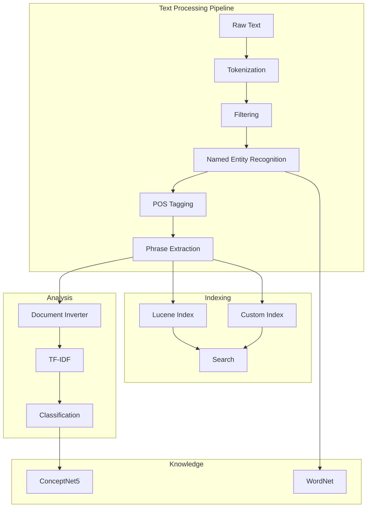
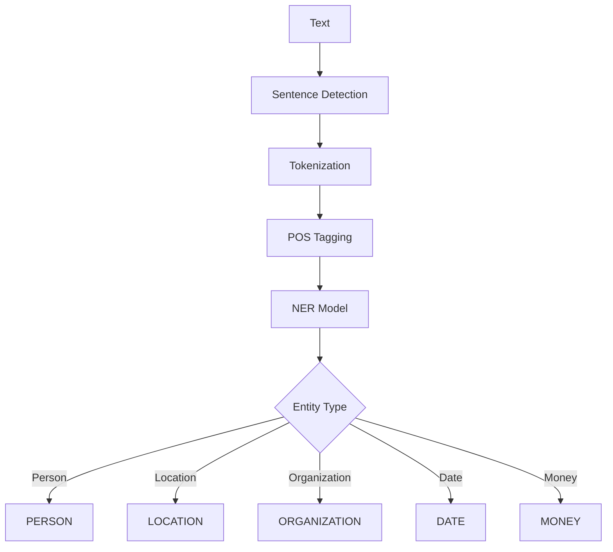
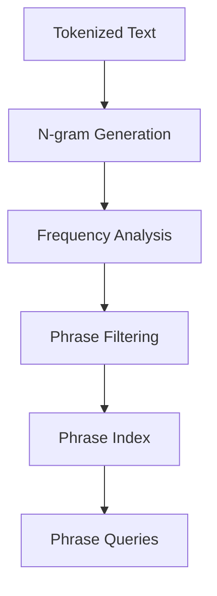
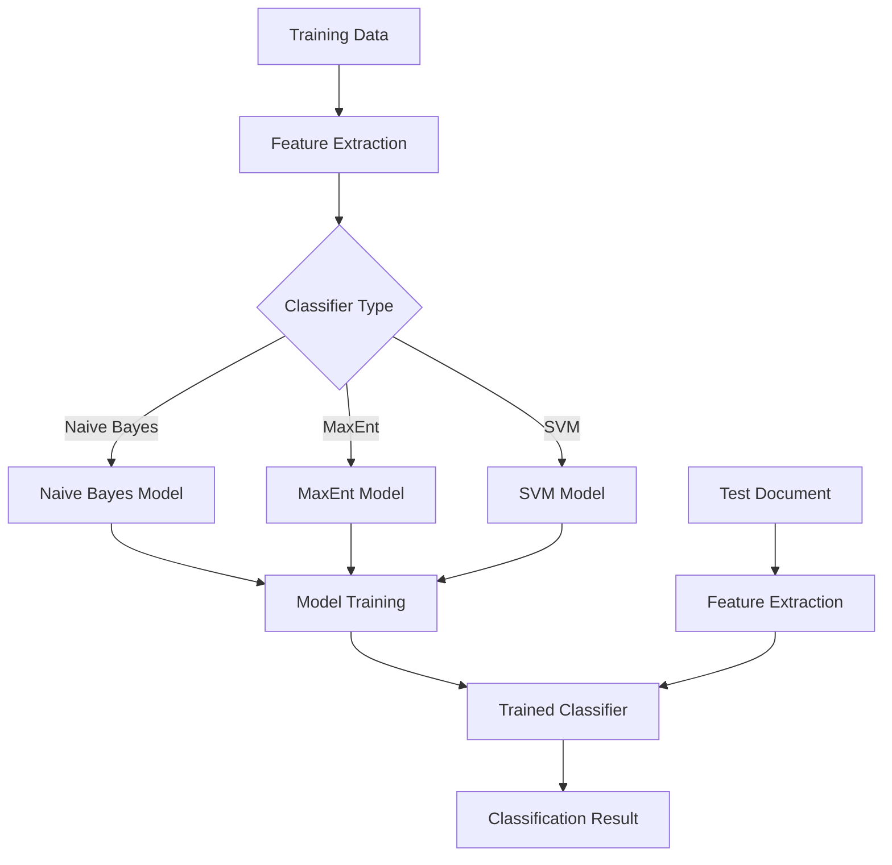
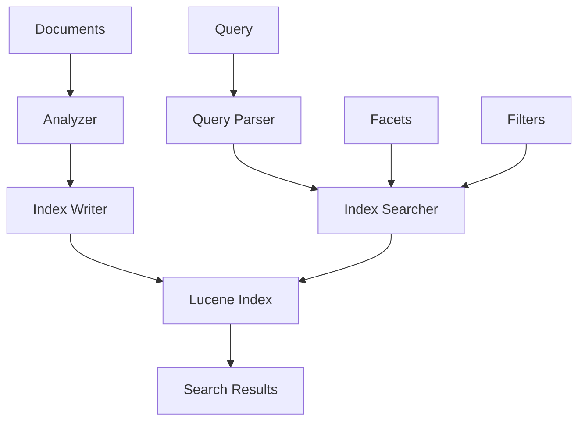
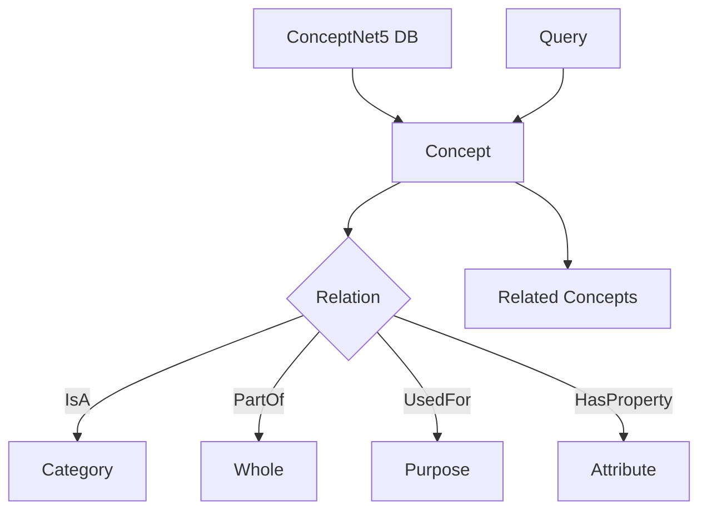
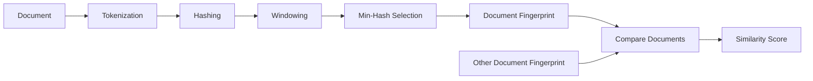

# Hitorro-Text-Core Module Documentation

## Overview

**hitorro-text-core** is a comprehensive natural language processing (NLP) and text analytics library. It provides advanced text processing capabilities including document classification, entity recognition, phrase extraction, text indexing, and integration with external NLP tools. The module supports both Apache Lucene-based indexing and custom inverted index implementations.

**Version:** 3.0.0  
**Package:** `com.hitorro.basetext`, `com.hitorro.language`, `com.hitorro.obj.core`  
**Artifact ID:** `hitorro-text-core`  
**Dependencies:** hitorro-util, hitorro-base, Apache Lucene, OpenNLP

---

## Architecture Overview



---

## Key Components

### 1. Text Processing & Tokenization

Advanced text tokenization and filtering with Lucene integration.


**Key Classes:**
- `TokenizerEnum` - Tokenizer configurations
- `FilterEnum` - Filter configurations
- `InterceptorTokenFilter` - Custom token filtering
- `NERMarkupTokenFilter` - NER integration in tokenization

**Tokenizer Types:**
- Standard tokenizer (word boundaries)
- Whitespace tokenizer
- Letter tokenizer
- N-gram tokenizer
- Edge n-gram tokenizer

**Filter Types:**
- Stop word removal
- Lowercase conversion
- Stemming (Porter, Snowball)
- Length filtering
- Pattern-based filtering
- Synonym expansion

**Example:**
```java
// Create analyzer
Analyzer analyzer = new StandardAnalyzer();

// Tokenize text
TokenStream stream = analyzer.tokenStream("content", text);
CharTermAttribute termAttr = stream.getAttribute(CharTermAttribute.class);

stream.reset();
while (stream.incrementToken()) {
    String term = termAttr.toString();
    System.out.println(term);
}
stream.close();
```

---

### 2. Named Entity Recognition (NER)

Identify and classify named entities in text.



**Key Classes:**
- `NamedEntityFilter` - Entity extraction filter
- `NamedEntityMarkupFilter` - Entity markup in text
- `NERMarkup` - Entity representation
- `NERJacksonMarkup` - JSON serialization

**Supported Entity Types:**
- Person names
- Organizations
- Locations (cities, countries, regions)
- Dates and times
- Monetary amounts
- Percentages
- Email addresses
- URLs

**OpenNLP Integration:**
```java
// Load NER models
Models.init();

// Extract entities
List<NERMarkup> entities = NamedEntityFilter.extractEntities(text);

for (NERMarkup entity : entities) {
    System.out.println(entity.getType() + ": " + entity.getText());
}

// Output:
// PERSON: John Smith
// ORGANIZATION: Microsoft Corporation
// LOCATION: Seattle
// DATE: January 15, 2024
```

---

### 3. Sentence Detection & POS Tagging

Natural language processing for sentence boundaries and part-of-speech tagging.

**Key Classes:**
- `Text2Sentences` - Sentence segmentation
- `String2SegmentedSentences` - Advanced segmentation
- `String2POSSentences` - POS tagging
- `ExtractPOS` - POS extraction

**Features:**
- Multi-language sentence detection
- Acronym handling
- Quote and parenthesis handling
- POS tag extraction
- Dependency parsing support

**Example:**
```java
// Detect sentences
List<String> sentences = Text2Sentences.segment(text);

for (String sentence : sentences) {
    System.out.println("Sentence: " + sentence);
    
    // POS tagging
    String[] words = sentence.split("\\s+");
    String[] tags = Models.getPosTagger().tag(words);
    
    for (int i = 0; i < words.length; i++) {
        System.out.println(words[i] + " -> " + tags[i]);
    }
}

// Output:
// Sentence: The quick brown fox jumps.
// The -> DT
// quick -> JJ
// brown -> JJ
// fox -> NN
// jumps -> VBZ
```

---

### 4. Phrase Extraction

Extract meaningful phrases and n-grams from text.



**Key Classes:**
- `PhraseIndex` - Phrase indexing
- `PhraseEmitter` - Phrase generation
- `FPPhraseEmitter` - Frequent pattern phrases
- `PhraseElement` - Phrase representation
- `PhraseFilter` - Phrase filtering

**Features:**
- N-gram extraction (bigrams, trigrams, etc.)
- Frequent pattern mining
- Phrase frequency analysis
- Collocation detection
- Phrase-based search

**Example:**
```java
// Create phrase index
PhraseIndex index = new PhraseIndex();

// Add documents
index.addDocument("doc1", "machine learning algorithms");
index.addDocument("doc2", "deep learning neural networks");
index.addDocument("doc3", "machine learning and deep learning");

// Extract phrases
List<PhraseElement> phrases = index.getFrequentPhrases(2, 3);

for (PhraseElement phrase : phrases) {
    System.out.println(phrase.getPhrase() + ": " + phrase.getFrequency());
}

// Output:
// machine learning: 2
// deep learning: 2
// learning algorithms: 1
```

---

### 5. Document Inverter & TF-IDF

Create inverted indices for document analysis and similarity computation.


**Key Classes:**
- `DocumentInverter` - Build inverted index
- `TermTuple` - Term representation
- `TermCollection` - Term collection management
- `TFIDFTermMeasureFunction` - TF-IDF computation
- `DocumentCollection` - Document collection

**Features:**
- In-memory inverted index
- TF-IDF weighting
- Cosine similarity
- Document clustering
- Term vector generation

**Example:**
```java
// Create document collection
DocumentCollection collection = new DocumentCollection();

// Add documents
collection.addDocument("doc1", "machine learning is great");
collection.addDocument("doc2", "deep learning is powerful");
collection.addDocument("doc3", "machine learning algorithms");

// Build inverted index
DocumentInverter inverter = new DocumentInverter(collection);
inverter.invert();

// Calculate TF-IDF
TFIDFTermMeasureFunction tfidf = new TFIDFTermMeasureFunction();
Map<String, Double> scores = tfidf.calculate(inverter, "doc1");

for (Map.Entry<String, Double> entry : scores.entrySet()) {
    System.out.println(entry.getKey() + ": " + entry.getValue());
}

// Compute similarity
double similarity = inverter.cosineSimilarity("doc1", "doc3");
System.out.println("Similarity: " + similarity);
```

---

### 6. Text Classification

Machine learning-based text classification using various algorithms.



**Key Classes:**
- `BaseClassifier` - Base classifier interface
- `ClassifierDoc` - Document representation
- `AnswerClassifierMapper` - Classification mapping
- `TermSpaceGeneratorVisitor` - Feature space generation
- `LogicalOpClassifyingTermCollection` - Logical classification

**Supported Algorithms:**
- Naive Bayes
- Maximum Entropy (MaxEnt)
- Support Vector Machines (SVM)
- Decision Trees
- Ensemble methods

**Example:**
```java
// Prepare training data
List<ClassifierDoc> trainingDocs = new ArrayList<>();
trainingDocs.add(new ClassifierDoc("sports", "football soccer game"));
trainingDocs.add(new ClassifierDoc("sports", "basketball team player"));
trainingDocs.add(new ClassifierDoc("tech", "computer software programming"));
trainingDocs.add(new ClassifierDoc("tech", "algorithm data structure"));

// Train classifier
BaseClassifier classifier = new NaiveBayesClassifier();
classifier.train(trainingDocs);

// Classify new document
String category = classifier.classify("machine learning algorithm");
System.out.println("Category: " + category); // Output: tech

// Get probabilities
Map<String, Double> probs = classifier.classifyWithProbabilities(
    "machine learning algorithm");
for (Map.Entry<String, Double> entry : probs.entrySet()) {
    System.out.println(entry.getKey() + ": " + entry.getValue());
}
```

---

### 7. Lucene Integration

Full-featured search indexing and querying with Apache Lucene.



**Key Classes:**
- `TypeFieldsAnalyzerCache` - Analyzer caching
- `AllTypesAnalyzerCache` - Multi-type analyzers
- `LuceneResultIterator` - Result iteration
- `IndexerFieldAdapter` - Field indexing
- `SearchResult` - Search result representation

**Features:**
- Full-text search
- Faceted search
- Fuzzy matching
- Phrase queries
- Boolean queries
- Range queries
- Sorting and pagination
- Highlighting

**Indexing Example:**
```java
// Create index writer
Directory directory = FSDirectory.open(Paths.get("index"));
Analyzer analyzer = new StandardAnalyzer();
IndexWriterConfig config = new IndexWriterConfig(analyzer);
IndexWriter writer = new IndexWriter(directory, config);

// Add documents
Document doc = new Document();
doc.add(new TextField("title", "Machine Learning", Field.Store.YES));
doc.add(new TextField("content", "Introduction to ML...", Field.Store.YES));
doc.add(new StringField("category", "tech", Field.Store.YES));
writer.addDocument(doc);

writer.close();
```

**Search Example:**
```java
// Create searcher
IndexReader reader = DirectoryReader.open(directory);
IndexSearcher searcher = new IndexSearcher(reader);

// Parse query
QueryParser parser = new QueryParser("content", analyzer);
Query query = parser.parse("machine learning");

// Search
TopDocs results = searcher.search(query, 10);

for (ScoreDoc scoreDoc : results.scoreDocs) {
    Document doc = searcher.doc(scoreDoc.doc);
    System.out.println(doc.get("title") + " - Score: " + scoreDoc.score);
}

reader.close();
```

---

### 8. WordNet Integration

Lexical database for semantic relationships and word sense disambiguation.

**Key Classes:**
- `WordNet` - WordNet interface
- `Synset` - Synonym set
- `WordSense` - Word sense representation

**Features:**
- Synonym lookup
- Hypernym/hyponym relationships
- Meronym/holonym relationships
- Antonym lookup
- Word sense disambiguation
- Semantic similarity

**Example:**
```java
// Initialize WordNet
WordNet wordnet = WordNet.getInstance();

// Get synonyms
Set<String> synonyms = wordnet.getSynonyms("happy");
System.out.println("Synonyms: " + synonyms);
// Output: [joyful, cheerful, glad, pleased, content]

// Get hypernyms (broader terms)
Set<String> hypernyms = wordnet.getHypernyms("dog");
System.out.println("Hypernyms: " + hypernyms);
// Output: [canine, mammal, animal]

// Get hyponyms (narrower terms)
Set<String> hyponyms = wordnet.getHyponyms("animal");
System.out.println("Hyponyms: " + hyponyms);
// Output: [dog, cat, bird, fish, ...]

// Semantic similarity
double similarity = wordnet.similarity("cat", "dog");
System.out.println("Similarity: " + similarity); // Output: 0.85
```

---

### 9. ConceptNet5 Integration

Common-sense knowledge base for semantic understanding.



**Key Classes:**
- `ConceptNet` - ConceptNet interface
- `Concept` - Concept representation
- `Relation` - Semantic relation
- `RelationType` - Relation types
- `SurfaceForm` - Surface form representation

**Relation Types:**
- IsA - Taxonomic relationship
- PartOf - Meronymic relationship
- UsedFor - Functional relationship
- CapableOf - Ability relationship
- HasProperty - Attribute relationship
- Causes - Causal relationship
- AtLocation - Spatial relationship

**Example:**
```java
// Initialize ConceptNet
ConceptNet conceptNet = ConceptNet.getInstance();

// Query concept
Concept coffee = conceptNet.getConcept("coffee");

// Get relations
List<Relation> relations = coffee.getRelations();
for (Relation relation : relations) {
    System.out.println(relation.getType() + ": " + 
                      relation.getTarget().getName());
}

// Output:
// UsedFor: drinking
// AtLocation: cafe
// HasProperty: hot
// IsA: beverage

// Find related concepts
List<Concept> related = conceptNet.getRelatedConcepts("coffee", "UsedFor");
for (Concept concept : related) {
    System.out.println(concept.getName());
}
// Output: drinking, waking up, energy
```

---

### 10. Document Filtering

Advanced document filtering and content extraction.

**Key Classes:**
- `FilterFactory` - Filter creation
- `FileFilterSubsystemModule` - File filter module
- `CommandLineTextFilter` - External tool integration
- `ContentQueueJob` - Filtered content processing

**Supported Formats:**
- PDF (Apache PDFBox)
- Microsoft Office (Apache POI)
- HTML (JSoup)
- XML (SAX/DOM)
- Plain text
- RTF
- Email (MIME)

**Example:**
```java
// Create filter factory
FilterFactory factory = new FilterFactory();

// Get filter for file type
ContentFilter filter = factory.getFilter("application/pdf");

// Extract text
InputStream input = new FileInputStream("document.pdf");
String text = filter.extractText(input);

// Extract metadata
Map<String, String> metadata = filter.extractMetadata(input);
System.out.println("Author: " + metadata.get("author"));
System.out.println("Title: " + metadata.get("title"));
System.out.println("Pages: " + metadata.get("pageCount"));
```

---

### 11. Winnowing (Plagiarism Detection)

Document fingerprinting for similarity detection and plagiarism checking.



**Key Classes:**
- `Winnower` - Winnowing algorithm
- `WinnowingHashWriter` - Hash storage
- `FixedShingleWindowHash` - Shingle hashing
- `HashBase` - Hash base class

**Features:**
- Document fingerprinting
- Similarity detection
- Copy detection
- Near-duplicate detection
- Scalable comparison

**Example:**
```java
// Create winnower
Winnower winnower = new Winnower();
winnower.setWindowSize(5);
winnower.setKGramSize(3);

// Fingerprint documents
Set<Long> fp1 = winnower.fingerprint("This is the first document");
Set<Long> fp2 = winnower.fingerprint("This is the second document");

// Calculate similarity (Jaccard)
Set<Long> intersection = new HashSet<>(fp1);
intersection.retainAll(fp2);
Set<Long> union = new HashSet<>(fp1);
union.addAll(fp2);

double similarity = (double) intersection.size() / union.size();
System.out.println("Similarity: " + (similarity * 100) + "%");
```

---

### 12. Feature Extraction

Extract numerical features from text for machine learning.

**Key Classes:**
- `WordCount` - Word counting features
- `TokTypeCounterExtractor` - Token type features
- `TokenTypeCounterContext` - Feature context

**Extracted Features:**
- Word count
- Sentence count
- Average word length
- Average sentence length
- Vocabulary size
- Type-token ratio
- Hapax legomena count
- POS tag distribution
- Entity counts

**Example:**
```java
// Extract features
Map<String, Double> features = new HashMap<>();

String text = "This is a sample text for feature extraction.";

// Basic features
features.put("wordCount", (double) text.split("\\s+").length);
features.put("sentenceCount", (double) text.split("[.!?]").length);

// Advanced features
TokenTypeCounterContext context = new TokenTypeCounterContext();
context.analyze(text);

features.put("nounCount", (double) context.getNounCount());
features.put("verbCount", (double) context.getVerbCount());
features.put("adjectiveCount", (double) context.getAdjectiveCount());

// Named entity features
List<NERMarkup> entities = NamedEntityFilter.extractEntities(text);
features.put("personCount", (double) countType(entities, "PERSON"));
features.put("locationCount", (double) countType(entities, "LOCATION"));

System.out.println(features);
```

---

## Configuration

### OpenNLP Models

**Model Loading:**
```java
public class Models {
    private static String MODEL_PATH = "${HT_HOME}/data/opennlpmodels1.5/";
    
    public static void init() {
        // Load models
        sentenceDetectorModel = loadModel("en-sent.bin");
        tokenizerModel = loadModel("en-token.bin");
        posModel = loadModel("en-pos-maxent.bin");
        nerPersonModel = loadModel("en-ner-person.bin");
        nerLocationModel = loadModel("en-ner-location.bin");
        nerOrganizationModel = loadModel("en-ner-organization.bin");
    }
}
```

### Lucene Configuration

**Example: `config/search.json`**
```json
{
  "search": {
    "indexPath": "${HT_HOME}/data/index",
    "analyzer": "standard",
    "ramBufferSize": 256,
    "maxBufferedDocs": 1000,
    "mergeFactor": 10,
    "similarity": "bm25",
    "queryParser": {
      "defaultOperator": "AND",
      "allowLeadingWildcard": false,
      "fuzzyPrefixLength": 2
    }
  }
}
```

### Text Processing Pipeline

**Example: `config/textpipeline.json`**
```json
{
  "pipeline": {
    "stages": [
      {
        "name": "sentence-detection",
        "enabled": true
      },
      {
        "name": "tokenization",
        "enabled": true,
        "analyzer": "standard"
      },
      {
        "name": "ner",
        "enabled": true,
        "models": ["person", "location", "organization"]
      },
      {
        "name": "pos-tagging",
        "enabled": true
      },
      {
        "name": "phrase-extraction",
        "enabled": true,
        "minLength": 2,
        "maxLength": 5
      }
    ]
  }
}
```

---

## Common Use Cases

### 1. Full-Text Search Implementation

```java
// Build search index
public void buildSearchIndex(List<Document> documents) {
    IndexWriter writer = createIndexWriter();
    
    for (Document doc : documents) {
        org.apache.lucene.document.Document luceneDoc = 
            new org.apache.lucene.document.Document();
        
        luceneDoc.add(new TextField("title", doc.getTitle(), 
                                   Field.Store.YES));
        luceneDoc.add(new TextField("content", doc.getContent(), 
                                   Field.Store.YES));
        luceneDoc.add(new StringField("id", doc.getId(), 
                                     Field.Store.YES));
        luceneDoc.add(new LongPoint("date", doc.getDate().getTime()));
        
        writer.addDocument(luceneDoc);
    }
    
    writer.close();
}

// Search
public List<SearchResult> search(String queryString, int maxResults) {
    IndexSearcher searcher = createSearcher();
    QueryParser parser = new QueryParser("content", analyzer);
    Query query = parser.parse(queryString);
    
    TopDocs results = searcher.search(query, maxResults);
    
    List<SearchResult> searchResults = new ArrayList<>();
    for (ScoreDoc scoreDoc : results.scoreDocs) {
        org.apache.lucene.document.Document doc = 
            searcher.doc(scoreDoc.doc);
        searchResults.add(new SearchResult(doc, scoreDoc.score));
    }
    
    return searchResults;
}
```

### 2. Document Similarity Detection

```java
public Map<String, Double> findSimilarDocuments(String docId, 
                                               int topN) {
    // Build document vectors
    DocumentCollection collection = loadDocumentCollection();
    DocumentInverter inverter = new DocumentInverter(collection);
    inverter.invert();
    
    // Compute TF-IDF vectors
    TFIDFTermMeasureFunction tfidf = new TFIDFTermMeasureFunction();
    
    // Compare with all other documents
    Map<String, Double> similarities = new HashMap<>();
    for (String otherId : collection.getDocumentIds()) {
        if (!otherId.equals(docId)) {
            double similarity = inverter.cosineSimilarity(docId, otherId);
            similarities.put(otherId, similarity);
        }
    }
    
    // Sort and return top N
    return similarities.entrySet().stream()
        .sorted(Map.Entry.<String, Double>comparingByValue().reversed())
        .limit(topN)
        .collect(Collectors.toMap(Map.Entry::getKey, Map.Entry::getValue));
}
```

### 3. Text Classification System

```java
public class DocumentClassifier {
    private BaseClassifier classifier;
    
    public void train(List<LabeledDocument> trainingDocs) {
        List<ClassifierDoc> docs = trainingDocs.stream()
            .map(d -> new ClassifierDoc(d.getLabel(), d.getText()))
            .collect(Collectors.toList());
        
        classifier = new MaxEntClassifier();
        classifier.train(docs);
    }
    
    public ClassificationResult classify(String text) {
        Map<String, Double> probs = 
            classifier.classifyWithProbabilities(text);
        
        String bestCategory = probs.entrySet().stream()
            .max(Map.Entry.comparingByValue())
            .map(Map.Entry::getKey)
            .orElse("unknown");
        
        return new ClassificationResult(bestCategory, probs);
    }
}
```

### 4. Entity Extraction Pipeline

```java
public EntityExtractionResult extractEntities(String text) {
    EntityExtractionResult result = new EntityExtractionResult();
    
    // Sentence detection
    List<String> sentences = Text2Sentences.segment(text);
    
    // Extract entities from each sentence
    for (String sentence : sentences) {
        List<NERMarkup> entities = 
            NamedEntityFilter.extractEntities(sentence);
        
        for (NERMarkup entity : entities) {
            result.addEntity(entity.getType(), entity.getText(), 
                           entity.getConfidence());
        }
    }
    
    // De-duplicate and normalize
    result.deduplicate();
    result.normalize();
    
    return result;
}
```

---

## Performance Considerations

### Indexing Performance
- **Batch Indexing**: Process documents in batches of 1000-5000
- **RAM Buffer**: Set to 256MB-512MB for optimal performance
- **Merge Policy**: Use TieredMergePolicy for better performance
- **Commit Frequency**: Commit every 5-10 minutes or 10,000 documents

### Search Performance
- **Caching**: Enable query result caching
- **Warm-up**: Pre-load frequently accessed indices
- **Sharding**: Distribute large indices across multiple shards
- **Filter Caching**: Cache commonly used filters

### NLP Processing
- **Model Loading**: Load models once at startup
- **Batch Processing**: Process documents in batches
- **Threading**: Use thread pools for parallel processing
- **Memory**: Allocate sufficient heap (4GB+ for large models)

---

## Best Practices

1. **Text Preprocessing**
   - Always normalize text (lowercase, remove special chars)
   - Handle encoding issues early
   - Remove or handle empty documents

2. **Index Management**
   - Regular optimization of Lucene indices
   - Implement index backup strategy
   - Monitor index size and performance

3. **NLP Pipeline**
   - Chain operations efficiently
   - Cache intermediate results
   - Handle errors gracefully

4. **Classification**
   - Use balanced training datasets
   - Validate model performance regularly
   - Implement confidence thresholds

5. **Search**
   - Implement relevance tuning
   - Use appropriate analyzers
   - Handle no-results scenarios

---

## Troubleshooting

### Common Issues

**OpenNLP model loading fails:**
- Verify model files exist in correct location
- Check file permissions
- Ensure compatible model version

**Lucene index corruption:**
- Always close IndexWriter properly
- Implement proper error handling
- Regular index backups

**Out of memory errors:**
- Increase JVM heap size
- Process documents in smaller batches
- Use streaming for large documents

**Poor search relevance:**
- Review analyzer configuration
- Tune similarity function
- Implement query expansion

---

## Related Modules

- **hitorro-util** - Core utilities and framework
- **hitorro-base** - Document processing integration
- **hitorro-basedms** - Content management integration
- **hitorro-analysis** - Advanced text analytics
- **hitorro-features** - Feature extraction
