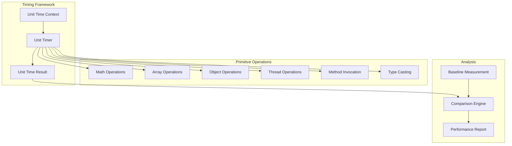
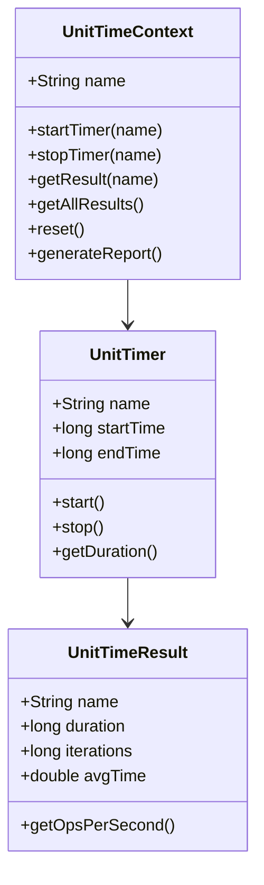

# Hitorro Unit-Time Module Documentation

## Overview

**hitorro-unittime** is a sophisticated performance benchmarking and timing framework that provides precise measurement of code execution times at the micro and nano-second level. It enables identifying performance bottlenecks, comparing implementations, and tracking performance regressions through automated benchmarking.

**Version:** 3.0.0  
**Package:** `com.hitorro.unittime`  
**Artifact ID:** `hitorro-unittime`  
**Dependencies:** hitorro-util

---

## Architecture Overview



---

## Key Components

### 1. Unit Time Context

Central context for managing timing operations and results.



**Key Classes:**
- `UnitTimeContext` - Timing context and coordination
- `UnitTimer` - Individual timer
- `UnitTimeResult` - Timing result with statistics
- `UnitTimeService` - Service integration

**Basic Usage:**
```java
// Create context
UnitTimeContext context = new UnitTimeContext("MyBenchmark");

// Time an operation
context.startTimer("operation1");
// ... code to benchmark ...
context.stopTimer("operation1");

// Get result
UnitTimeResult result = context.getResult("operation1");
System.out.println("Duration: " + result.getDuration() + " ns");
System.out.println("Avg time: " + result.getAvgTime() + " ns");
```

---

### 2. Benchmarking Primitives

Pre-built benchmarks for common primitive operations.

**Available Benchmarks:**
- **Math Operations**: Addition, subtraction, multiplication, division, modulo
- **Array Operations**: Creation, access, iteration, copying
- **Object Operations**: Creation, field access, method calls
- **Thread Operations**: Thread creation, synchronization, context switching
- **Method Invocation**: Static, instance, interface, virtual calls
- **Type Casting**: Up-casting, down-casting, instanceof checks

**Example - Math Operations:**
```java
import com.hitorro.unittime.primitive.math.*;

// Benchmark integer addition
MathAdditionTimer addTimer = new MathAdditionTimer();
UnitTimeResult result = addTimer.benchmark(1000000);

System.out.println("Integer additions per second: " + 
                  result.getOpsPerSecond());

// Benchmark floating point operations
MathMultiplicationTimer multTimer = new MathMultiplicationTimer();
result = multTimer.benchmark(1000000);

System.out.println("Float multiplications per second: " + 
                  result.getOpsPerSecond());
```

**Example - Array Operations:**
```java
import com.hitorro.unittime.primitive.array.*;

// Benchmark array creation
ArrayCreationTimer createTimer = new ArrayCreationTimer();
UnitTimeResult result = createTimer.benchmark(100000);

System.out.println("Array creations per second: " + 
                  result.getOpsPerSecond());

// Benchmark array access
ArrayAccessTimer accessTimer = new ArrayAccessTimer();
result = accessTimer.benchmark(1000000);

System.out.println("Array accesses per second: " + 
                  result.getOpsPerSecond());
```

---

### 3. Custom Benchmarks

Create custom benchmarks for your code:

```java
public class MyBenchmark {
    
    private UnitTimeContext context;
    
    public void benchmarkAlgorithm() {
        context = new UnitTimeContext("Algorithm Comparison");
        
        // Benchmark algorithm 1
        context.startTimer("algorithm1");
        for (int i = 0; i < 1000000; i++) {
            algorithm1(data);
        }
        context.stopTimer("algorithm1");
        
        // Benchmark algorithm 2
        context.startTimer("algorithm2");
        for (int i = 0; i < 1000000; i++) {
            algorithm2(data);
        }
        context.stopTimer("algorithm2");
        
        // Compare results
        UnitTimeResult result1 = context.getResult("algorithm1");
        UnitTimeResult result2 = context.getResult("algorithm2");
        
        System.out.println("Algorithm 1: " + result1.getAvgTime() + " ns/op");
        System.out.println("Algorithm 2: " + result2.getAvgTime() + " ns/op");
        
        if (result1.getAvgTime() < result2.getAvgTime()) {
            double speedup = result2.getAvgTime() / result1.getAvgTime();
            System.out.printf("Algorithm 1 is %.2fx faster%n", speedup);
        } else {
            double speedup = result1.getAvgTime() / result2.getAvgTime();
            System.out.printf("Algorithm 2 is %.2fx faster%n", speedup);
        }
    }
}
```

---

### 4. Baseline Calibration

Establish baseline measurements to account for timing overhead:

```java
public class BaselineCalibration {
    
    public void calibrate() {
        BaseLineUnitTimer baseline = new BaseLineUnitTimer();
        
        // Measure timing overhead
        UnitTimeResult result = baseline.benchmark(100000);
        
        System.out.println("Timing overhead: " + result.getAvgTime() + " ns");
        System.out.println("Empty loop: " + result.getDuration() + " ns");
        
        // Use baseline to correct measurements
        long rawMeasurement = measureOperation();
        long correctedMeasurement = rawMeasurement - result.getAvgTime();
    }
}
```

---

### 5. Comparative Benchmarking

Compare multiple implementations:

```java
public class ComparativeBenchmark {
    
    public void compareImplementations() {
        int iterations = 1000000;
        
        // Implementation 1: ArrayList
        UnitTimeContext context = new UnitTimeContext("List Comparison");
        context.startTimer("ArrayList");
        List<String> arrayList = new ArrayList<>();
        for (int i = 0; i < iterations; i++) {
            arrayList.add("item" + i);
        }
        context.stopTimer("ArrayList");
        
        // Implementation 2: LinkedList
        context.startTimer("LinkedList");
        List<String> linkedList = new LinkedList<>();
        for (int i = 0; i < iterations; i++) {
            linkedList.add("item" + i);
        }
        context.stopTimer("LinkedList");
        
        // Implementation 3: HashSet
        context.startTimer("HashSet");
        Set<String> hashSet = new HashSet<>();
        for (int i = 0; i < iterations; i++) {
            hashSet.add("item" + i);
        }
        context.stopTimer("HashSet");
        
        // Generate comparison report
        String report = context.generateReport();
        System.out.println(report);
    }
}
```

---

### 6. Statistical Analysis

Get detailed statistics on benchmark results:

```java
public class StatisticalAnalysis {
    
    public void analyzePerformance() {
        UnitTimeContext context = new UnitTimeContext("Analysis");
        
        // Run multiple iterations
        for (int run = 0; run < 10; run++) {
            context.startTimer("operation");
            performOperation();
            context.stopTimer("operation");
        }
        
        // Get statistics
        UnitTimeResult result = context.getResult("operation");
        
        System.out.println("Min time: " + result.getMinTime() + " ns");
        System.out.println("Max time: " + result.getMaxTime() + " ns");
        System.out.println("Avg time: " + result.getAvgTime() + " ns");
        System.out.println("Median time: " + result.getMedianTime() + " ns");
        System.out.println("Std dev: " + result.getStdDev() + " ns");
        System.out.println("Operations/sec: " + result.getOpsPerSecond());
    }
}
```

---

### 7. Warmup and JIT Compilation

Handle JIT compilation effects:

```java
public class JITAwareBenchmark {
    
    public void benchmarkWithWarmup() {
        // Warmup phase - allow JIT compilation
        System.out.println("Warming up...");
        for (int i = 0; i < 10000; i++) {
            performOperation();
        }
        
        // Wait for JIT
        try {
            Thread.sleep(100);
        } catch (InterruptedException e) {
            Thread.currentThread().interrupt();
        }
        
        // Actual benchmark
        System.out.println("Running benchmark...");
        UnitTimeContext context = new UnitTimeContext("JIT Aware");
        
        context.startTimer("operation");
        for (int i = 0; i < 1000000; i++) {
            performOperation();
        }
        context.stopTimer("operation");
        
        UnitTimeResult result = context.getResult("operation");
        System.out.println("Avg time: " + result.getAvgTime() + " ns/op");
    }
}
```

---

### 8. Memory Benchmarking

Combine with memory profiling:

```java
public class MemoryBenchmark {
    
    public void benchmarkMemory() {
        Runtime runtime = Runtime.getRuntime();
        
        // Force GC before benchmark
        System.gc();
        Thread.yield();
        
        long memoryBefore = runtime.totalMemory() - runtime.freeMemory();
        
        UnitTimeContext context = new UnitTimeContext("Memory Benchmark");
        context.startTimer("operation");
        
        // Perform operation
        List<Object> objects = new ArrayList<>();
        for (int i = 0; i < 100000; i++) {
            objects.add(new Object());
        }
        
        context.stopTimer("operation");
        
        long memoryAfter = runtime.totalMemory() - runtime.freeMemory();
        long memoryUsed = memoryAfter - memoryBefore;
        
        UnitTimeResult timeResult = context.getResult("operation");
        
        System.out.println("Time: " + timeResult.getDuration() + " ns");
        System.out.println("Memory: " + memoryUsed + " bytes");
        System.out.println("Memory per object: " + (memoryUsed / 100000) + " bytes");
    }
}
```

---

## Command-Line Interface

Execute benchmarks via CLI:

```bash
# Run specific benchmark
unittime benchmark math.addition 1000000

# Run all benchmarks
unittime benchmark all

# Compare implementations
unittime compare arraylist linkedlist hashset

# Generate report
unittime report --format csv --output results.csv

# Set warmup iterations
unittime benchmark --warmup 10000 array.creation 1000000
```

**Java API for CLI:**
```java
@DebugCommandArg(
    cmd = "benchmark",
    argtype = "operation iterations",
    description = "Run performance benchmark"
)
public class UnitTimeCommand extends Command {
    
    @Override
    public int execute(Response response, JsonNode args) {
        String operation = args.get("operation").asText();
        int iterations = args.get("iterations").asInt(100000);
        
        UnitTimeContext context = new UnitTimeContext("Benchmark");
        
        // Run benchmark
        runBenchmark(operation, iterations, context);
        
        // Display results
        UnitTimeResult result = context.getResult(operation);
        response.println("Operation: " + operation);
        response.println("Iterations: " + iterations);
        response.println("Total time: " + result.getDuration() + " ns");
        response.println("Avg time: " + result.getAvgTime() + " ns/op");
        response.println("Ops/sec: " + result.getOpsPerSecond());
        
        return 0;
    }
}
```

---

## Reporting and Visualization

### CSV Export

```java
public class CSVExport {
    
    public void exportResults() {
        UnitTimeContext context = runBenchmarks();
        
        CSVWriter writer = new CSVWriter("benchmark-results.csv");
        writer.writeHeader("Operation", "Iterations", "Total (ns)", 
                          "Avg (ns)", "Ops/sec");
        
        for (String name : context.getAllResults().keySet()) {
            UnitTimeResult result = context.getResult(name);
            writer.writeRow(
                name,
                result.getIterations(),
                result.getDuration(),
                result.getAvgTime(),
                result.getOpsPerSecond()
            );
        }
        
        writer.close();
    }
}
```

### JSON Export

```java
public class JSONExport {
    
    public void exportResults() {
        UnitTimeContext context = runBenchmarks();
        
        ObjectMapper mapper = new ObjectMapper();
        ObjectNode root = mapper.createObjectNode();
        
        ArrayNode results = root.putArray("results");
        for (String name : context.getAllResults().keySet()) {
            UnitTimeResult result = context.getResult(name);
            
            ObjectNode resultNode = results.addObject();
            resultNode.put("operation", name);
            resultNode.put("iterations", result.getIterations());
            resultNode.put("duration", result.getDuration());
            resultNode.put("avgTime", result.getAvgTime());
            resultNode.put("opsPerSecond", result.getOpsPerSecond());
        }
        
        mapper.writeValue(new File("results.json"), root);
    }
}
```

---

## Integration with Testing

### JUnit Integration

```java
public class PerformanceTest {
    
    private UnitTimeContext context;
    
    @Before
    public void setUp() {
        context = new UnitTimeContext("Performance Test");
    }
    
    @Test
    public void testPerformance() {
        // Set performance requirement
        long maxTimeNs = 1000; // 1 microsecond
        
        context.startTimer("operation");
        performOperation();
        context.stopTimer("operation");
        
        UnitTimeResult result = context.getResult("operation");
        
        // Assert performance meets requirement
        assertTrue("Operation too slow: " + result.getAvgTime() + " ns",
                  result.getAvgTime() < maxTimeNs);
    }
    
    @Test
    public void testThroughput() {
        int minOpsPerSec = 1000000; // 1M ops/sec
        
        context.startTimer("throughput");
        for (int i = 0; i < 1000000; i++) {
            performOperation();
        }
        context.stopTimer("throughput");
        
        UnitTimeResult result = context.getResult("throughput");
        
        assertTrue("Throughput too low: " + result.getOpsPerSecond(),
                  result.getOpsPerSecond() >= minOpsPerSec);
    }
}
```

---

## Best Practices

### 1. Warmup

Always warmup before benchmarking:
```java
// Warmup
for (int i = 0; i < 10000; i++) {
    performOperation();
}
Thread.sleep(100); // Let JIT complete

// Benchmark
context.startTimer("operation");
for (int i = 0; i < 1000000; i++) {
    performOperation();
}
context.stopTimer("operation");
```

### 2. Multiple Runs

Run multiple times for statistical significance:
```java
for (int run = 0; run < 10; run++) {
    context.startTimer("operation_" + run);
    performOperation();
    context.stopTimer("operation_" + run);
}
```

### 3. Minimize External Factors

```java
// Disable GC during benchmark
System.gc();
Thread.yield();

// Increase thread priority
Thread.currentThread().setPriority(Thread.MAX_PRIORITY);

// Run benchmark
context.startTimer("operation");
performOperation();
context.stopTimer("operation");

// Reset priority
Thread.currentThread().setPriority(Thread.NORM_PRIORITY);
```

### 4. Account for Overhead

```java
// Measure overhead
context.startTimer("overhead");
context.stopTimer("overhead");
long overhead = context.getResult("overhead").getDuration();

// Subtract overhead from measurements
context.startTimer("operation");
performOperation();
context.stopTimer("operation");
long adjusted = context.getResult("operation").getDuration() - overhead;
```

---

## Performance Tips

### High-Resolution Timing

```java
// Use nano-time for precision
long start = System.nanoTime();
performOperation();
long duration = System.nanoTime() - start;

// Avoid System.currentTimeMillis() - lower resolution
```

### Batch Measurements

```java
// Good - amortize timing overhead
long start = System.nanoTime();
for (int i = 0; i < 1000000; i++) {
    performOperation();
}
long duration = System.nanoTime() - start;
double avgTime = duration / 1000000.0;

// Bad - timing overhead dominates
for (int i = 0; i < 1000000; i++) {
    long start = System.nanoTime();
    performOperation();
    long duration = System.nanoTime() - start;
}
```

---

## Common Use Cases

### 1. Algorithm Comparison

```java
public void compareSearchAlgorithms() {
    int[] data = generateRandomArray(10000);
    int target = data[5000];
    
    UnitTimeContext context = new UnitTimeContext("Search Comparison");
    
    // Linear search
    context.startTimer("linear");
    for (int i = 0; i < 1000; i++) {
        linearSearch(data, target);
    }
    context.stopTimer("linear");
    
    // Binary search
    Arrays.sort(data);
    context.startTimer("binary");
    for (int i = 0; i < 1000; i++) {
        binarySearch(data, target);
    }
    context.stopTimer("binary");
    
    System.out.println(context.generateReport());
}
```

### 2. Data Structure Performance

```java
public void compareCollections() {
    int operations = 100000;
    
    UnitTimeContext context = new UnitTimeContext("Collections");
    
    // ArrayList
    context.startTimer("ArrayList");
    testCollection(new ArrayList<>(), operations);
    context.stopTimer("ArrayList");
    
    // LinkedList
    context.startTimer("LinkedList");
    testCollection(new LinkedList<>(), operations);
    context.stopTimer("LinkedList");
    
    // HashSet
    context.startTimer("HashSet");
    testCollection(new HashSet<>(), operations);
    context.stopTimer("HashSet");
    
    System.out.println(context.generateReport());
}
```

### 3. I/O Performance

```java
public void compareIOOperations() {
    byte[] data = generateData(1024 * 1024); // 1MB
    
    UnitTimeContext context = new UnitTimeContext("I/O Comparison");
    
    // Buffered write
    context.startTimer("buffered");
    writeBuffered(data);
    context.stopTimer("buffered");
    
    // Direct write
    context.startTimer("direct");
    writeDirect(data);
    context.stopTimer("direct");
    
    // Memory mapped
    context.startTimer("mapped");
    writeMapped(data);
    context.stopTimer("mapped");
    
    System.out.println(context.generateReport());
}
```

---

## Related Modules

- **hitorro-util** - Core utilities and service framework
- **hitorro-test** - Testing framework integration

---

*Last Updated: January 2026*
