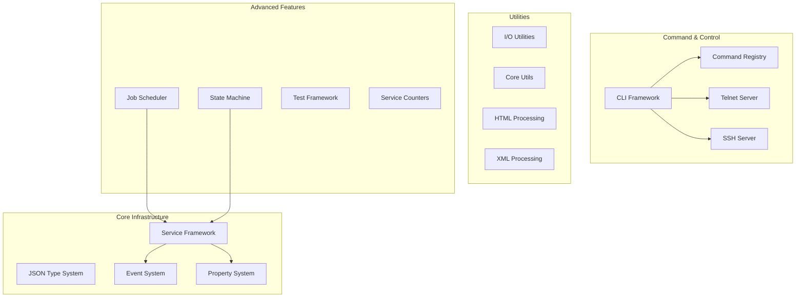
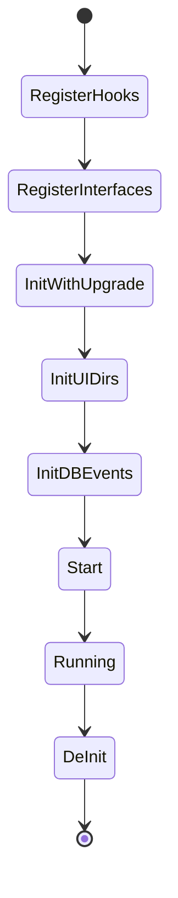
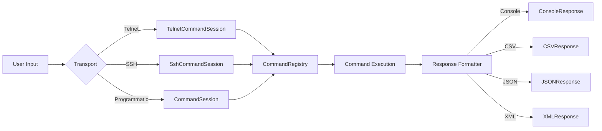
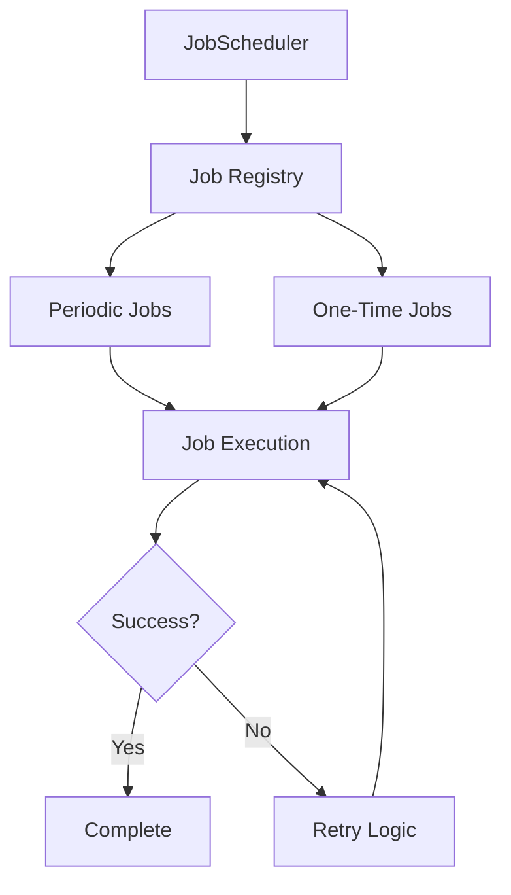

# Hitorro-Util Module Documentation

## Overview

**hitorro-util** is the foundational utility library for the Hitorro platform. It provides core infrastructure, framework components, and utility classes that are used throughout the entire Hitorro ecosystem. This module has no dependencies on other Hitorro modules, making it the base layer of the architecture.

**Version:** 3.0.0  
**Package:** `com.hitorro`  
**Artifact ID:** `hitorro-util`

---

## Architecture Overview



---

## Key Components

### 1. Service Startup Framework

The service framework provides a robust lifecycle management system for initializing and managing services.

#### Service Lifecycle Phases



**Key Classes:**
- `ServiceContext` - Central service management
- `ServiceWrapper` - Service lifecycle wrapper
- `ServiceDefinition` - Annotation for service configuration
- `HTServer` - Server startup orchestration

**Features:**
- Dependency-based service initialization
- Database schema migration support
- Event-driven startup phases
- Configuration validation

**Example Service Definition:**
```java
@ServiceDefinition(
    dependentService = {HibernateService.class},
    shortName = "myservice",
    description = "My custom service",
    debugCommands = {MyDebugCommand.class},
    typeManagedClasses = {MyEntity.class}
)
public class MyService {
    public String init(boolean dbInit, boolean upgrading, 
                      long currentVersion, long targetVersion) {
        // Initialize service
        return null; // null = success
    }
    
    public String start(boolean dbInit) {
        // Start service operations
        return null;
    }
    
    public String deInit() {
        // Cleanup
        return null;
    }
}
```

---

### 2. Command & Control System

A powerful CLI framework with support for telnet, SSH, and programmatic command execution.



**Key Classes:**
- `Command` - Base class for commands
- `CommandRegistry` - Command discovery and registration
- `CommandSession` - Session management with history and context
- `Response` - Abstraction for output formatting
- `TelnetCommandSession` - Telnet server support
- `SshCommandSession` - SSH server support

**Features:**
- Auto-discovery of commands via annotations
- Multiple response formats (Console, CSV, JSON, XML)
- Command history and tab completion
- Context-aware command execution
- ANSI color support

**Example Command:**
```java
@DebugCommandArg(
    cmd = "hello",
    argtype = "name",
    description = "Say hello",
    helpText = "Usage: hello <name>"
)
public class HelloCommand extends Command {
    @Override
    public int execute(Response response, JsonNode args) {
        String name = args.get("name").asText();
        response.println("Hello, " + name + "!");
        return 0;
    }
}
```

---

### 3. JSON Type System (JVS)

A dynamic type system that uses JSON schemas to define and validate complex data structures.

**Key Classes:**
- `JVS` - JSON Value Store
- `JVSProperties` - Configuration property system
- `TypeManager` - Type registration and management
- `PropertyKey` - Strongly-typed property accessors

**Features:**
- JSON-based type definitions
- Property validation and type coercion
- Nested property access with dot notation
- Variable resolution (e.g., `${HT_HOME}/config`)
- Multiple property sources (files, environment, system properties)

**Property Configuration:**
```java
// Define property keys
public static StringProperty ServerName = 
    new StringProperty("server.name", "Server name", "localhost");

public static IntegerProperty ServerPort = 
    new IntegerProperty("server.port", "Server port", 8080);

// Access properties
String name = ServerName.apply();
int port = ServerPort.apply();
```

---

### 4. Event System

A local event hub for pub-sub messaging within the application.

**Key Classes:**
- `LocalEventHub` - Central event bus
- `EventListener` - Interface for event handlers
- `EventRegistry` - Event registration and management

**Features:**
- Synchronous and asynchronous event delivery
- Topic-based routing
- Wildcard topic matching
- Event prioritization

**Example Usage:**
```java
// Register listener
LocalEventHub.get().addEventListener(new EventListener() {
    @Override
    public boolean event(String topic, String subTopic, Object args) {
        Log.info("Received event: %s/%s", topic, subTopic);
        return true;
    }
    
    @Override
    public String eventName() {
        return "MyListener";
    }
}, "system.startup");

// Fire event
LocalEventHub.get().event("system.startup", "", null);
```

---

### 5. Core Utilities

#### String Utilities (`com.hitorro.util.core.string`)
- `StringUtil` - String manipulation and validation
- `Fmt` - String formatting (printf-style)
- Advanced text processing

#### I/O Utilities (`com.hitorro.util.io`)
- `FileUtil` - File operations and path handling
- `IOUtil` - Stream processing
- `CSVUtil` - CSV reading/writing
- Archive handling (ZIP, TAR, GZIP)

#### Collection Utilities (`com.hitorro.util.core`)
- `ListUtil` - List operations and filtering
- `MapUtil` - Map utilities
- Iterator chains and transformations
- Predicate-based filtering

#### Date/Time (`com.hitorro.util.datefilters`)
- Date parsing and formatting
- Time zone handling
- Date range filters

---

### 6. HTML Processing

**Key Classes:**
- `HTMLParser` - Robust HTML parsing with error recovery
- `HTMLPage` - Structured HTML document representation
- `HTMLPageFetcher` - Web page retrieval with retry logic
- `HTMLEncoder` - HTML entity encoding/decoding

**Features:**
- Fault-tolerant HTML parsing
- CSS selector support
- Link extraction
- Meta tag extraction
- Content sanitization

---

### 7. Job Scheduler

A flexible job scheduling system for periodic and one-time tasks.



**Key Classes:**
- `JobScheduler` - Job scheduling engine
- `Job` - Base job interface
- `JobParameters` - Job configuration
- `JobContext` - Execution context

**Features:**
- Cron-style scheduling
- Job dependencies
- Retry logic with exponential backoff
- Job monitoring and statistics

---

### 8. Test Framework

A comprehensive unit testing framework built on JUnit with advanced filtering and execution control.

**Key Classes:**
- `TestServerService` - Test service manager
- `EnhancedTestCase` - Enhanced JUnit test base
- `TestUtil` - Test execution utilities
- `RunLevel` - Test categorization (smoke, full, stress)

**Features:**
- Test filtering by tags, packages, services
- Multiple run levels (smoke, full, stress)
- Test dependency management
- Automatic test discovery
- CSV and XML result reporting
- Test timeout watchdog

**Configuration:**
```yaml
hitorro:
  test:
    run-on-startup: false  # Control automatic test execution
```

---

### 9. State Machine Framework

A flexible state machine implementation for workflow and process automation.

**Key Classes:**
- `StateMachine` - State machine engine
- `State` - State definition
- `Transition` - State transition logic
- `StateMachineService` - Service integration

**Features:**
- Graph-based state definitions
- Conditional transitions
- Action execution on state entry/exit
- State persistence
- Visualization support

---

### 10. Additional Features

#### URL Handlers
- Custom protocol handlers
- Resource loading abstractions
- Virtual file system support

#### XML Processing
- SAX and DOM utilities
- XPath evaluation
- XML transformation

#### Mail Support
- Email sending and receiving
- MIME message handling
- Template-based emails

#### Redis Integration
- Redis connection management
- Distributed caching
- Pub/sub messaging

#### Cluster Support
- Distributed coordination
- Leader election
- Cluster membership

---

## Integration Events

The integration events system provides a mechanism for executing data loading and initialization tasks during service startup.

**Key Classes:**
- `IntegrationEventsContext` - Event coordination
- CSV-based data loading
- Event sequencing and dependencies

**Configuration:**
```json
{
  "integration": {
    "initdblist": "users,permissions,roles",
    "events": {
      "users": {
        "file": "data/users.csv",
        "consumer": "com.example.UserCSVConsumer"
      }
    }
  }
}
```

---

## Configuration System

### Property Sources (Priority Order)
1. System arguments (command-line)
2. `HT_BIN/config` directory
3. `HT_HOME/config` directory
4. Spring Boot configuration (if using Spring integration)

### Property Files
- `config/server.json` - Server configuration
- `config/database.json` - Database settings
- `config/types/**/*.json` - Type definitions

### Environment Variables
- `HT_BIN` - Hitorro installation directory
- `HT_HOME` - Hitorro runtime data directory

---

## Logging

The module uses SLF4J for logging with custom log categories:

```java
public class Log {
    public static Logger core;      // Core operations
    public static Logger db;        // Database operations
    public static Logger net;       // Network operations
    public static Logger security;  // Security events
    public static Logger test;      // Test execution
    public static Logger audit;     // Audit trail
}
```

---

## Dependencies

### Core Dependencies
- **SLF4J** - Logging abstraction
- **Jackson** - JSON processing
- **Commons IO** - I/O utilities
- **Commons Lang** - Language utilities
- **Groovy** - Scripting support
- **Lettuce** - Redis client
- **JUnit** - Testing framework

### Optional Dependencies
- **Apache SSHD** - SSH server
- **Apache MINA** - Telnet server
- **ZooKeeper** - Distributed coordination

---

## Usage Examples

### Starting a Service Context

```java
// Initialize service context
ServiceContext sc = ServiceContext.getSC();

// Add services
sc.addModule("com.hitorro.util.testframework.TestServerService");
sc.addModule("com.hitorro.myapp.MyService");

// Validate configuration
String error = ServiceContext.validateConfigKeys();
if (error != null) {
    throw new IllegalStateException(error);
}

// Initialize services
sc.setInitDb(true);
error = sc.init();
if (error != null) {
    throw new IllegalStateException(error);
}
```

### Creating a Custom Command

```java
@DebugCommandArg(
    cmd = "stats",
    argtype = "format=json|csv",
    description = "Display statistics",
    helpText = "Usage: stats [format=json]"
)
public class StatsCommand extends Command {
    @Override
    public int execute(Response response, JsonNode args) {
        String format = args.get("format").asText("json");
        
        // Gather statistics
        Map<String, Object> stats = gatherStats();
        
        // Output based on format
        if ("csv".equals(format)) {
            response.startCSV("key", "value");
            stats.forEach((k, v) -> response.printCSVRow(k, v));
        } else {
            response.printJSON(stats);
        }
        
        return 0;
    }
    
    private Map<String, Object> gatherStats() {
        // Implementation
        return new HashMap<>();
    }
}
```

---

## Best Practices

1. **Service Dependencies**: Always declare service dependencies in `@ServiceDefinition`
2. **Property Validation**: Use typed property keys for type safety
3. **Error Handling**: Return error strings from service lifecycle methods
4. **Event Listeners**: Always return `true` from event handlers unless you want to stop propagation
5. **Resource Cleanup**: Implement `deInit()` for proper resource cleanup
6. **Testing**: Use appropriate run levels for tests (smoke/full/stress)
7. **Logging**: Use appropriate log categories for different operations

---

## Troubleshooting

### Common Issues

**Service initialization fails:**
- Check service dependencies are loaded first
- Verify configuration files are in correct locations
- Review HT_BIN and HT_HOME environment variables

**Commands not discovered:**
- Ensure command classes are in the classpath
- Check `@DebugCommandArg` annotation is present
- Verify command package is being scanned

**Properties not loading:**
- Confirm property files exist in config directories
- Check JSON syntax is valid
- Verify property keys match configuration

---

## Module Services

The util module provides these built-in services:

| Service | Short Name | Description |
|---------|------------|-------------|
| HTServer | server | Service startup orchestration |
| TestServerService | test | Test execution framework |
| CounterService | counters | Performance counters |
| StateMachineService | statemachine | State machine engine |
| MapFactoryService | mapchains | Map chain processing |
| ZKContext | zookeeper | ZooKeeper integration |

---

## Performance Considerations

- **Service Initialization**: Happens once at startup, order matters for dependencies
- **Event System**: Asynchronous listeners run in thread pool, synchronous block the caller
- **Property Access**: Properties are cached after first access
- **Command Execution**: Commands run in caller's thread unless explicitly async
- **HTML Parsing**: Can be CPU-intensive for large documents

---

## Thread Safety

- `ServiceContext` - Thread-safe after initialization
- `LocalEventHub` - Thread-safe
- `JVSProperties` - Thread-safe for reads after initialization
- `CommandRegistry` - Thread-safe
- Most utilities - Thread-safe unless documented otherwise

---

## Future Enhancements

- Metrics and monitoring integration
- Enhanced security features
- Improved cluster coordination
- WebSocket command interface
- GraphQL command API

---

## Related Modules

- **hitorro-base** - Builds on util for document processing
- **hitorro-basedms** - Uses service framework for persistence
- **hitorro-spring-boot** - Spring Boot integration layer
