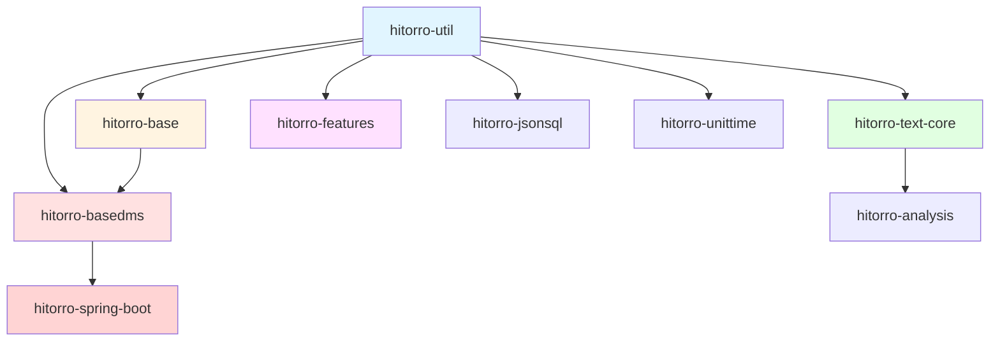
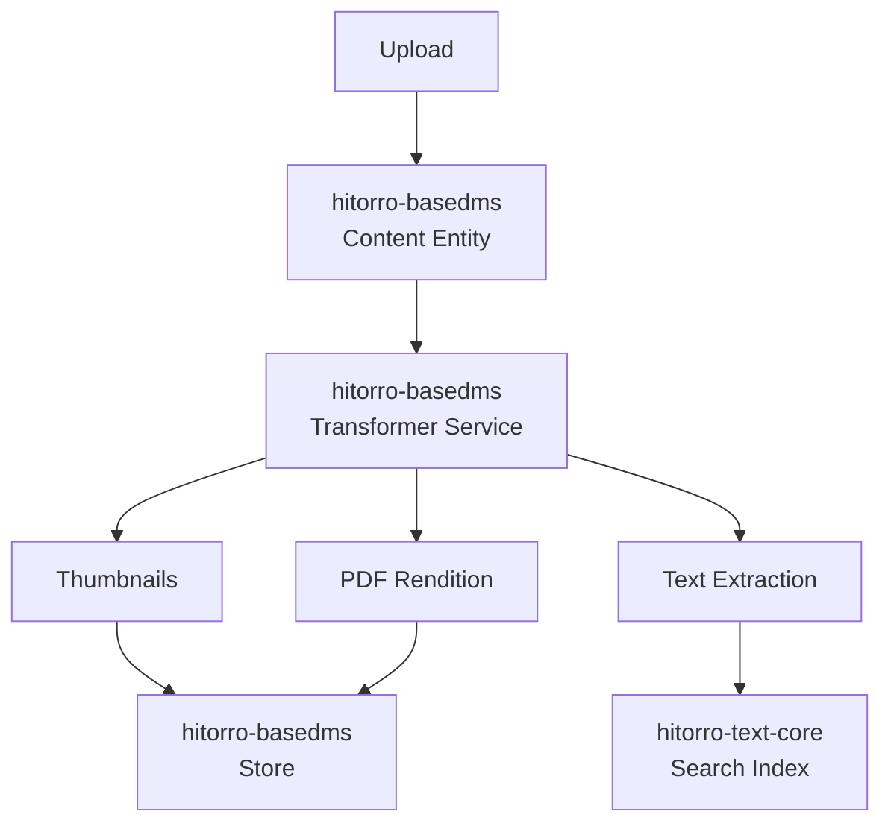

# Hitorro Module Documentation Index

## Overview

This documentation provides comprehensive guides for the core Hitorro platform modules. Each module builds upon the foundation established by lower-level modules to provide increasingly sophisticated capabilities.

---

## Module Hierarchy



---

## Module Overview

### 1. [hitorro-util](MODULE_HITORRO_UTIL.md) - Foundation Layer

**Purpose:** Core infrastructure and utilities for the entire Hitorro platform.

**Key Features:**
- Service startup framework with lifecycle management
- Command & control system (CLI, telnet, SSH)
- JSON-based type system and property management
- Event system for pub-sub messaging
- Job scheduling and state machines
- Test framework with multiple run levels
- Core utilities (I/O, string, collections, dates)

**When to Use:**
- Building new Hitorro services
- Implementing custom commands
- Creating scheduled jobs
- Working with configuration properties
- Event-driven architectures

**Dependencies:** None (base layer)

**Documentation:** [MODULE_HITORRO_UTIL.md](MODULE_HITORRO_UTIL.md)

---

### 2. [hitorro-base](MODULE_HITORRO_BASE.md) - Document Processing Layer

**Purpose:** Document processing pipelines and file set management for large-scale operations.

**Key Features:**
- Scalable document processing pipelines
- File set management and tracking
- Distributed queue integration (Kafka, RabbitMQ)
- Multiple input sources (file system, HDFS, S3, HTTP)
- Sink targets for processed documents
- Channel loaders for various data sources
- Block queue management with fault tolerance

**When to Use:**
- Batch document processing
- Building ETL pipelines
- Managing large file collections
- Distributed document processing
- Real-time document ingestion

**Dependencies:** hitorro-util

**Documentation:** [MODULE_HITORRO_BASE.md](MODULE_HITORRO_BASE.md)

---

### 3. [hitorro-basedms](MODULE_HITORRO_BASEDMS.md) - Content Management Layer

**Purpose:** Enterprise-grade Document Management System with persistence, versioning, and transformations.

**Key Features:**
- Hibernate-based persistence layer
- Hierarchical folder structure
- Version control and history
- Role-based access control (RBAC)
- Content transformers (thumbnails, format conversion)
- Workflow engine for content lifecycle
- Multi-tenant support via domains
- Multiple storage backends (local, S3, HDFS)
- Job queue for async processing
- Caching system for performance

**When to Use:**
- Building content management systems
- Document repositories
- Digital asset management
- Workflow automation
- Version-controlled content

**Dependencies:** hitorro-util, hitorro-base, Hibernate 6.x

**Documentation:** [MODULE_HITORRO_BASEDMS.md](MODULE_HITORRO_BASEDMS.md)

---

### 4. [hitorro-text-core](MODULE_HITORRO_TEXT_CORE.md) - NLP & Text Analytics Layer

**Purpose:** Natural language processing and text analytics with Lucene integration.

**Key Features:**
- Advanced tokenization and filtering
- Named Entity Recognition (NER)
- Sentence detection and POS tagging
- Phrase extraction and n-gram analysis
- Document classification (Naive Bayes, MaxEnt, SVM)
- TF-IDF and document similarity
- Apache Lucene integration for full-text search
- WordNet integration for semantic relationships
- ConceptNet5 for common-sense knowledge
- Winnowing for plagiarism detection
- Feature extraction for ML
- Multi-format document filtering (PDF, Office, HTML)

**When to Use:**
- Full-text search implementation
- Document classification systems
- Entity extraction from text
- Semantic analysis
- Plagiarism detection
- Text similarity computation
- Content-based recommendations

**Dependencies:** hitorro-util, hitorro-base, Apache Lucene, OpenNLP

**Documentation:** [MODULE_HITORRO_TEXT_CORE.md](MODULE_HITORRO_TEXT_CORE.md)

---

### 5. [hitorro-spring-boot](MODULE_HITORRO_SPRING_BOOT.md) - Spring Boot Integration Layer

**Purpose:** Seamless integration between Hitorro platform and Spring Boot applications.

**Key Features:**
- Auto-configuration of Hitorro services
- Property system integration (Spring Boot ↔ JVS)
- DMS integration with Spring transactions
- Auto-generated REST endpoints for Hitorro objects
- Multiple CLI options (Telnet, SSH, Spring Shell, Actuator)
- Content transformation REST API
- File system abstraction (Local, S3, JAR)
- Integration events for data loading

**When to Use:**
- Building Spring Boot applications with Hitorro
- Modernizing legacy Hitorro applications
- Exposing Hitorro functionality via REST APIs
- Leveraging Spring ecosystem with Hitorro

**Dependencies:** Spring Boot 3.x, hitorro-util, hitorro-basedms

**Documentation:** [MODULE_HITORRO_SPRING_BOOT.md](MODULE_HITORRO_SPRING_BOOT.md)

---

### 6. [hitorro-features](MODULE_HITORRO_FEATURES.md) - Feature Extraction Framework

**Purpose:** Extract, manage, and index features for machine learning applications.

**Key Features:**
- Extensible feature extraction framework
- Feature collections with multiple storage strategies
- Feature normalization (min-max, z-score, custom)
- Efficient feature indexing (inverted, KD-tree, LSH)
- Derived features from existing features
- Similarity search and nearest neighbor queries
- Integration with document processing pipelines
- High-performance binary I/O with compression

**When to Use:**
- Building recommendation systems
- Document similarity and clustering
- Feature-based classification
- Machine learning pipelines
- Content-based filtering

**Dependencies:** hitorro-util

**Documentation:** [MODULE_HITORRO_FEATURES.md](MODULE_HITORRO_FEATURES.md)

---

### 7. [hitorro-jsonsql](MODULE_HITORRO_JSONSQL.md) - JSON Query Engine

**Purpose:** SQL-like querying for JSON data structures.

**Key Features:**
- Familiar SQL syntax for JSON data
- Path navigation with dot notation
- Comprehensive filtering (WHERE, LIKE, IN, BETWEEN)
- Aggregation functions (COUNT, SUM, AVG, MIN, MAX)
- JOIN operations across JSON collections
- Sorting and pagination
- Subqueries and parameterized queries
- Query optimization with indexing

**When to Use:**
- Querying JSON documents without a database
- Ad-hoc data analysis on JSON
- REST API query interfaces
- Configuration file queries
- In-memory data filtering

**Dependencies:** hitorro-util, Jackson

**Documentation:** [MODULE_HITORRO_JSONSQL.md](MODULE_HITORRO_JSONSQL.md)

---

### 8. [hitorro-unittime](MODULE_HITORRO_UNITTIME.md) - Performance Benchmarking

**Purpose:** Precise performance measurement and benchmarking at micro/nano-second level.

**Key Features:**
- High-resolution timing (nano-second precision)
- Pre-built benchmarks for primitives (math, array, object, thread)
- Custom benchmark creation
- Statistical analysis (min, max, avg, median, std dev)
- JIT-aware benchmarking with warmup
- Comparative benchmarking
- Command-line interface
- CSV/JSON report export
- JUnit integration

**When to Use:**
- Performance optimization
- Algorithm comparison
- Identifying bottlenecks
- Regression testing
- Performance requirements validation
- System performance profiling

**Dependencies:** hitorro-util

**Documentation:** [MODULE_HITORRO_UNITTIME.md](MODULE_HITORRO_UNITTIME.md)

---

## Quick Start Guide

### Setting Up a Basic Project

```xml
<!-- pom.xml -->
<dependencies>
    <!-- Core utilities -->
    <dependency>
        <groupId>com.hitorro</groupId>
        <artifactId>hitorro-util</artifactId>
        <version>3.0.0</version>
    </dependency>
    
    <!-- Document processing (if needed) -->
    <dependency>
        <groupId>com.hitorro</groupId>
        <artifactId>hitorro-base</artifactId>
        <version>3.0.0</version>
    </dependency>
    
    <!-- DMS features (if needed) -->
    <dependency>
        <groupId>com.hitorro</groupId>
        <artifactId>hitorro-basedms</artifactId>
        <version>3.0.0</version>
    </dependency>
    
    <!-- NLP features (if needed) -->
    <dependency>
        <groupId>com.hitorro</groupId>
        <artifactId>hitorro-text-core</artifactId>
        <version>3.0.0</version>
    </dependency>
</dependencies>
```

### Initializing Services

```java
import com.hitorro.util.startupframework.ServiceContext;

public class MyApplication {
    public static void main(String[] args) {
        // Get service context
        ServiceContext sc = ServiceContext.getSC();
        
        // Add required services
        sc.addModule("com.hitorro.basedms.db.HibernateService");
        sc.addModule("com.hitorro.base.service.BasicService");
        
        // Validate configuration
        String error = ServiceContext.validateConfigKeys();
        if (error != null) {
            System.err.println("Config error: " + error);
            System.exit(1);
        }
        
        // Initialize services
        sc.setInitDb(true);
        error = sc.init();
        if (error != null) {
            System.err.println("Init error: " + error);
            System.exit(1);
        }
        
        System.out.println("Hitorro initialized successfully");
        
        // Your application logic here
    }
}
```

---

## Common Integration Patterns

### Pattern 1: Document Processing Pipeline


**Use Case:** Processing a large collection of documents, extracting text, storing in DMS, and indexing for search.

**Modules Used:** hitorro-base, hitorro-text-core, hitorro-basedms

---

### Pattern 2: Content Management with Transformations



**Use Case:** Managing documents with automatic thumbnail generation, format conversion, and search indexing.

**Modules Used:** hitorro-basedms, hitorro-text-core

---

### Pattern 3: Text Analytics Pipeline


**Use Case:** Analyzing documents to extract entities, classify content, and store enriched metadata.

**Modules Used:** hitorro-text-core, hitorro-basedms

---

## Module Selection Guide

### Choose **hitorro-util** if you need:
- ✓ Service framework
- ✓ Command system
- ✓ Configuration management
- ✓ Core utilities
- ✓ Event system
- ✓ Job scheduling

### Add **hitorro-base** if you need:
- ✓ Document processing pipelines
- ✓ Large-scale file management
- ✓ Distributed processing
- ✓ Queue-based architectures

### Add **hitorro-basedms** if you need:
- ✓ Content persistence
- ✓ Version control
- ✓ Access control
- ✓ Folder hierarchies
- ✓ Workflow automation
- ✓ Content transformations

### Add **hitorro-text-core** if you need:
- ✓ Full-text search
- ✓ NLP processing
- ✓ Entity extraction
- ✓ Document classification
- ✓ Text analytics
- ✓ Semantic analysis

### Add **hitorro-spring-boot** if you need:
- ✓ Spring Boot integration
- ✓ Auto-configuration
- ✓ REST API exposure
- ✓ Spring transactions
- ✓ Modern application architecture

### Add **hitorro-features** if you need:
- ✓ Feature extraction
- ✓ Similarity search
- ✓ Recommendation systems
- ✓ ML feature management
- ✓ Content-based filtering

### Add **hitorro-jsonsql** if you need:
- ✓ SQL queries on JSON
- ✓ In-memory data filtering
- ✓ Ad-hoc JSON analysis
- ✓ Query-based REST APIs

### Add **hitorro-unittime** if you need:
- ✓ Performance benchmarking
- ✓ Algorithm comparison
- ✓ Bottleneck identification
- ✓ Performance monitoring

---

## Configuration Files

### Required Configuration Directories

```
${HT_BIN}/
  config/
    server.json          # Server configuration
    database.json        # Database settings
    types/               # Type definitions
      core/
        *.json
    collections/         # Collection configs
    
${HT_HOME}/
  config/
    local.json           # Local overrides
  data/
    content/             # Content storage
    index/               # Search indices
    filesets/            # File set tracking
  logs/
    hitorro.log          # Application logs
```

### Environment Variables

```bash
export HT_BIN=/opt/hitorro          # Installation directory
export HT_HOME=/var/lib/hitorro     # Runtime data directory
export JAVA_OPTS="-Xmx4g -Xms1g"    # JVM settings
```

---

## Performance Guidelines

### Memory Recommendations

| Module | Minimum | Recommended | Notes |
|--------|---------|-------------|-------|
| hitorro-util | 512MB | 1GB | Base system |
| hitorro-base | +256MB | +512MB | Per 100 concurrent files |
| hitorro-basedms | +512MB | +2GB | Depends on cache size |
| hitorro-text-core | +1GB | +4GB | For NLP models |

### Thread Pool Sizing

```yaml
# Recommended thread pool configurations
docprocessing:
  threads: ${CPU_CORES * 2}

transformers:
  threads: ${CPU_CORES}

search:
  threads: ${CPU_CORES * 4}

hibernate:
  connectionPool:
    maxSize: 20
    minSize: 5
```

---

## Troubleshooting

### Common Issues Across Modules

**Service initialization fails:**
1. Check dependency order in service loading
2. Verify configuration files exist
3. Review HT_BIN and HT_HOME environment variables
4. Check log files for detailed errors

**Performance issues:**
1. Review thread pool configurations
2. Enable caching where appropriate
3. Monitor memory usage
4. Check database connection pool settings

**Integration problems:**
1. Verify module versions are compatible
2. Check classpath for duplicate JARs
3. Review service dependencies
4. Ensure proper initialization order

---

## Migration Guides

### From Hitorro 2.x to 3.0

**Key Changes:**
- Updated to Hibernate 6.x
- Jakarta Persistence API (Jakarta EE 9+)
- Java 21 requirement
- Improved Spring Boot integration
- Updated third-party dependencies

**Migration Steps:**
1. Update dependencies to 3.0.0
2. Review deprecated APIs
3. Update Hibernate entity annotations
4. Test thoroughly in development environment

---

## Additional Resources

### Example Applications
- `hitorro-example-springboot` - Spring Boot integration example
- `hitorro-test` - Test examples and utilities

### External Documentation
- [Hibernate Documentation](https://hibernate.org/orm/documentation/)
- [Apache Lucene](https://lucene.apache.org/core/)
- [OpenNLP](https://opennlp.apache.org/)
- [Spring Framework](https://spring.io/)

### Community
- GitHub: [Hitorro Platform](https://github.com/hitorro)
- Issues: Submit via GitHub Issues
- Contributions: Pull requests welcome

---

## Module Comparison Matrix

| Feature | util | base | basedms | text-core | spring-boot | features | jsonsql | unittime |
|---------|------|------|---------|-----------|-------------|----------|---------|----------|
| Service Framework | ✓ | - | - | - | ✓ | - | - | - |
| CLI System | ✓ | - | - | - | ✓ | - | - | - |
| File Processing | - | ✓ | - | - | - | - | - | - |
| Persistence | - | - | ✓ | - | ✓ | - | - | - |
| Version Control | - | - | ✓ | - | - | - | - | - |
| Access Control | - | - | ✓ | - | - | - | - | - |
| Transformations | - | - | ✓ | - | ✓ | - | - | - |
| Full-Text Search | - | - | - | ✓ | - | - | - | - |
| NER | - | - | - | ✓ | - | - | - | - |
| Classification | - | - | - | ✓ | - | - | - | - |
| Semantic Analysis | - | - | - | ✓ | - | - | - | - |
| Spring Integration | - | - | - | - | ✓ | - | - | - |
| REST Auto-Gen | - | - | - | - | ✓ | - | - | - |
| Feature Extraction | - | - | - | - | - | ✓ | - | - |
| Similarity Search | - | - | - | - | - | ✓ | - | - |
| JSON Queries | - | - | - | - | - | - | ✓ | - |
| Benchmarking | - | - | - | - | - | - | - | ✓ |

---

## Getting Help

### Documentation
- **Module Docs**: Individual module documentation files
- **API Docs**: JavaDoc available in source
- **Examples**: See example applications

### Support Channels
- **GitHub Issues**: Bug reports and feature requests
- **Stack Overflow**: Tag questions with `hitorro`
- **Email**: support@hitorro.com (if available)

---

## License

Hitorro Platform is licensed under the MIT License. See individual module LICENSE files for details.

---

## Version History

- **3.0.0** (Current) - Major update with Hibernate 6, Jakarta EE, Java 21
- **2.x** - Previous stable release
- **1.x** - Initial release

---

*Last Updated: January 2026*
