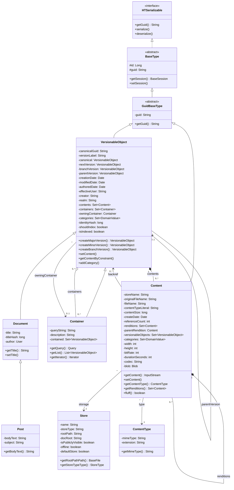
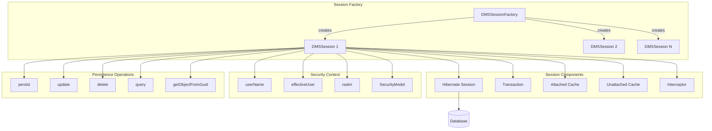
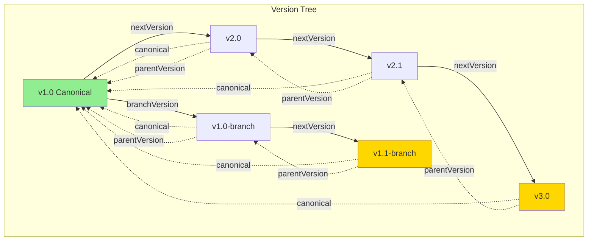
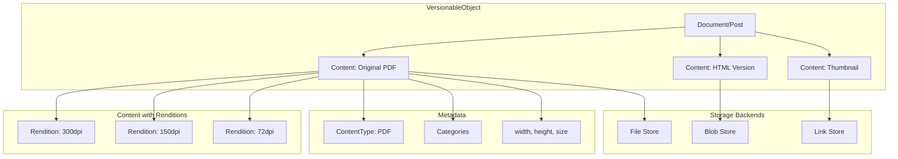
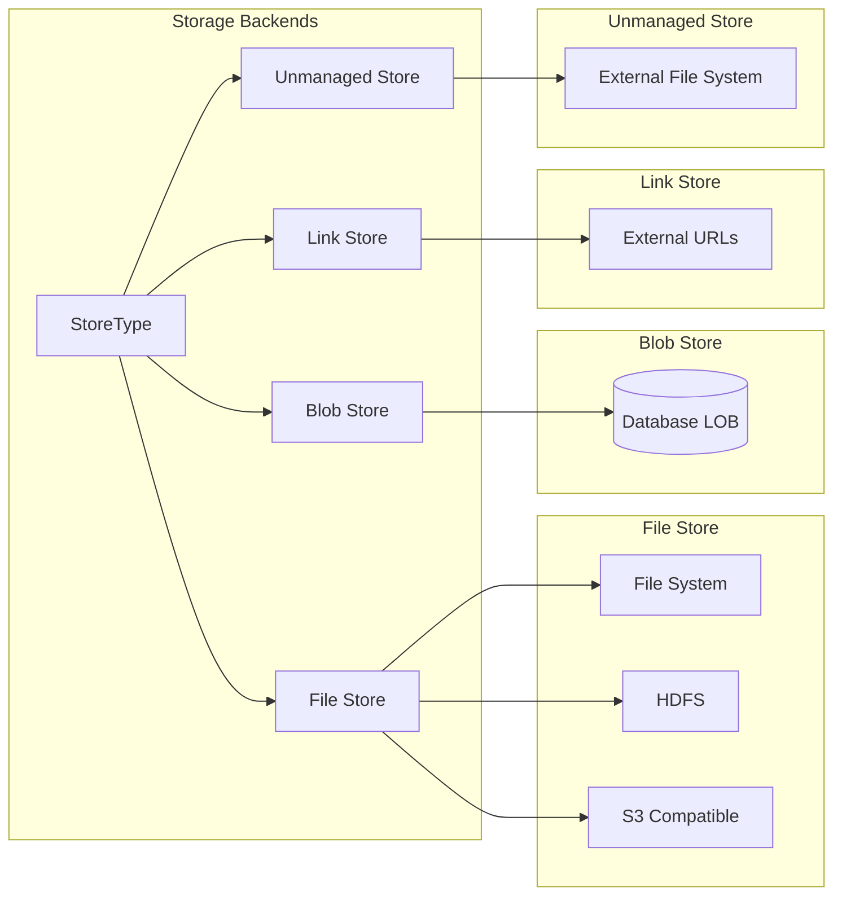

# Hitorro Document Management System (DMS) - Technical Documentation

## Overview

The Hitorro DMS is a sophisticated document management system built on top of Hibernate/JPA that provides comprehensive content storage, versioning, and management capabilities. The system is designed to handle large-scale document repositories with features including hierarchical versioning, multiple content renditions, flexible storage backends, and transactional session management.

## Table of Contents

1. [Object Model](#object-model)
2. [DMS Session Management](#dms-session-management)
3. [Versioning System](#versioning-system)
4. [Content & Rendition Management](#content--rendition-management)
5. [Storage Architecture](#storage-architecture)
6. [Code Examples](#code-examples)

---

## Object Model

The DMS object model is centered around a hierarchical entity structure with sophisticated relationships for managing documents, content, and metadata.

### Core Entity Diagram



### Key Entity Relationships

#### VersionableObject
The core entity for all versionable content in the system. Every document, post, or custom content type extends `VersionableObject`.

**Key Attributes:**
- **Identity & GUIDs**: `guid`, `canonicalGuid`, `identityHash`
- **Version Navigation**: `canonical`, `nextVersion`, `branchVersion`, `parentVersion`
- **Timestamps**: `creationDate`, `modifiedDate`, `authoredDate`
- **Security**: `creator`, `effectiveUser`, `realm`
- **Indexing**: `shouldIndex`, `isIndexed`, `indexName`

#### Content
Represents actual binary content (files, blobs) associated with versionable objects. A single `VersionableObject` can have multiple `Content` objects representing different file types, formats, or renditions.

**Key Features:**
- Multiple storage backends (File, Blob, Link, Unmanaged)
- Reference counting for shared content
- Hierarchical renditions (thumbnails, previews, transcoded versions)
- Rich metadata (dimensions, bitrate, duration, codec)
- Category-based tagging

#### Container
Provides dynamic collections of `VersionableObject` instances based on HQL queries. Unlike static collections, containers compute membership on-the-fly.

---

## DMS Session Management

The `DMSSession` class extends `BaseSession` and provides the primary interface for all DMS operations. It manages Hibernate transactions, object caching, and security context.

### Session Architecture Diagram



### Core Session APIs

#### Session Creation

```java
// Get basic session (no caching)
DMSSession session = DMSSessionFactory.getFactory().getSession();

// Get cached session (with object caching)
DMSSession cachedSession = DMSSessionFactory.getFactory().getCachedDMSSession();

// Get session with specific database key
DMSSession dbSession = DMSSessionFactory.getFactory().getDMSSession("dbKey");
```

#### Session Lifecycle Management

```java
// Standard pattern
DMSSession session = null;
try {
    session = DMSSessionFactory.getFactory().getSession();
    session.setName("MySessionName"); // Optional: for debugging
    
    // Perform operations
    VersionableObject obj = new Document();
    session.persist(obj);
    
    // Commit changes
    session.commit();
} catch (Exception e) {
    if (session != null) {
        session.rollback();
    }
} finally {
    if (session != null) {
        DMSSessionFactory.getFactory().close(session);
    }
}
```

#### Transaction Management

The session automatically manages Hibernate transactions:

```java
// Implicit transaction on persist
session.persist(object);  // Transaction begins automatically

// Explicit commit
session.commit();  // Commits and clears transaction

// Rollback on error
session.rollback();  // Rolls back current transaction

// Flush without commit
session.flush();  // Pushes changes to DB, clears session cache
```

#### Object Persistence APIs

##### Basic CRUD Operations

```java
// Create/Persist
Document doc = new Document();
doc.setTitle("My Document");
session.persist(doc);

// Update
doc.setTitle("Updated Title");
session.saveOrUpdate(doc);  // Handles both insert and update

// Retrieve by GUID
VersionableObject retrieved = session.getObjectFromGuid("Document:abc123");

// Retrieve by database ID
Document docById = session.retrieveDocumentById(123L);
Content contentById = session.retrieveContentById(456L);

// Delete
session.delete(doc);
```

##### Query Operations

```java
// HQL query with parameters
List<Document> docs = new ArrayList<>();
session.getObjects(
    Document.class, 
    "where title like :a", 
    docs, 
    "test%"
);

// Single object query
Document doc = (Document) session.getObject(
    Document.class,
    "where title = :a",
    "My Title"
);

// Native SQL query
NativeQuery query = session.createSQLQuery("SELECT * FROM document");

// Iterator-based retrieval (memory efficient)
Iterator iter = session.getIteratorFromQuery(
    "from Document where authoredDate > :a",
    someDate
);
```

#### Security Context APIs

```java
// Set user context for audit trail
session.setUser(
    "johndoe",              // actual user
    "johndoe",              // effective user (for impersonation)
    "corporate",            // realm
    securityModel           // security model implementation
);

// Query context
String user = session.getUser();
String effectiveUser = session.getEffectiveUser();
String realm = session.getRealm();
```

#### Session Caching

The `DMSSession` supports optional object caching to reduce database round-trips:

```java
// Enable/disable caching
session.enableCache(true);

// Cache management
session.clearCaches();  // Clear all cached objects

// Cached objects are automatically:
// - Added to attached cache on persist/load
// - Moved to unattached cache on session disconnect
// - Reattached on session reconnect
```

**Cache Behavior:**
- **Attached Cache**: Objects in current active session
- **Unattached Cache**: Objects from disconnected sessions
- **Version Stamping**: Tracks object versions for optimistic locking
- **Stale Detection**: Automatically marks replaced objects as stale

#### Specialized Retrieval APIs

```java
// Get object by identity hash
VersionableObject obj = session.getObjectFromHash(hashValue, true);

// Get by soft reference (non-GUID key)
HTSerializable obj = session.getSoftReference(type, "mykey");

// Get by GUID parts
HTSerializable obj = session.getGuidReference(type, "part1", "part2");

// Get by key-value map
Map<String, String> keyParts = new HashMap<>();
keyParts.put("field1", "value1");
HTSerializable obj = session.getGuidReference(type, keyParts);
```

#### Blob Support

```java
// Create blob from input stream
InputStream is = new FileInputStream(file);
Blob blob = session.createBlob(is, fileSize);
```

#### Raw Connection Access

```java
// Execute JDBC operations
session.doJdbcWork(connection -> {
    // Use connection for custom SQL
    PreparedStatement stmt = connection.prepareStatement("...");
    // ... execute operations
    return null;
});
```

---

## Versioning System

The DMS implements a sophisticated versioning model supporting linear version chains, branches, and canonical object references.

### Version Tree Structure



### Versioning Concepts

#### Canonical Object
The **canonical** object is the root of a version tree. All versions point back to the canonical via the `canonical` reference and share the same `canonicalGuid`.

#### Version Labels
Version labels follow semantic versioning: `major.minor` or `major.minor-branch`
- **Major Version**: `1.0` → `2.0` → `3.0`
- **Minor Version**: `2.0` → `2.1` → `2.2`  
- **Branch Version**: `1.0` → `1.0-branch` → `1.1-branch`

#### Version Pointers
- **canonical**: Points to root of version tree (null for canonical itself)
- **nextVersion**: Points to next version in linear chain
- **branchVersion**: Points to first version in a branch
- **parentVersion**: Points to immediate predecessor

### Versioning APIs

```java
// Create major version (1.0 -> 2.0)
VersionableObject v2 = v1.createMajorVersion();
session.persist(v2);

// Create minor version (2.0 -> 2.1)
VersionableObject v2_1 = v2.createMinorVersion();
session.persist(v2_1);

// Create branch version (1.0 -> 1.0-branch)
VersionableObject v1_branch = v1.createBranchVersion();
session.persist(v1_branch);

// Navigate version tree
VersionableObject canonical = v2_1.getCanonical();
VersionableObject next = v2.getNextVersion();
VersionableObject parent = v2_1.getParentVersion();
String versionLabel = v2_1.getVersionLabel(); // "2.1"
```

### Version Tree Traversal

```java
// Implement visitor pattern for version tree
class MyVersionVisitor implements VersionableObjectVisitor {
    public boolean visit(VersionableObject obj) {
        System.out.println("Version: " + obj.getVersionLabel());
        return true; // Continue traversal
    }
}

// Traverse entire version tree
versionableObject.visitVersionTree(new MyVersionVisitor());
```

### Version Behavior

**Copy-on-Version**: When creating a new version:
1. All non-version-specific fields are copied
2. Content references are copied (ref count incremented)
3. Container memberships are preserved
4. New GUID is generated
5. Version pointers are updated

**Content Sharing**: Content objects are reference-counted and shared across versions until explicitly replaced.

```java
// Content is shared between versions
Document v1 = new Document();
Content c1 = v1.setContent("file.pdf", contentType, inputStream);
// c1.referenceCount = 1

Document v2 = v1.createMajorVersion();
// c1.referenceCount = 2 (shared)

// Replacing content in v2
Content c2 = v2.setContent("file.pdf", contentType, newInputStream);
// c1.referenceCount = 1 (decremented)
// c2.referenceCount = 1
```

---

## Content & Rendition Management

Content management is a core strength of the DMS, supporting multiple file storage backends, renditions, and flexible metadata tagging.

### Content Architecture



### Content Creation APIs

#### Basic Content Operations

```java
Document doc = new Document();
doc.setTitle("My Document");

// Set content from File
File file = new File("document.pdf");
ContentType pdfType = ContentTypeCache.getCache().getTypeFromFileWithDefault("document.pdf");
Content content = doc.setContent("document.pdf", pdfType, file);

// Set content from InputStream
InputStream is = new FileInputStream(file);
Content content = doc.setContent("document.pdf", pdfType, is);

// Set content from BaseFile (virtual file system)
BaseFile bfile = fileSystem.getFile("/path/to/file");
Content content = doc.setContent("document.pdf", pdfType, bfile);

// Set string content (text/HTML)
Content htmlContent = doc.setStringContent(
    "docparts",              // domain
    "body",                  // label/tag
    "body.html",            // filename
    "<html>...</html>",     // content
    "text/html"             // mime type
);

// Set serialized object as content
MySerializableObject obj = new MySerializableObject();
ContentType binType = ContentTypeCache.getCache().getContentTypeByMimeType("application/octet-stream");
Content binContent = doc.setHTSerializableContent(
    "metadata",             // domain
    "config",              // label
    "config.bin",          // filename
    obj,                   // serializable object
    binType
);
```

#### Renditions

Renditions allow multiple representations of the same content (e.g., different resolutions, formats):

```java
// Create main content
Content mainContent = doc.setContent("video.mp4", videoType, videoFile);

// Add renditions
Content lowResRendition = mainContent.setContentRendition(
    session,
    videoType,
    lowResFile,
    "640x480"              // resolution descriptor
);

Content thumbRendition = mainContent.setContentRendition(
    session,
    jpegType,
    thumbnailFile,
    "thumbnail"
);

// Renditions are hierarchical
Set<Content> renditions = mainContent.getRenditions();
```

#### Content with External Storage

```java
// Link to external URL
Content linkContent = doc.setContentLink("http://example.com/file.pdf", pdfType);

// Unmanaged file system (files not managed by DMS)
Store unmanagedStore = StoreUtil.getStore("unmanaged_store");
File externalFile = new File("/external/path/document.pdf");
Content unmanagedContent = doc.setContentLinkForUnmanagedFileStore(
    externalFile,
    pdfType,
    unmanagedStore
);
```

### Content Retrieval APIs

#### Query Content

```java
// Get content by filename
Content content = doc.getContentByFileName("document.pdf", true);

// Get content by category tag
Content content = doc.getContentByConstraint(
    new TagConstraint("docparts", "body"),
    true  // recurse into renditions
);

// Get multiple content objects by constraint
List<Content> allContent = doc.getAllContentByConstraint(
    new LogicalOrOperator<>(
        new TagConstraint("media", "video"),
        new TagConstraint("media", "audio")
    ),
    true
);

// Get content by resolution
Content hdContent = doc.getContentByConstraint(
    new ResolutionConstraint("1920x1080"),
    true
);
```

#### Access Content Data

```java
// Get content as InputStream
InputStream is = content.getContent();
byte[] buffer = new byte[1024];
int bytesRead;
while ((bytesRead = is.read(buffer)) != -1) {
    // Process bytes
}
is.close();

// Get content as String (for text types)
if (content.hasStringValue()) {
    String text = content.getStringValue();
}

// Write content to file
File outputFile = new File("/tmp/output.pdf");
content.getContent(outputFile);

// Get content metadata
long size = content.getContentSize();
long actualSize = content.getContentSize(true); // from storage
ContentType type = content.getContentType();
String mimeType = type.getMimeType();
Date uploaded = content.getCreationDate();
```

#### Retrieve Serialized Objects

```java
// Retrieve HTSerializable object from content
MySerializableObject obj = (MySerializableObject) doc.getHTSerializableContent(
    "metadata",
    "config"
);

// Retrieve string content
String html = doc.getStringContent("docparts", "body");
```

### Content Metadata & Properties

```java
// Rich media properties
content.setWidth(1920);
content.setHeight(1080);
content.setBitRate(320000);
content.setDurationSeconds(180);
content.setCodec("h264");
content.setResolutionAux("1080p");

// Query properties
int width = content.getWidth();
int height = content.getHeight();
String resolution = content.getResolutionAux();
String durationStr = content.getDurationMinutes(); // "03:00"

// Category tagging
content.addCategory("format", "hd");
content.addCategory("language", "en");
boolean hasTag = content.getCategoryValueExists("format", "hd");
content.removeCategory("format", "hd");
```

### Content Property Extraction

The system supports automatic metadata extraction via the "fluff" mechanism:

```java
// Extract metadata from file (dimensions, duration, codec, etc.)
content.fluff();

// Fluff all content on a versionable object
doc.fluffAllContent();

// Fluff content matching a constraint
doc.fluffContentByConstraint(new TagConstraint("media", "video"));
```

### Content Reference Counting

Content objects use reference counting for garbage collection:

```java
// Reference count tracks how many VersionableObjects reference this Content
int refCount = content.getReferenceCount();

// Increment/decrement ref count
content.incrementRefCount();
content.decrementRefCount();

// Delete content when ref count reaches zero
if (content.getReferenceCount() == 0) {
    content.delete(session);
}
```

### Content Deletion

```java
// Remove specific content
doc.removeAllContentWithDomainValue("docparts", "obsolete");

// Remove by constraint
int removed = doc.removeAllContentByConstraint(
    new FileNameMatchContentConstraint("*.tmp", false),
    true  // recurse
);

// Delete content object (decrements ref counts)
versionableObject.delete(session); // Handles content cleanup
```

---

## Storage Architecture

The DMS supports multiple storage backends for maximum flexibility.

### Storage Types



### Store Configuration

```java
// Create a file-based store
Store fileStore = new Store();
fileStore.setName("primary_store");
fileStore.setStoreType(StoreType.File.name());
fileStore.setRootPath("/data/dms/content");
fileStore.setDocRoot("http://cdn.example.com/");
fileStore.setIsPubliclyVisible(true);
fileStore.setDefaultStore(true);
session.persist(fileStore);

// Create a blob store (database LOB)
Store blobStore = new Store();
blobStore.setName("blob_store");
blobStore.setStoreType(StoreType.Blob.name());
session.persist(blobStore);

// Create link store (external URLs)
Store linkStore = new Store();
linkStore.setName("link_store");
linkStore.setStoreType(StoreType.Link.name());
session.persist(linkStore);

// Create unmanaged file store
Store unmanagedStore = new Store();
unmanagedStore.setName("unmanaged_archive");
unmanagedStore.setStoreType(StoreType.Unmanaged.name());
unmanagedStore.setRootPath("/mnt/legacy/files");
session.persist(unmanagedStore);
```

### Store Retrieval

```java
// Get default store
Store defaultStore = StoreUtil.getDefaultStore();

// Get store by name
Store store = StoreUtil.getStore("primary_store");

// Get store by soft GUID
Store store = StoreUtil.getStoreByGuid("Store:s:primary_store");
```

### Store Operations

```java
// Check store status
boolean isOffline = store.getOffline();
store.setOffline(true); // Take store offline

// Access store root (for File stores)
BaseFile rootDir = store.getRootPathPath();
BaseFile contentFile = rootDir.getChild("path/to/file.pdf");

// Check visibility
boolean isPublic = store.getIsPubliclyVisible();

// Get external URL (for public stores)
String docRoot = store.getDocRoot();
```

### Content Storage Behavior

**File Store**: 
- Files stored in hierarchical directory structure
- Unique filenames generated using ID-to-hex mapping
- Public files retain original extensions for client compatibility

**Blob Store**:
- Binary content stored as database LOBs
- No file system interaction required
- Suitable for smaller files with high transactional consistency

**Link Store**:
- No actual storage; references external URLs
- Content retrieved on-demand from external source

**Unmanaged Store**:
- Files remain in original location
- DMS tracks metadata and references only
- Suitable for legacy content integration

---

## Code Examples

### Complete Document Creation Example

```java
public Document createDocumentWithContent() throws Exception {
    DMSSession session = null;
    try {
        // Create session
        session = DMSSessionFactory.getFactory().getSession();
        session.setName("CreateDocumentSession");
        
        // Set user context
        session.setUser("admin", "admin", "production", securityModel);
        
        // Create document
        Document doc = new Document();
        doc.setTitle("Annual Report 2025");
        doc.setAuthoredDate(new Date());
        doc.setNote("Q4 financial report");
        
        // Add categories
        doc.addCategory("department", "finance");
        doc.addCategory("year", "2025");
        doc.addCategory("type", "report");
        
        // Add PDF content
        File pdfFile = new File("/tmp/report.pdf");
        ContentType pdfType = ContentTypeCache.getCache()
            .getContentTypeByMimeType("application/pdf");
        Content pdfContent = doc.setContent("report.pdf", pdfType, pdfFile);
        pdfContent.addCategory("docparts", "primary");
        
        // Add HTML rendition
        File htmlFile = new File("/tmp/report.html");
        ContentType htmlType = ContentTypeCache.getCache()
            .getContentTypeByMimeType("text/html");
        Content htmlContent = doc.setContent("report.html", htmlType, htmlFile);
        htmlContent.addCategory("docparts", "html_version");
        
        // Add thumbnail
        File thumbFile = new File("/tmp/report_thumb.jpg");
        ContentType jpegType = ContentTypeCache.getCache()
            .getContentTypeByMimeType("image/jpeg");
        Content thumbContent = pdfContent.setContentRendition(
            session, jpegType, thumbFile, "thumbnail"
        );
        
        // Persist and commit
        session.persist(doc);
        session.commit();
        
        return doc;
        
    } catch (Exception e) {
        if (session != null) {
            session.rollback();
        }
        throw e;
    } finally {
        if (session != null) {
            DMSSessionFactory.getFactory().close(session);
        }
    }
}
```

### Versioning Workflow Example

```java
public void versioningWorkflow() throws Exception {
    DMSSession session = null;
    try {
        session = DMSSessionFactory.getFactory().getSession();
        
        // Create initial version (v1.0)
        Document v1 = new Document();
        v1.setTitle("API Documentation");
        v1.setStringContent("docparts", "body", "content.html", 
            "<html><body>Version 1.0</body></html>", "text/html");
        session.persist(v1);
        session.commit();
        
        String canonicalGuid = v1.getGuid();
        System.out.println("Created v1.0: " + canonicalGuid);
        System.out.println("Version label: " + v1.getVersionLabel()); // "1.0"
        
        // Create minor version (v1.1)
        Document v1_1 = v1.createMinorVersion();
        v1_1.setStringContent("docparts", "body", "content.html",
            "<html><body>Version 1.1 - Minor update</body></html>", "text/html");
        session.persist(v1_1);
        session.commit();
        
        System.out.println("Created v1.1: " + v1_1.getGuid());
        System.out.println("Version label: " + v1_1.getVersionLabel()); // "1.1"
        
        // Create major version (v2.0)
        Document v2 = v1_1.createMajorVersion();
        v2.setStringContent("docparts", "body", "content.html",
            "<html><body>Version 2.0 - Major rewrite</body></html>", "text/html");
        session.persist(v2);
        session.commit();
        
        System.out.println("Created v2.0: " + v2.getGuid());
        System.out.println("Version label: " + v2.getVersionLabel()); // "2.0"
        
        // Create branch from v1.0
        Document v1_branch = v1.createBranchVersion();
        v1_branch.setStringContent("docparts", "body", "content.html",
            "<html><body>Version 1.0-branch - Experimental</body></html>", "text/html");
        session.persist(v1_branch);
        session.commit();
        
        System.out.println("Created branch: " + v1_branch.getGuid());
        System.out.println("Version label: " + v1_branch.getVersionLabel()); // "1.0-branch"
        
        // Verify canonical relationships
        assert v1.getCanonical() == null; // v1 is canonical
        assert v1_1.getCanonical().getGuid().equals(canonicalGuid);
        assert v2.getCanonical().getGuid().equals(canonicalGuid);
        assert v1_branch.getCanonical().getGuid().equals(canonicalGuid);
        
        // Navigate version tree
        assert v1.getNextVersion().equals(v1_1);
        assert v1_1.getNextVersion().equals(v2);
        assert v1.getBranchVersion().equals(v1_branch);
        
    } finally {
        if (session != null) {
            DMSSessionFactory.getFactory().close(session);
        }
    }
}
```

### Query and Retrieval Example

```java
public List<Document> findDocuments(String titlePattern, String category) {
    DMSSession session = null;
    try {
        session = DMSSessionFactory.getFactory().getSession();
        
        // Query documents by title and category
        List<Document> results = new ArrayList<>();
        session.getObjects(
            Document.class,
            "as doc where doc.title like :a and exists " +
            "(select 1 from doc.categories cat where cat.m_domain = :b and cat.m_value = :c)",
            results,
            titlePattern + "%",
            "department",
            category
        );
        
        // Load content for each document
        for (Document doc : results) {
            // Get primary PDF content
            Content pdfContent = doc.getContentByConstraint(
                new TagConstraint("docparts", "primary"),
                false
            );
            
            if (pdfContent != null) {
                System.out.println(doc.getTitle() + " - " + 
                    pdfContent.getContentSizeFromStoreKB() + "KB");
            }
        }
        
        return results;
        
    } finally {
        if (session != null) {
            DMSSessionFactory.getFactory().close(session);
        }
    }
}
```

### Container Usage Example

```java
public void containerExample() throws Exception {
    DMSSession session = null;
    try {
        session = DMSSessionFactory.getFactory().getSession();
        
        // Create container with query
        Container recentDocs = new Container(
            Document.class,
            "order by s.creationDate desc"
        );
        recentDocs.setDescription("Recent Documents");
        session.persist(recentDocs);
        
        // Create documents
        for (int i = 0; i < 5; i++) {
            Document doc = new Document();
            doc.setTitle("Document " + i);
            doc.addContainer(recentDocs); // Add to container
            session.persist(doc);
        }
        
        session.commit();
        
        // Query container contents
        List<VersionableObject> contents = recentDocs.getList(session);
        for (VersionableObject obj : contents) {
            Document doc = (Document) obj;
            System.out.println(doc.getTitle());
        }
        
        // Iterator approach (memory efficient)
        Iterator<Object[]> iter = recentDocs.getIterator(session);
        while (iter.hasNext()) {
            Object[] row = iter.next();
            Document doc = (Document) row[0];
            // Process document
        }
        
    } finally {
        if (session != null) {
            DMSSessionFactory.getFactory().close(session);
        }
    }
}
```

### Multi-Store Content Example

```java
public void multiStoreExample() throws Exception {
    DMSSession session = null;
    try {
        session = DMSSessionFactory.getFactory().getSession();
        
        Document doc = new Document();
        doc.setTitle("Multi-Format Document");
        
        // Store large PDF in file system
        Store fileStore = StoreUtil.getStore("primary_store");
        File pdfFile = new File("/tmp/large_document.pdf");
        ContentType pdfType = ContentTypeCache.getCache()
            .getContentTypeByMimeType("application/pdf");
        Content pdfContent = doc.setContent(
            "document.pdf", pdfType, new FileInputStream(pdfFile), fileStore
        );
        
        // Store small metadata in database blob
        Store blobStore = StoreUtil.getStore("blob_store");
        String metadata = "{\"pages\": 100, \"author\": \"John Doe\"}";
        Content metaContent = doc.setStringContent(
            "metadata", "info", "meta.json",
            metadata,
            "application/json",
            blobStore
        );
        
        // Link to external resource
        Content linkContent = doc.setContentLink(
            "http://cdn.example.com/supplemental.pdf",
            pdfType
        );
        linkContent.addCategory("docparts", "supplemental");
        
        session.persist(doc);
        session.commit();
        
        System.out.println("PDF store: " + pdfContent.getStore().getName());
        System.out.println("Meta store: " + metaContent.getStore().getName());
        System.out.println("Link store: " + linkContent.getStore().getName());
        
    } finally {
        if (session != null) {
            DMSSessionFactory.getFactory().close(session);
        }
    }
}
```

---

## Best Practices

### Session Management
1. **Always use try-finally**: Ensure sessions are closed even on exceptions
2. **Commit explicitly**: Don't rely on auto-commit behavior
3. **Use cached sessions sparingly**: Only when repeated object access is needed
4. **Set session names**: Aids debugging in multi-threaded environments

### Versioning
1. **Always set version labels**: Helps track version history
2. **Use canonical references**: Navigate version trees via canonical object
3. **Test version constraints**: Ensure business rules (e.g., "only one active version")

### Content Management
1. **Use reference counting**: Let the system manage content lifecycle
2. **Choose appropriate stores**: File stores for large files, blob stores for small files
3. **Tag content liberally**: Categories enable flexible queries
4. **Fluff metadata**: Extract properties when possible for better searchability

### Performance
1. **Use iterators for large result sets**: Avoid loading all objects into memory
2. **Leverage HQL projections**: Query only needed fields
3. **Enable caching judiciously**: Balance memory usage with performance
4. **Index frequently queried fields**: Especially identity hash, canonical GUID

---

## Summary

The Hitorro DMS provides a robust, enterprise-grade document management system with:
- **Rich object model** for hierarchical versioning and content management
- **Flexible session APIs** for transactional operations and caching
- **Comprehensive versioning** supporting linear chains and branches
- **Multi-format content support** with renditions and metadata
- **Multiple storage backends** for optimal storage strategy
- **Category-based tagging** for flexible organization

This architecture supports scalable document repositories while maintaining transactional integrity and providing extensive querying capabilities.
